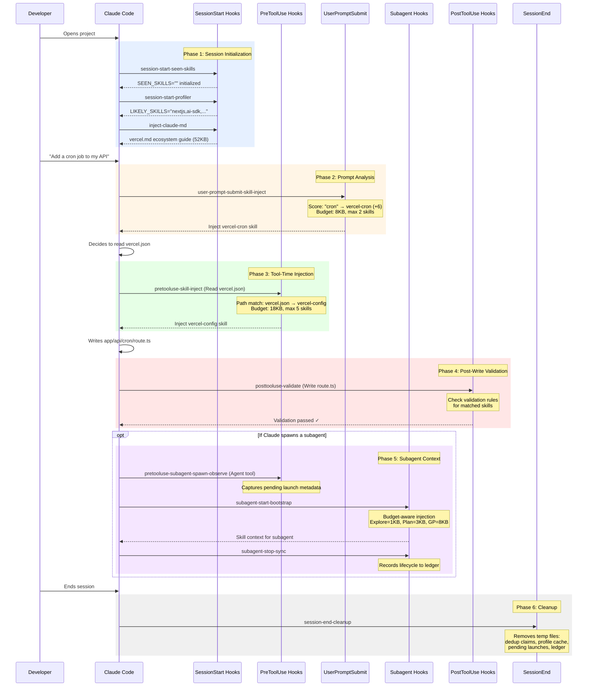

# Architecture Overview

> **Audience**: Everyone — developers, skill authors, maintainers, and contributors.

The Vercel Plugin for Claude Code is an **event-driven skill injection system** that automatically delivers relevant context to Claude based on what the developer is doing. When a developer opens a Next.js project, edits a configuration file, or types a prompt about deployments, the plugin detects the intent and injects precisely the right knowledge — without the developer asking for it.

---

## Table of Contents

1. [System Architecture Diagram](#system-architecture-diagram)
2. [Core Concepts](#core-concepts)
3. [Hook Lifecycle](#hook-lifecycle)
4. [Complete Hook Inventory](#complete-hook-inventory)
5. [Data Flow: From SKILL.md to Injection](#data-flow-from-skillmd-to-injection)
6. [User Story: Developer Opens Claude Code in a Next.js Project](#user-story-developer-opens-claude-code-in-a-nextjs-project)
7. [Glossary](#glossary)
8. [Cross-References](#cross-references)

---

## System Architecture Diagram

```mermaid
graph TB
    subgraph "Build Time"
        SKILL["skills/*/SKILL.md<br/>(43 skills, YAML frontmatter + markdown)"]
        BUILD_MANIFEST["scripts/build-manifest.ts"]
        BUILD_FROM["scripts/build-from-skills.ts"]
        MANIFEST["generated/skill-manifest.json<br/>(pre-compiled glob→regex)"]
        TEMPLATES["agents/*.md.tmpl<br/>commands/*.md.tmpl"]
        GENERATED_MD["agents/*.md<br/>commands/*.md"]

        SKILL -->|"extract frontmatter<br/>compile patterns"| BUILD_MANIFEST
        BUILD_MANIFEST --> MANIFEST
        SKILL -->|"resolve {{include:skill:...}}"| BUILD_FROM
        TEMPLATES --> BUILD_FROM
        BUILD_FROM --> GENERATED_MD
    end

    subgraph "Runtime (Claude Code Session)"
        HOOKS_JSON["hooks/hooks.json<br/>(hook registry)"]

        subgraph "SessionStart"
            PROFILER["session-start-profiler.mjs<br/>scans project → LIKELY_SKILLS"]
            SEEN_INIT["session-start-seen-skills.mjs<br/>initializes dedup state"]
            INJECT_MD["inject-claude-md.mjs<br/>injects vercel.md ecosystem guide"]
        end

        subgraph "PreToolUse"
            SKILL_INJECT["pretooluse-skill-inject.mjs<br/>pattern match → rank → inject"]
            SUBAGENT_OBSERVE["pretooluse-subagent-spawn-observe.mjs<br/>captures pending Agent launches"]
        end

        subgraph "UserPromptSubmit"
            PROMPT_INJECT["user-prompt-submit-skill-inject.mjs<br/>prompt signal scoring → inject"]
        end

        subgraph "SubagentStart / SubagentStop"
            SUBAGENT_BOOT["subagent-start-bootstrap.mjs<br/>budget-aware context for subagents"]
            SUBAGENT_STOP["subagent-stop-sync.mjs<br/>records lifecycle to ledger"]
        end

        subgraph "PostToolUse"
            VALIDATE["posttooluse-validate.mjs<br/>skill validation rules"]
            SHADCN["posttooluse-shadcn-font-fix.mjs<br/>shadcn font patch"]
            VERIFY_OBS["posttooluse-verification-observe.mjs<br/>verification boundary detection"]
        end

        CLEANUP["session-end-cleanup.mjs<br/>removes temp files"]
    end

    MANIFEST -->|"loaded at runtime"| SKILL_INJECT
    MANIFEST -->|"loaded at runtime"| PROMPT_INJECT
    MANIFEST -->|"loaded at runtime"| VALIDATE
    MANIFEST -->|"loaded at runtime"| SUBAGENT_BOOT
    HOOKS_JSON -->|"registers all hooks"| PROFILER
    HOOKS_JSON --> SKILL_INJECT
    HOOKS_JSON --> PROMPT_INJECT
    HOOKS_JSON --> CLEANUP

    SKILL_INJECT -->|"additionalContext"| CLAUDE["Claude Code Agent"]
    PROMPT_INJECT -->|"additionalContext"| CLAUDE
    SUBAGENT_BOOT -->|"additionalContext"| SUBAGENT["Spawned Subagent"]

    style SKILL fill:#f9f,stroke:#333
    style MANIFEST fill:#bbf,stroke:#333
    style CLAUDE fill:#bfb,stroke:#333
```



---

## Core Concepts

The plugin is built around a simple pipeline:

1. **Skills** define *what* knowledge exists (markdown content + matching rules)
2. **The build** compiles skills into an optimized **manifest** (pre-compiled regex patterns)
3. **Hooks** fire at lifecycle events, use the manifest to **match** and **rank** skills, then **inject** the right ones into Claude's context

Every piece flows through this pipeline. Skills are the single source of truth — the manifest is derived, hooks consume it, and templates reference it.

---

## Hook Lifecycle

The plugin registers hooks for seven Claude Code lifecycle events. Here's how they execute in sequence during a typical session:



---

## Complete Hook Inventory

Every hook registered in `hooks/hooks.json`, organized by lifecycle event:

### SessionStart

Fires once when a Claude Code session starts (on `startup|resume|clear|compact`).

| Hook | Source | Purpose |
|------|--------|---------|
| `session-start-seen-skills.mjs` | `hooks/src/session-start-seen-skills.mts` | Initializes `VERCEL_PLUGIN_SEEN_SKILLS=""` in the env file — the seed state for dedup tracking |
| `session-start-profiler.mjs` | `hooks/src/session-start-profiler.mts` | Scans project for frameworks, dependencies, and config files. Sets `VERCEL_PLUGIN_LIKELY_SKILLS` (+5 priority boost). Detects greenfield projects. Caches profile for subagents |
| `inject-claude-md.mjs` | `hooks/src/inject-claude-md.mts` | Injects the `vercel.md` ecosystem guide (~52KB) as additionalContext. Appends greenfield execution mode banner if project is empty |

### PreToolUse

Fires before each tool execution. Two matchers handle different tool types.

| Hook | Matcher | Source | Purpose |
|------|---------|--------|---------|
| `pretooluse-skill-inject.mjs` | `Read\|Edit\|Write\|Bash` | `hooks/src/pretooluse-skill-inject.mts` | **Main injection engine.** Matches file paths (glob), bash commands (regex), and imports (regex) against skill patterns. Applies vercel.json routing (±10), profiler boost (+5), ranks by priority, deduplicates, and injects up to **5 skills within 18KB budget** |
| `pretooluse-subagent-spawn-observe.mjs` | `Agent` | `hooks/src/pretooluse-subagent-spawn-observe.mts` | **Observer.** Captures pending subagent spawn metadata (description, prompt, type) to a JSONL file. Later consumed by `subagent-start-bootstrap` to correlate skills with the subagent's task |

**Special triggers in pretooluse-skill-inject:**
- **TSX review**: After N `.tsx` edits (default 3, configurable via `VERCEL_PLUGIN_REVIEW_THRESHOLD`), injects `react-best-practices`
- **Dev server detection**: Boosts `agent-browser-verify` when dev server patterns appear in bash commands
- **Vercel env help**: One-time injection for `vercel env` commands

### UserPromptSubmit

Fires when the user submits a prompt (matches all prompts — empty matcher string).

| Hook | Source | Purpose |
|------|--------|---------|
| `user-prompt-submit-skill-inject.mjs` | `hooks/src/user-prompt-submit-skill-inject.mts` | **Prompt signal scoring engine.** Normalizes prompt text (lowercases, expands contractions), scores against skill `promptSignals` frontmatter (phrases +6, allOf +4, anyOf +1 capped at +2, noneOf suppresses). Classifies troubleshooting intent. Injects up to **2 skills within 8KB budget** |

### SubagentStart

Fires when a subagent is spawned (matches any agent type via `.+`).

| Hook | Source | Purpose |
|------|--------|---------|
| `subagent-start-bootstrap.mjs` | `hooks/src/subagent-start-bootstrap.mts` | **Budget-aware subagent context injection.** Scales content by agent type: `Explore` gets ~1KB (skill names + profile summary), `Plan` gets ~3KB (summaries + deployment constraints), `general-purpose` gets ~8KB (full skill bodies with summary fallback). Reads profiler cache and pending launch metadata. Marks injected skills in agent-scoped dedup claims |

### SubagentStop

Fires when a subagent completes (matches any agent type via `.+`).

| Hook | Source | Purpose |
|------|--------|---------|
| `subagent-stop-sync.mjs` | `hooks/src/subagent-stop-sync.mts` | **Observer.** Records subagent lifecycle metadata (agent ID, type, skill count, timestamp) to a JSONL ledger at `<tmpdir>/vercel-plugin-<sessionId>-subagent-ledger.jsonl` |

### PostToolUse

Fires after tool execution. Two matchers handle different scenarios.

| Hook | Matcher | Source | Purpose |
|------|---------|--------|---------|
| `posttooluse-shadcn-font-fix.mjs` | `Bash` | standalone (no .mts source) | Fixes shadcn font loading issues by patching font import statements |
| `posttooluse-verification-observe.mjs` | `Bash` | `hooks/src/posttooluse-verification-observe.mts` | **Observer.** Classifies bash commands into verification boundaries: `uiRender` (browser/screenshot), `clientRequest` (curl/fetch), `serverHandler` (log tailing), `environment` (env var reads). Infers routes from recent file edits or command URLs. Emits structured log events |
| `posttooluse-validate.mjs` | `Write\|Edit` | `hooks/src/posttooluse-validate.mts` | **Validation engine.** Matches written/edited files to skills, runs regex-based validation rules from skill frontmatter. Reports errors (mandatory fix) and warnings (suggestions) with line numbers |

### SessionEnd

Fires when the session ends (no matcher — always fires).

| Hook | Source | Purpose |
|------|--------|---------|
| `session-end-cleanup.mjs` | `hooks/src/session-end-cleanup.mts` | **Best-effort cleanup.** Removes all session-scoped temp files: dedup claims, dedup session file, profile cache, pending launches JSONL, subagent ledger. Silently ignores failures |

### Shared Library Modules

These are not hooks themselves but are imported by entry-point hooks:

| Module | Purpose |
|--------|---------|
| `hook-env.mts` | Shared runtime helpers: env file parsing, plugin root resolution, dedup claim operations (atomic O_EXCL), audit logging, profile cache paths |
| `patterns.mts` | Glob→regex conversion, path/bash/import matching with match reasons, ranking engine, dedup state merging |
| `prompt-patterns.mts` | Prompt text normalization (contraction expansion), signal compilation, scoring, lexical fallback, troubleshooting intent classification |
| `skill-map-frontmatter.mts` | Inline YAML parser (no js-yaml), frontmatter extraction, `buildSkillMap()`, `validateSkillMap()` with structured warnings |
| `logger.mts` | Structured JSON logging to stderr (off/summary/debug/trace levels), per-invocation tracing, timing metrics |
| `vercel-config.mts` | Reads `vercel.json` keys → maps to skill routing adjustments (±10 priority) |
| `prompt-analysis.mts` | Dry-run prompt analysis reports (for debugging prompt matching) |
| `lexical-index.mts` | MiniSearch-based lexical fallback index for fuzzy skill matching |
| `subagent-state.mts` | File-locked JSONL operations for pending launches and agent-scoped dedup claims |

---

## Data Flow: From SKILL.md to Injection

Here's how a skill goes from source markdown to injected context:

```
┌─────────────────────────────────────────────────────────────────┐
│  1. AUTHOR                                                       │
│                                                                  │
│  skills/vercel-cron/SKILL.md                                     │
│  ┌──────────────────────────────┐                                │
│  │ ---                          │                                │
│  │ name: vercel-cron            │  ← YAML frontmatter defines    │
│  │ metadata:                    │    matching rules + priority    │
│  │   priority: 6               │                                 │
│  │   pathPatterns:              │                                 │
│  │     - "vercel.json"         │                                 │
│  │   promptSignals:            │                                 │
│  │     phrases: ["cron job"]   │                                 │
│  │ ---                          │                                │
│  │ # How to configure crons... │  ← Markdown body = injected     │
│  └──────────────────────────────┘    context                     │
│                                                                  │
├─────────────────────────────────────────────────────────────────┤
│  2. BUILD  (bun run build)                                       │
│                                                                  │
│  build-manifest.ts reads all 43 SKILL.md files                   │
│       ↓                                                          │
│  Parses YAML frontmatter (inline parser, not js-yaml)            │
│       ↓                                                          │
│  Compiles globs → regex at build time for runtime speed           │
│       ↓                                                          │
│  generated/skill-manifest.json (paired arrays format v2)          │
│                                                                  │
├─────────────────────────────────────────────────────────────────┤
│  3. RUNTIME  (Claude Code session)                               │
│                                                                  │
│  Hook loads manifest → compiles patterns → matches input          │
│       ↓                                                          │
│  Ranking: base priority (6)                                      │
│         + vercel.json routing (±10 if key matches)               │
│         + profiler boost (+5 if in LIKELY_SKILLS)                │
│       ↓                                                          │
│  Dedup: skip if skill already claimed in session                 │
│       ↓                                                          │
│  Budget: fit skills into byte limit (18KB PreToolUse, 8KB UPS)   │
│       ↓                                                          │
│  Inject as additionalContext → Claude reads it before acting      │
└─────────────────────────────────────────────────────────────────┘
```

---

## User Story: Developer Opens Claude Code in a Next.js Project

> **Scenario**: A developer opens Claude Code in a Next.js project that uses the AI SDK and has a `vercel.json` with cron configuration. They ask: "Add a new cron job that sends a weekly digest email."

### Phase 1: Session Initialization

When the session starts, three hooks fire in sequence:

1. **`session-start-seen-skills`** initializes dedup tracking:
   ```
   VERCEL_PLUGIN_SEEN_SKILLS=""
   ```

2. **`session-start-profiler`** scans the project root:
   - Finds `next.config.js` → hints `nextjs`
   - Reads `package.json`, finds `ai` dependency → hints `ai-sdk`
   - Finds `vercel.json` with `crons` key → hints `vercel-cron`
   - Checks `vercel --version` → up to date
   - Checks `agent-browser` availability → found on PATH
   - **Result**: `VERCEL_PLUGIN_LIKELY_SKILLS="nextjs,ai-sdk,vercel-cron"`
   - Caches profile to `<tmpdir>/vercel-plugin-<sessionId>-profile.json`

3. **`inject-claude-md`** loads `vercel.md` (~52KB ecosystem guide) and outputs it as additionalContext. Claude now has broad Vercel platform knowledge.

### Phase 2: Prompt Analysis

The developer types: *"Add a new cron job that sends a weekly digest email"*

**`user-prompt-submit-skill-inject`** fires:
- Normalizes prompt: `"add a new cron job that sends a weekly digest email"`
- Scores against all skills with `promptSignals`:
  - `vercel-cron`: phrase `"cron job"` matches → +6 → score 6 ≥ minScore 6 ✓
- Dedup check: `vercel-cron` not in SEEN_SKILLS → proceed
- Budget check: skill body fits within 8KB → inject
- Claims `vercel-cron` in dedup state
- **Result**: Claude receives the full `vercel-cron` skill content as additionalContext

### Phase 3: Tool-Time Injection

Claude decides to read `vercel.json` to understand existing cron configuration.

**`pretooluse-skill-inject`** fires (tool: Read, path: `vercel.json`):
- Path match: `vercel.json` → matches `vercel-config` skill's pathPattern
- Also matches `vercel-cron` → but already claimed in dedup → skip
- Profiler boost: `vercel-config` not in LIKELY_SKILLS → no boost
- Ranking: `vercel-config` at base priority
- Budget: fits within 18KB → inject
- **Result**: Claude receives `vercel-config` skill content

### Phase 4: Writing Code

Claude creates `app/api/cron/weekly-digest/route.ts`.

**`posttooluse-validate`** fires (tool: Write):
- Matches file path against skill validation rules
- Checks `vercel-cron` validation rules (e.g., route handler patterns)
- All rules pass → no violations reported
- **Result**: Write proceeds without intervention

### Phase 5: Session End

Developer closes the session.

**`session-end-cleanup`** fires:
- Deletes `<tmpdir>/vercel-plugin-<sessionId>-seen-skills.txt`
- Deletes `<tmpdir>/vercel-plugin-<sessionId>-seen-skills.d/` (claim dir)
- Deletes `<tmpdir>/vercel-plugin-<sessionId>-profile.json`
- All temp state is gone — next session starts fresh

### What the Developer Experienced

The developer never asked for help with Vercel cron configuration. They just described what they wanted. The plugin:
- Detected their Next.js + Vercel stack at session start
- Recognized "cron job" in their prompt and injected cron docs
- Injected config knowledge when Claude read `vercel.json`
- Validated the output after writing

All of this happened transparently. The developer got expert-level Vercel guidance without knowing the plugin was there.

---

## Glossary

| Term | Definition |
|------|------------|
| **Skill** | A unit of injectable knowledge. Lives in `skills/<name>/SKILL.md` with YAML frontmatter (matching rules, priority, validation) and a markdown body (the content injected into Claude's context) |
| **Hook** | A Node.js script registered in `hooks/hooks.json` that runs at a specific Claude Code lifecycle event. Hooks receive JSON on stdin and may output JSON on stdout to modify Claude's behavior (e.g., inject additionalContext) |
| **Manifest** | `generated/skill-manifest.json` — a pre-compiled index of all skill frontmatter with glob patterns converted to regex at build time. Hooks load this at runtime instead of scanning SKILL.md files directly |
| **Dedup** | The deduplication system that prevents the same skill from being injected twice in a session. Uses three layers: atomic file claims (O_EXCL), a session file (comma-delimited), and an env var (`VERCEL_PLUGIN_SEEN_SKILLS`). All three are merged via `mergeSeenSkillStates()` |
| **Budget** | Byte limits that cap how much skill content can be injected per hook invocation. PreToolUse: 18KB max, 5 skills. UserPromptSubmit: 8KB max, 2 skills. SubagentStart: varies by agent type (1KB–8KB). Prevents context window bloat |
| **Profiler** | The `session-start-profiler` hook that scans the project at session start — checking config files, package.json dependencies, and vercel.json keys — to pre-identify likely relevant skills. Profiled skills receive a +5 priority boost |
| **Claim Dir** | `<tmpdir>/vercel-plugin-<sessionId>-seen-skills.d/` — a directory of empty files, one per claimed skill, created atomically with `O_EXCL` flag to prevent race conditions. The authoritative source of dedup truth. Agent-scoped variants exist for subagent isolation |
| **Priority** | A numeric score (typically 4–8) that determines injection order. Base priority is set in SKILL.md frontmatter. Modified at runtime by vercel.json routing (±10), profiler boost (+5), and prompt signal scores. Higher priority = injected first |
| **additionalContext** | The mechanism hooks use to inject content into Claude's context. Returned as part of the hook's JSON output. Claude Code prepends this to the tool result or prompt, so the agent sees it before acting |
| **Greenfield** | A project with no source files (only dot-directories). The profiler detects this and sets `VERCEL_PLUGIN_GREENFIELD=true`, which triggers a special execution mode: skip planning, use sensible defaults, bootstrap immediately |
| **Observer Hook** | A hook that records telemetry but does not modify behavior. Returns empty JSON `{}`. Examples: `pretooluse-subagent-spawn-observe`, `posttooluse-verification-observe`, `subagent-stop-sync` |

---

## Cross-References

- **Section 2**: [Injection Pipeline Deep-Dive](./02-injection-pipeline.md) — detailed walkthrough of pattern matching, ranking, budget enforcement, and prompt signal scoring
- **Section 3**: [Skill Authoring Guide](./03-skill-authoring.md) — how to create, test, and validate a new skill
- **Section 4**: [Operations & Debugging](./04-operations-debugging.md) — environment variables, log levels, `doctor`/`explain` CLI, dedup troubleshooting
- **Section 5**: [Reference](./05-reference.md) — complete hook registry, env var table, YAML parser edge cases, skill catalog
