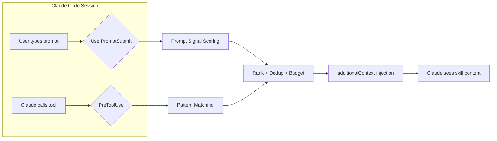
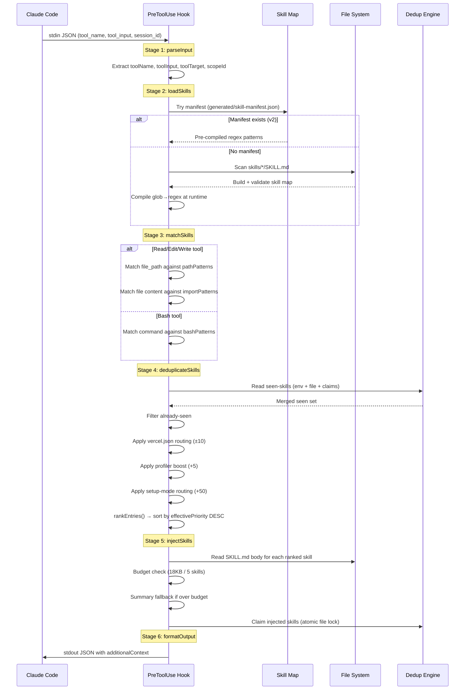
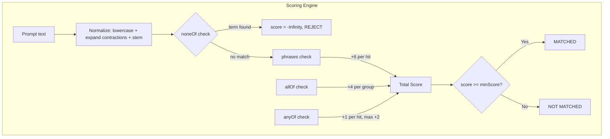
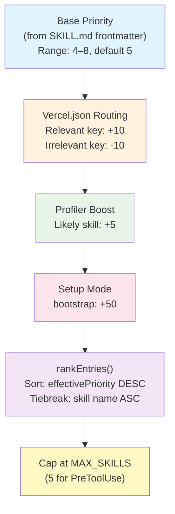

# 2. Injection Pipeline Deep-Dive

This document explains how vercel-plugin decides **which skills to inject**, **when**, and **why**. It covers both the PreToolUse hook (file/bash/import pattern matching) and the UserPromptSubmit hook (prompt signal scoring), including the ranking pipeline, dedup state machine, budget enforcement, and special-case triggers.

---

## Table of Contents

1. [Overview](#overview)
2. [PreToolUse Pipeline](#pretooluse-pipeline)
   - [Stage 1: parseInput](#stage-1-parseinput)
   - [Stage 2: loadSkills](#stage-2-loadskills)
   - [Stage 3: matchSkills](#stage-3-matchskills)
   - [Stage 4: deduplicateSkills](#stage-4-deduplicateskills)
   - [Stage 5: injectSkills](#stage-5-injectskills)
   - [Stage 6: formatOutput](#stage-6-formatoutput)
3. [UserPromptSubmit Pipeline](#userpromptsubmit-pipeline)
4. [Pattern Matching In Depth](#pattern-matching-in-depth)
   - [Glob-to-Regex Compilation](#glob-to-regex-compilation)
   - [Path Matching Strategy](#path-matching-strategy)
   - [Bash Pattern Matching](#bash-pattern-matching)
   - [Import Pattern Matching](#import-pattern-matching)
5. [Prompt Signal Scoring](#prompt-signal-scoring)
   - [Scoring Weights](#scoring-weights)
   - [Normalization and Contractions](#normalization-and-contractions)
   - [Lexical Fallback Scoring](#lexical-fallback-scoring)
   - [Troubleshooting Intent Classification](#troubleshooting-intent-classification)
6. [Ranking Pipeline](#ranking-pipeline)
   - [Base Priority](#base-priority)
   - [Vercel.json Key-Aware Routing](#verceljson-key-aware-routing)
   - [Profiler Boost](#profiler-boost)
   - [Setup Mode Routing](#setup-mode-routing)
   - [Unified Ranker](#unified-ranker)
7. [Dedup State Machine](#dedup-state-machine)
   - [Three State Sources](#three-state-sources)
   - [Merge Strategy](#merge-strategy)
   - [Fallback Strategies](#fallback-strategies)
   - [Scope-Aware Dedup for Subagents](#scope-aware-dedup-for-subagents)
8. [Budget Enforcement](#budget-enforcement)
   - [PreToolUse Budget](#pretooluse-budget)
   - [UserPromptSubmit Budget](#userpromptsubmit-budget)
   - [Summary Fallback](#summary-fallback)
9. [Special-Case Triggers](#special-case-triggers)
   - [TSX Review Trigger](#tsx-review-trigger)
   - [Dev Server Detection](#dev-server-detection)
   - [Vercel Env Help](#vercel-env-help)
   - [Investigation Companion Selection](#investigation-companion-selection)
10. [User Story: Why Didn't My Skill Inject?](#user-story-why-didnt-my-skill-inject)

---

## Overview

The injection pipeline is the core mechanism that makes vercel-plugin context-aware. Instead of dumping all 43 skills into every Claude session, the plugin watches what Claude is doing and injects only the skills that are relevant to the current action.

There are two independent injection paths:

| Hook | Trigger | Budget | Max Skills | Match Method |
|------|---------|--------|------------|--------------|
| **PreToolUse** | Claude calls Read, Edit, Write, or Bash | 18 KB | 5 | File path globs, bash command regex, import patterns |
| **UserPromptSubmit** | User types a prompt | 8 KB | 2 | Prompt signal scoring (phrases, allOf, anyOf, noneOf) |

Both hooks share the same dedup system to prevent re-injecting skills that were already delivered in the current session.



---

## PreToolUse Pipeline

The PreToolUse hook fires every time Claude calls a Read, Edit, Write, or Bash tool. It runs a six-stage pipeline, each stage independently importable and testable.



### Stage 1: parseInput

**Source**: `pretooluse-skill-inject.mts:parseInput()`

Reads JSON from stdin and extracts:
- `toolName` — one of `Read`, `Edit`, `Write`, `Bash`
- `toolInput` — the tool's arguments (e.g., `file_path`, `command`)
- `sessionId` — used for file-based dedup
- `toolTarget` — the primary target (file path for file tools, command string for Bash)
- `scopeId` — agent ID for subagent-scoped dedup (undefined for the main agent)

Unsupported tools (anything not in `["Read", "Edit", "Write", "Bash"]`) are rejected immediately with an empty `{}` response.

### Stage 2: loadSkills

**Source**: `pretooluse-skill-inject.mts:loadSkills()`

Loads the skill catalog with a two-tier strategy:

1. **Try the manifest** (`generated/skill-manifest.json`) — a pre-built JSON file containing all skill metadata with pre-compiled regex sources. Version 2 manifests include paired arrays (`pathPatterns` ↔ `pathRegexSources`) so the hook can reconstruct `RegExp` objects directly without re-running glob-to-regex compilation.

2. **Fall back to live scan** — if no manifest exists, scans `skills/*/SKILL.md`, parses YAML frontmatter via `buildSkillMap()`, validates with `validateSkillMap()`, and compiles patterns at runtime.

The manifest path is always preferred because it's faster (no filesystem scan, no YAML parsing, no glob compilation).

### Stage 3: matchSkills

**Source**: `pretooluse-skill-inject.mts:matchSkills()`

For **file tools** (Read/Edit/Write):
1. Match `file_path` against each skill's compiled `pathPatterns`
2. If no path match, attempt **import matching** — scan file content (`content`, `old_string`, `new_string`) against `importPatterns`

For **Bash**:
1. Match `command` against each skill's compiled `bashPatterns`

Each match produces a `MatchReason` with the winning pattern and match type (`full`, `basename`, `suffix`, `import`).

### Stage 4: deduplicateSkills

**Source**: `pretooluse-skill-inject.mts:deduplicateSkills()`

This is where priority adjustments and filtering happen:

1. **Filter already-seen** — remove skills present in the merged dedup state
2. **Vercel.json routing** — if the target is `vercel.json`, read its keys and adjust priorities (see [Ranking Pipeline](#ranking-pipeline))
3. **Profiler boost** — skills in `VERCEL_PLUGIN_LIKELY_SKILLS` get +5 priority
4. **Setup-mode routing** — in greenfield projects, `bootstrap` gets a +50 priority boost
5. **Rank** — sort by `effectivePriority` DESC, then skill name ASC
6. **Cap** — take the top N skills (default 5)

### Stage 5: injectSkills

**Source**: `pretooluse-skill-inject.mts:injectSkills()`

For each ranked skill (in priority order):
1. Check the hard ceiling (max 5 skills)
2. Read `skills/<name>/SKILL.md` from disk
3. Strip YAML frontmatter, keep only the body
4. Wrap in HTML comment markers: `<!-- skill:name -->...<!-- /skill:name -->`
5. Check byte budget — the first skill always gets full body; subsequent skills must fit within remaining budget
6. If over budget, try summary fallback (see [Budget Enforcement](#budget-enforcement))
7. Atomically claim the skill in the dedup system

### Stage 6: formatOutput

Assembles the final JSON output:

```json
{
  "hookSpecificOutput": {
    "additionalContext": "<!-- skill:nextjs -->\n...skill body...\n<!-- /skill:nextjs -->"
  }
}
```

Also embeds a metadata comment for debugging:
```html
<!-- skillInjection: {"version":1,"hookEvent":"PreToolUse","matchedSkills":[...],"injectedSkills":[...],...} -->
```

---

## UserPromptSubmit Pipeline

The UserPromptSubmit hook fires when the user types a prompt, before any tool calls. It uses a different matching strategy — **prompt signal scoring** instead of pattern matching.

**Source**: `user-prompt-submit-skill-inject.mts`

Pipeline stages:
1. **parsePromptInput** — extract prompt text, session ID, cwd; reject prompts shorter than 10 characters
2. **normalizePromptText** — lowercase, expand contractions, stem tokens, collapse whitespace
3. **loadSkills** — reuses the same `loadSkills()` from PreToolUse
4. **analyzePrompt** — score every skill's `promptSignals` against the normalized prompt (see [Prompt Signal Scoring](#prompt-signal-scoring))
5. **Troubleshooting intent routing** — classify prompt into flow-verification, stuck-investigation, or browser-only buckets
6. **Investigation companion selection** — when `investigation-mode` is selected, pick the best companion skill
7. **Dedup + inject** — filter seen skills, load SKILL.md bodies, enforce 8KB budget / 2 skill cap
8. **formatOutput** — build banner explaining why skills were auto-suggested

Key differences from PreToolUse:
- **Budget**: 8 KB (vs 18 KB)
- **Max skills**: 2 (vs 5)
- **Match method**: prompt signal scoring (not file/bash patterns)
- **Minimum prompt length**: 10 characters

---

## Pattern Matching In Depth

### Glob-to-Regex Compilation

**Source**: `patterns.mts:globToRegex()`

Skill frontmatter uses glob patterns for `pathPatterns`. At build time (or runtime if no manifest), these are compiled to JavaScript `RegExp` objects.

Supported wildcards:

| Glob | Regex | Meaning |
|------|-------|---------|
| `*` | `[^/]*` | Match any characters except `/` |
| `**` | `.*` | Match anything (including `/`) |
| `**/` | `(?:[^/]+/)*` | Match zero or more path segments |
| `?` | `[^/]` | Match exactly one character (not `/`) |
| `{a,b}` | `(?:a\|b)` | Brace expansion (alternation) |

**Examples**:

```
Glob:  **/*.tsx
Regex: ^(?:[^/]+/)*[^/]*\.tsx$
Match: src/components/Button.tsx ✓
       Button.tsx ✓
       src/styles/global.css ✗

Glob:  app/**/page.{ts,tsx}
Regex: ^app/(?:[^/]+/)*page\.(?:ts|tsx)$
Match: app/page.tsx ✓
       app/dashboard/settings/page.ts ✓
       lib/page.tsx ✗

Glob:  vercel.json
Regex: ^vercel\.json$
Match: vercel.json ✓
       app/vercel.json ✗ (but see suffix matching below)
```

The manifest (v2) stores the compiled regex source alongside the original glob, so the hook only needs `new RegExp(source)` at runtime — no glob compilation needed.

### Path Matching Strategy

**Source**: `patterns.mts:matchPathWithReason()`

Path matching attempts three strategies in order:

1. **Full path match** — test the entire normalized path against the regex
2. **Basename match** — test just the filename (`Button.tsx`)
3. **Suffix match** — progressively test longer suffixes (`components/Button.tsx`, `src/components/Button.tsx`, etc.)

This multi-strategy approach means `vercel.json` in a glob will match both `/project/vercel.json` and `/project/apps/web/vercel.json`.

### Bash Pattern Matching

**Source**: `patterns.mts:matchBashWithReason()`

Bash patterns are regular expressions tested against the full command string. No special normalization is applied — the regex is tested directly.

```yaml
# In SKILL.md frontmatter:
metadata:
  bashPatterns: ["\\bnext\\s+dev\\b", "\\bnpm\\s+run\\s+build\\b"]
```

### Import Pattern Matching

**Source**: `patterns.mts:importPatternToRegex()`

Import patterns match against file content (not file paths). They detect `import`, `require`, and dynamic `import()` statements.

```yaml
# In SKILL.md frontmatter:
metadata:
  importPatterns: ["@vercel/analytics", "ai"]
```

The pattern `ai` generates a regex that matches:
```
from 'ai'
from 'ai/react'
require('ai')
import('ai/rsc')
```

Import matching is a **fallback** — it only runs when path matching produces no hit for a given skill.

---

## Prompt Signal Scoring

**Source**: `prompt-patterns.mts`

Each skill can define `promptSignals` in its frontmatter to declare what user prompts should trigger injection.

### Scoring Weights



| Signal Type | Weight | Behavior |
|-------------|--------|----------|
| `phrases` | **+6** per hit | Exact substring match (case-insensitive, after normalization) |
| `allOf` | **+4** per group | All terms in the group must appear in the prompt |
| `anyOf` | **+1** per hit, **capped at +2** | Any term matches; cap prevents low-signal flooding |
| `noneOf` | **-Infinity** | Hard suppress — if any noneOf term matches, the skill is excluded |
| `minScore` | threshold (default **6**) | Score must meet or exceed this to qualify |

**Example**: A skill with `phrases: ["deploy to vercel"]` and `minScore: 6`:
- "How do I **deploy to vercel**?" → score 6 (one phrase hit) → matched
- "How do I deploy?" → score 0 (no phrase hit) → not matched

**Example**: Reaching threshold via allOf + anyOf only:
```yaml
promptSignals:
  allOf: [["cron", "schedule"]]  # +4
  anyOf: ["vercel", "deploy", "production"]  # +1 each, capped at +2
  minScore: 6
```
- "I need to schedule a cron job on vercel for production" → allOf +4, anyOf +2 = score 6 → matched

### Normalization and Contractions

Before scoring, both the prompt text and the signal terms undergo normalization:

1. **Lowercase** — `"Deploy to Vercel"` → `"deploy to vercel"`
2. **Contraction expansion** — `"it's"` → `"it is"`, `"don't"` → `"do not"`, `"can't"` → `"cannot"`
3. **Stemming** — `"deploying"` → `"deploy"`, `"configured"` → `"configur"`
4. **Whitespace collapse** — multiple spaces/newlines → single space

This means skill authors don't need to account for contractions or verb tenses in their signal definitions.

### Lexical Fallback Scoring

**Source**: `prompt-patterns.mts:scorePromptWithLexical()`

When exact prompt signal scoring doesn't reach the threshold, a **lexical index** (TF-IDF based) provides a fallback. The lexical score is boosted by 1.35x and compared against the exact score. The higher score wins.

This ensures skills with strong keyword overlap still get matched even if the user's phrasing doesn't exactly hit the configured phrases.

### Troubleshooting Intent Classification

**Source**: `prompt-patterns.mts:classifyTroubleshootingIntent()`

A regex-based classifier detects three troubleshooting intents in user prompts:

| Intent | Pattern Examples | Routed Skills |
|--------|-----------------|---------------|
| `flow-verification` | "loads but", "submits but", "works locally but" | `verification` |
| `stuck-investigation` | "stuck", "frozen", "timed out", "not responding" | `investigation-mode` |
| `browser-only` | "blank page", "white screen", "console errors" | `agent-browser-verify`, `investigation-mode` |

**Suppression**: Test framework mentions (`jest`, `vitest`, `playwright test`, etc.) suppress all verification-family skills to avoid injecting browser verification guidance during unit testing.

---

## Ranking Pipeline

Every matched skill goes through a ranking pipeline that determines injection order. The pipeline applies priority adjustments in layers:



### Base Priority

Set in each skill's SKILL.md frontmatter:

```yaml
metadata:
  priority: 6  # Range 4–8, default 5
```

Higher priority means earlier injection. Skills with equal priority are sorted alphabetically.

### Vercel.json Key-Aware Routing

**Source**: `vercel-config.mts`

When the tool target is a `vercel.json` file, the hook reads the file's keys and adjusts priorities for skills that claim `vercel.json` in their `pathPatterns`:

| vercel.json Key | Relevant Skill |
|----------------|----------------|
| `redirects`, `rewrites`, `headers`, `cleanUrls`, `trailingSlash` | `routing-middleware` |
| `crons` | `cron-jobs` |
| `functions`, `regions` | `vercel-functions` |
| `builds`, `buildCommand`, `installCommand`, `outputDirectory`, `framework`, `devCommand`, `ignoreCommand` | `deployments-cicd` |

**Priority adjustment**:
- Skill **is** relevant to the file's keys → **+10**
- Skill **is not** relevant (but claims vercel.json) → **-10**

This prevents irrelevant skills from being injected when editing vercel.json. For example, editing a vercel.json with `{ "crons": [...] }` will boost `cron-jobs` by +10 and demote `routing-middleware` by -10.

### Profiler Boost

The session-start profiler scans the project's dependencies, config files, and directory structure to predict which skills are likely relevant. These "likely skills" are stored in `VERCEL_PLUGIN_LIKELY_SKILLS`.

**Boost**: +5 to `effectivePriority` for any matched skill that's also in the likely-skills set.

The boost stacks on top of vercel.json routing:
```
effectivePriority = base + vercelJsonAdjustment + profilerBoost
```

### Setup Mode Routing

When the project is greenfield (`VERCEL_PLUGIN_GREENFIELD=true`), the `bootstrap` skill gets a massive priority boost of **+50**, ensuring it's always injected first. If `bootstrap` didn't naturally match the tool call, it's synthetically added to the match set.

### Unified Ranker

**Source**: `patterns.mts:rankEntries()`

After all priority adjustments, skills are sorted:
1. **Primary**: `effectivePriority` DESC (or base `priority` if no adjustments)
2. **Secondary**: skill name ASC (alphabetical tiebreak)

---

## Dedup State Machine

The dedup system prevents the same skill from being injected twice in a session. It uses three independent state sources that are merged into a unified view.

```mermaid
stateDiagram-v2
    [*] --> Initialized: SessionStart hook sets<br/>VERCEL_PLUGIN_SEEN_SKILLS=""

    state "Three State Sources" as sources {
        EnvVar: Env Var<br/>VERCEL_PLUGIN_SEEN_SKILLS<br/>(comma-delimited)
        ClaimDir: Claim Directory<br/>tmp/vercel-plugin-{sessionId}-seen-skills.d/<br/>(one file per skill, atomic O_EXCL)
        SessionFile: Session File<br/>tmp/vercel-plugin-{sessionId}-seen-skills.txt<br/>(comma-delimited snapshot)
    }

    Initialized --> sources: Hook invocation

    sources --> Merge: mergeSeenSkillStates()
    Merge --> Check: Is skill in merged set?

    Check --> Skip: Yes → already injected
    Check --> Inject: No → new skill

    Inject --> Claim: tryClaimSessionKey()<br/>(atomic openSync O_EXCL)
    Claim --> ClaimSuccess: File created
    Claim --> ClaimFail: File exists<br/>(concurrent hook won)

    ClaimSuccess --> Sync: syncSessionFileFromClaims()
    Sync --> UpdateEnv: Update env var + session file

    ClaimFail --> Skip

    state "Fallback Strategies" as fallback {
        File: "file" strategy<br/>(primary: atomic claims)
        EnvOnly: "env-var" strategy<br/>(no session ID)
        Memory: "memory-only" strategy<br/>(single invocation)
        Disabled: "disabled" strategy<br/>(VERCEL_PLUGIN_HOOK_DEDUP=off)
    }

    Note right of fallback: Strategies degrade gracefully:<br/>file → env-var → memory-only → disabled
```

### Three State Sources

1. **Environment variable** (`VERCEL_PLUGIN_SEEN_SKILLS`): Comma-delimited list of skill slugs. Fast to read, but can drift if multiple hooks run concurrently.

2. **Claim directory** (`<tmpdir>/vercel-plugin-<sessionId>-seen-skills.d/`): Contains one empty file per claimed skill. Files are created atomically with `openSync(path, "wx")` (O_EXCL flag), which provides a filesystem-level mutex. If two hooks try to claim the same skill simultaneously, only one succeeds.

3. **Session file** (`<tmpdir>/vercel-plugin-<sessionId>-seen-skills.txt`): A comma-delimited snapshot periodically synced from the claim directory. Acts as a checkpoint.

### Merge Strategy

**Source**: `patterns.mts:mergeSeenSkillStates()`

All three sources are unioned into a single `Set<string>`. A skill is considered "seen" if it appears in **any** of the three sources.

```
mergedSeen = union(envVar, claimDir, sessionFile)
```

### Fallback Strategies

The dedup system degrades gracefully:

| Strategy | When | Behavior |
|----------|------|----------|
| **file** | Session ID available, filesystem writable | Full atomic claims + session file + env var |
| **env-var** | No session ID, or claim dir unavailable | Env var only (no cross-process safety) |
| **memory-only** | No env var support | In-memory set for single invocation |
| **disabled** | `VERCEL_PLUGIN_HOOK_DEDUP=off` | No dedup — every match is injected |

### Scope-Aware Dedup for Subagents

**Source**: `patterns.mts:mergeScopedSeenSkillStates()`

When running inside a subagent (identified by `scopeId` / `agent_id`):
- The parent's **env var** is excluded from the merge, because it carries the parent's seen-skills and would incorrectly suppress skills the subagent hasn't seen
- Only the **session file** and **claim directory** are merged
- Claims are scoped to the subagent's scope ID

This ensures subagents get fresh skill injection while still deduplicating within their own scope.

---

## Budget Enforcement

Budget enforcement prevents the plugin from flooding Claude's context window with too much skill content.

### PreToolUse Budget

| Parameter | Default | Env Override |
|-----------|---------|-------------|
| Byte budget | **18,000 bytes** (18 KB) | `VERCEL_PLUGIN_INJECTION_BUDGET` |
| Max skills | **5** | — |

Rules:
- The **first skill always gets its full body**, regardless of budget
- Subsequent skills must fit within the remaining byte budget
- Skills are measured as UTF-8 bytes after wrapping in comment markers

### UserPromptSubmit Budget

| Parameter | Default | Env Override |
|-----------|---------|-------------|
| Byte budget | **8,000 bytes** (8 KB) | `VERCEL_PLUGIN_PROMPT_INJECTION_BUDGET` |
| Max skills | **2** | — |

The smaller budget reflects that prompt-based injection is speculative — the user hasn't started working with specific files yet.

### Summary Fallback

When a skill's full body would exceed the remaining budget, the hook checks if a `summary` field exists in the frontmatter:

```yaml
summary: "Brief guidance for this skill (injected when budget exceeded)"
```

If the summary fits within budget, it's injected with a `mode:summary` marker:
```html
<!-- skill:nextjs mode:summary -->
Brief guidance for this skill...
<!-- /skill:nextjs -->
```

If neither the full body nor summary fits, the skill is dropped with a `droppedByBudget` classification.

---

## Special-Case Triggers

These triggers operate alongside the normal pattern-matching pipeline and have their own dedup/counter mechanisms.

### TSX Review Trigger

**Source**: `pretooluse-skill-inject.mts:checkTsxReviewTrigger()`

After a configurable number of `.tsx` file edits (default: 3), the `react-best-practices` skill is injected with a massive priority boost (+40).

| Parameter | Default | Env Override |
|-----------|---------|-------------|
| Edit threshold | 3 | `VERCEL_PLUGIN_REVIEW_THRESHOLD` |
| Priority boost | +40 | — |

**Behavior**:
1. Every Edit/Write on a `.tsx` file increments `VERCEL_PLUGIN_TSX_EDIT_COUNT`
2. When the count reaches the threshold, the trigger fires
3. The counter resets after injection, allowing re-injection after another N edits
4. This trigger **bypasses** the normal SEEN_SKILLS dedup — the counter is the sole gate

### Dev Server Detection

**Source**: `pretooluse-skill-inject.mts:checkDevServerVerify()`

When Claude runs a dev server command (e.g., `next dev`, `npm run dev`, `vite`), the `agent-browser-verify` skill is injected to encourage browser-based verification.

Detected patterns:
```
next dev, npm run dev, pnpm dev, bun dev, bun run dev,
yarn dev, vite dev, vite, nuxt dev, vercel dev, astro dev
```

| Parameter | Value |
|-----------|-------|
| Priority boost | +45 |
| Max iterations | 2 per session |
| Loop guard env | `VERCEL_PLUGIN_DEV_VERIFY_COUNT` |
| Companion skills | `verification` (co-injected) |

**Graceful degradation**: If `agent-browser` is not installed (`VERCEL_PLUGIN_AGENT_BROWSER_AVAILABLE=0`), the hook injects an unavailability notice instead, suggesting the user install it.

### Vercel Env Help

**Source**: `pretooluse-skill-inject.mts:checkVercelEnvHelp()`

One-time injection of a quick-reference guide when Claude runs `vercel env add`, `vercel env update`, or `vercel env pull`. The guide clarifies common pitfalls (e.g., "do NOT pass NAME=value as a positional argument").

This uses the standard dedup system with key `vercel-env-help` — once shown, it won't appear again in the session.

### Investigation Companion Selection

**Source**: `user-prompt-submit-skill-inject.mts:selectInvestigationCompanion()`

When `investigation-mode` is selected via prompt signals, the second skill slot is reserved for the best "companion" skill from a prioritized list:

1. `workflow` (highest priority)
2. `agent-browser-verify`
3. `vercel-cli`

The companion must have independently matched (score >= its minScore). This ensures debugging prompts get both the investigation methodology and a relevant tooling skill.

---

## User Story: Why Didn't My Skill Inject?

**Scenario**: You authored a new skill called `my-feature` with `pathPatterns: ["**/my-feature.config.ts"]`, but when Claude reads `src/my-feature.config.ts`, the skill doesn't appear.

### Step 1: Use `vercel-plugin explain`

```bash
vercel-plugin explain src/my-feature.config.ts
```

This shows which skills match the file path, with a priority breakdown:

```
Matches for "src/my-feature.config.ts":
  ✓ my-feature        priority=5  pattern="**/my-feature.config.ts"  match=suffix

Budget simulation (18000 bytes, max 5 skills):
  1. my-feature  body=2340B  cumulative=2340B  ✓ within budget
```

If your skill doesn't appear here, the pattern doesn't match. Check:
- Is the glob correct? Run `bun run build:manifest` to recompile.
- Is the pattern in `pathPatterns` (not `bashPatterns`)?

### Step 2: Check dedup state

```bash
echo $VERCEL_PLUGIN_SEEN_SKILLS
```

If `my-feature` is already in the list, it was injected earlier in the session and dedup is filtering it out. This is expected behavior — skills inject once per session.

To test without dedup:
```bash
VERCEL_PLUGIN_HOOK_DEDUP=off vercel-plugin explain src/my-feature.config.ts
```

### Step 3: Check budget

If your skill appears in `explain` output but the budget simulation shows it as "dropped by budget", the preceding skills consumed too much of the 18 KB budget. Options:
- Increase the budget: `VERCEL_PLUGIN_INJECTION_BUDGET=25000`
- Reduce your skill's body size
- Add a `summary` field for budget-constrained injection

### Step 4: Enable debug logging

```bash
VERCEL_PLUGIN_LOG_LEVEL=debug
```

This produces structured JSON logs on stderr showing every pipeline stage:
- `input-parsed` — what the hook received
- `matches-found` — which skills matched and why
- `dedup-filtered` — which skills were filtered out
- `skill-injected` / `skill-dropped` — final injection decisions

For maximum detail, use `VERCEL_PLUGIN_LOG_LEVEL=trace` to see every pattern evaluation.

### Step 5: Check the manifest

```bash
cat generated/skill-manifest.json | jq '.skills["my-feature"]'
```

Verify:
- `pathPatterns` contains your glob
- `pathRegexSources` contains the compiled regex
- The regex actually matches your file path

If the manifest is stale, rebuild:
```bash
bun run build:manifest
```

### Common Gotchas

| Symptom | Cause | Fix |
|---------|-------|-----|
| Skill never matches | Glob doesn't cover the path | Test with `vercel-plugin explain <path>` |
| Skill matched but not injected | Already in `SEEN_SKILLS` | Expected — dedup prevents re-injection |
| Skill matched but "dropped by budget" | Too many higher-priority skills | Add a `summary` fallback or increase budget |
| Skill matches locally but not in session | Stale manifest | Run `bun run build:manifest` |
| Prompt-based skill not matching | Phrases don't match after normalization | Check stemming (e.g., "deploying" stems to "deploy") |
| Skill injected in parent but not subagent | Scope-aware dedup working correctly | Subagents get fresh dedup state |
