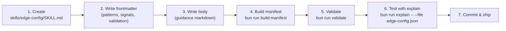
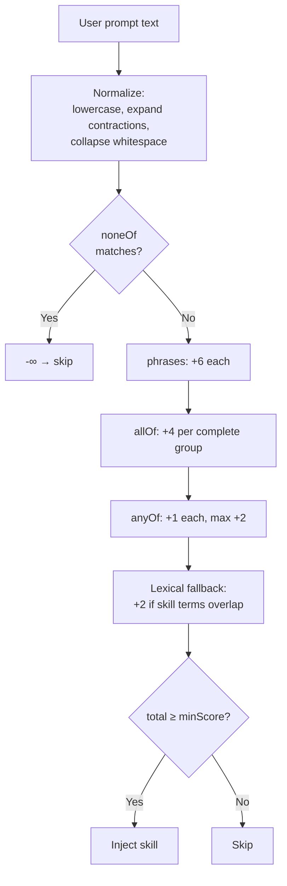
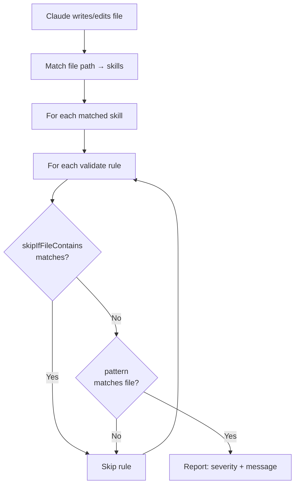

# 3. Skill Authoring Guide

> **Audience**: Skill authors — anyone adding new skills or extending existing ones.

This guide walks you through creating a new skill from scratch, explains every frontmatter field, documents the template include engine, and covers the custom YAML parser's non-standard behavior.

---

## Table of Contents

1. [User Story: Adding a New Vercel Feature Skill](#user-story-adding-a-new-vercel-feature-skill)
2. [Step-by-Step: Create a Skill from Scratch](#step-by-step-create-a-skill-from-scratch)
3. [SKILL.md Frontmatter Schema](#skillmd-frontmatter-schema)
   - [Top-Level Fields](#top-level-fields)
   - [metadata Object](#metadata-object)
   - [promptSignals Object](#promptsignals-object)
   - [validate Array](#validate-array)
   - [retrieval Object](#retrieval-object)
4. [Pattern Matching Reference](#pattern-matching-reference)
   - [pathPatterns (Globs)](#pathpatterns-globs)
   - [bashPatterns (Regex)](#bashpatterns-regex)
   - [importPatterns (Package Matchers)](#importpatterns-package-matchers)
5. [Prompt Signal Scoring](#prompt-signal-scoring)
6. [Validation Rules](#validation-rules)
7. [Template Include Engine](#template-include-engine)
   - [Section Includes](#section-includes)
   - [Frontmatter Includes](#frontmatter-includes)
   - [Build Workflow](#build-workflow)
8. [Custom YAML Parser Gotchas](#custom-yaml-parser-gotchas)
9. [Build & Test Workflow](#build--test-workflow)
10. [Cross-References](#cross-references)

---

## User Story: Adding a New Vercel Feature Skill

> **Scenario**: You're a Vercel engineer. Vercel just shipped a new feature called "Edge Config" and you want Claude to automatically inject best-practice guidance whenever a developer touches Edge Config files or asks about it in a prompt.

Here's the journey:



**What happens at runtime:**

1. **SessionStart**: The profiler scans `package.json` — if `@vercel/edge-config` is a dependency, your skill gets a +5 priority boost via `VERCEL_PLUGIN_LIKELY_SKILLS`.
2. **PreToolUse**: When Claude reads `edge-config.json` or runs `vercel env pull`, your skill's `pathPatterns` and `bashPatterns` match → it's ranked, deduped, and injected within the 18KB budget.
3. **UserPromptSubmit**: When the developer types "how do I set up edge config?", your `promptSignals.phrases` score +6 → the skill injects within the 8KB budget.
4. **PostToolUse**: When Claude writes to a matched file, your `validate` rules run and flag any antipatterns.

---

## Step-by-Step: Create a Skill from Scratch

### Step 1: Create the skill directory

```bash
mkdir -p skills/edge-config
```

Skills are keyed by **directory name**, not the frontmatter `name` field. The directory name is the canonical identifier used everywhere (dedup, manifest, env vars, logs).

### Step 2: Create `SKILL.md` with frontmatter

```bash
touch skills/edge-config/SKILL.md
```

Start with this minimal skeleton:

```markdown
---
name: edge-config
description: "Best practices for Vercel Edge Config — a low-latency global data store"
summary: "Edge Config: use read() not get(), prefer JSON values"
metadata:
  priority: 6
  pathPatterns:
    - "edge-config.*"
    - ".env*"
  bashPatterns:
    - "\\bedge.config\\b"
  importPatterns:
    - "@vercel/edge-config"
  promptSignals:
    phrases:
      - "edge config"
      - "edge-config"
    allOf:
      - ["vercel", "config", "edge"]
    anyOf:
      - "low latency"
      - "feature flags"
    noneOf:
      - "next.config"
    minScore: 6
  validate:
    - pattern: "edgeConfig\\.get\\("
      message: "Use edgeConfig.read() instead of .get() — read() returns typed values"
      severity: error
    - pattern: "new EdgeConfig\\("
      message: "Import createClient from @vercel/edge-config instead of constructing directly"
      severity: warn
      skipIfFileContains: "createClient"
---

# Edge Config

## When to Use

Edge Config is a global, low-latency data store...

## API Patterns

...your guidance here...
```

### Step 3: Build the manifest

```bash
bun run build:manifest
```

This reads all `skills/*/SKILL.md` files, extracts frontmatter, compiles glob patterns to regex, and writes `generated/skill-manifest.json`. The manifest is what hooks read at runtime for fast matching.

### Step 4: Validate

```bash
bun run validate
```

This checks:
- Frontmatter parses without errors
- Required fields are present
- Patterns are valid (globs compile, regexes parse)
- Manifest is in sync with live skills

### Step 5: Test with explain

```bash
# Test file path matching
bun run scripts/explain.ts --file edge-config.json

# Test bash command matching
bun run scripts/explain.ts --bash "vercel edge-config ls"

# Test with profiler boost simulation
bun run scripts/explain.ts --file edge-config.json --likely-skills edge-config
```

The explain command mirrors the runtime matching logic exactly — it shows priority scores, match reasons, and whether your skill would be injected within the budget.

### Step 6: Run tests

```bash
bun test
```

If you added new patterns, consider adding a test case in `tests/` to cover your skill's matching behavior.

### Step 7: Build everything and commit

```bash
bun run build   # hooks + manifest + from-skills
bun test        # verify nothing broke
```

---

## SKILL.md Frontmatter Schema

Every `SKILL.md` begins with a YAML frontmatter block between `---` delimiters. Below is the complete schema.

### Top-Level Fields

| Field | Type | Required | Description |
|-------|------|----------|-------------|
| `name` | `string` | No | Human-readable name. Falls back to directory name if omitted. |
| `description` | `string` | Yes | One-line description of the skill's purpose. |
| `summary` | `string` | Recommended | Brief fallback text (injected when full body exceeds budget). Keep under ~200 chars. |
| `metadata` | `object` | Yes | Contains all matching, scoring, and validation configuration. |

### metadata Object

| Field | Type | Default | Description |
|-------|------|---------|-------------|
| `priority` | `number` | `5` | Injection priority (range 4–8). Higher = injected first. |
| `pathPatterns` | `string[]` | `[]` | Glob patterns for file path matching (see [Pattern Matching](#pathpatterns-globs)). |
| `bashPatterns` | `string[]` | `[]` | Regex patterns for bash command matching. |
| `importPatterns` | `string[]` | `[]` | Package name patterns for import/require matching. |
| `promptSignals` | `object` | — | Prompt-based scoring configuration (see [promptSignals](#promptsignals-object)). |
| `validate` | `object[]` | `[]` | PostToolUse validation rules (see [validate](#validate-array)). |
| `retrieval` | `object` | — | Discovery metadata for search/retrieval systems (see [retrieval](#retrieval-object)). |

### promptSignals Object

Controls how the UserPromptSubmit hook scores user prompts against this skill.

| Field | Type | Default | Description |
|-------|------|---------|-------------|
| `phrases` | `string[]` | `[]` | Exact substring matches (case-insensitive). Each hit scores **+6**. |
| `allOf` | `string[][]` | `[]` | Groups of terms that must **all** appear. Each complete group scores **+4**. |
| `anyOf` | `string[]` | `[]` | Optional terms. Each hit scores **+1**, capped at **+2 total**. |
| `noneOf` | `string[]` | `[]` | Suppression terms. Any match sets score to **-Infinity** (hard suppress). |
| `minScore` | `number` | `6` | Minimum score threshold for injection. |

**Scoring example**: If a user types "I want to add the ai sdk for streaming", and the skill has:
- `phrases: ["ai sdk"]` → +6 (substring match)
- `allOf: [["streaming", "generation"]]` → +0 (only "streaming" matched, not "generation")
- `anyOf: ["streaming"]` → +1

Total: **7** ≥ `minScore: 6` → skill injects.

### validate Array

Each entry defines a PostToolUse validation rule that runs when Claude writes or edits a file matched by the skill.

| Field | Type | Required | Description |
|-------|------|----------|-------------|
| `pattern` | `string` | Yes | Regex pattern to search for in the written file content. |
| `message` | `string` | Yes | Error/warning message shown to Claude when pattern matches. |
| `severity` | `"error" \| "warn"` | Yes | `error` = must fix before proceeding. `warn` = advisory. |
| `skipIfFileContains` | `string` | No | Regex — if the file also matches this pattern, skip the rule. |

**Example**:

```yaml
validate:
  - pattern: "from\\s+['\"]openai['\"]"
    message: "Use @ai-sdk/openai provider instead of importing openai directly"
    severity: error
    skipIfFileContains: "@ai-sdk/openai"
```

This fires when Claude writes `import { OpenAI } from "openai"` but **not** if the file already contains `@ai-sdk/openai`.

### retrieval Object

Optional metadata for discovery systems (search, RAG, skill recommendation).

| Field | Type | Description |
|-------|------|-------------|
| `aliases` | `string[]` | Alternative names (e.g., `["vercel ai", "ai library"]`). |
| `intents` | `string[]` | User intents this skill addresses (e.g., `["add ai to app"]`). |
| `entities` | `string[]` | Key API symbols/functions (e.g., `["useChat", "streamText"]`). |

---

## Pattern Matching Reference

### pathPatterns (Globs)

File path globs are compiled to regex at build time via `globToRegex()`. Supported syntax:

| Pattern | Matches | Example |
|---------|---------|---------|
| `*` | Any characters except `/` | `*.ts` → `foo.ts`, not `dir/foo.ts` |
| `**` | Any path depth (including zero) | `app/**/*.tsx` → `app/page.tsx`, `app/a/b/page.tsx` |
| `?` | Single character | `?.ts` → `a.ts`, not `ab.ts` |
| `{a,b}` | Alternation | `*.{ts,tsx}` → `foo.ts`, `foo.tsx` |
| `[abc]` | Character class | `[._]env` → `.env`, `_env` |

**Matching strategy at runtime** (PreToolUse tries in order):
1. **Full path**: The glob matches the complete relative file path
2. **Basename**: The glob matches just the filename
3. **Suffix**: The path ends with the glob pattern

### bashPatterns (Regex)

Bash patterns are **JavaScript regular expressions** tested against the full bash command string. Common patterns:

```yaml
bashPatterns:
  - "\\bnext\\s+(dev|build|start)\\b"   # next dev, next build, next start
  - "npm run (dev|build)"                # npm scripts
  - "vercel\\s+deploy"                   # vercel deploy command
```

**Tips**:
- Use `\\b` for word boundaries (YAML requires escaping the backslash)
- Use alternation `(a|b)` for command variants
- Patterns are case-sensitive by default

### importPatterns (Package Matchers)

Import patterns match against `import`/`require` statements in file content. They support wildcard scoping:

```yaml
importPatterns:
  - "ai"              # Exact: import { x } from "ai"
  - "@ai-sdk/*"       # Scoped wildcard: @ai-sdk/openai, @ai-sdk/anthropic
  - "@vercel/edge-config"  # Exact scoped package
```

At build time, these are compiled into regex patterns with appropriate flags by `importPatternToRegex()`.

---

## Prompt Signal Scoring

The UserPromptSubmit hook normalizes the user's prompt before scoring:

1. **Lowercased**: All comparisons are case-insensitive
2. **Contraction expansion**: "don't" → "do not", "isn't" → "is not", etc.
3. **Whitespace normalization**: Multiple spaces collapsed to single space

Then each skill's `promptSignals` are evaluated:



**Lexical fallback scoring**: When phrase/allOf/anyOf scoring yields a low result, the system tokenizes both the prompt and skill metadata (description, phrases, entities) and checks for significant term overlap. This adds up to +2 and catches prompts that are topically relevant but don't match exact phrases.

---

## Validation Rules

Validation rules run in the PostToolUse hook after Claude writes or edits a file. The hook:

1. Matches the written file path against all skills' `pathPatterns`
2. For each matched skill, runs its `validate` rules against the file content
3. Returns fix instructions as `additionalContext` for any violations

**Rule execution flow**:



**Best practices for validation rules**:
- Use `severity: error` sparingly — only for patterns that will definitely break functionality
- Use `severity: warn` for style preferences or potential issues
- Use `skipIfFileContains` to avoid false positives (e.g., skip "use X" if X is already imported)
- Keep `message` actionable — tell Claude what to do, not just what's wrong
- Remember patterns are **regex**, so escape special characters (`.` → `\\.`, `(` → `\\(`)

---

## Template Include Engine

Skills are the single source of truth for domain knowledge. Agents and commands pull content from skills at build time via `.md.tmpl` templates, so they stay in sync without duplicating prose.

### Section Includes

Extract a markdown section by heading:

```
{{include:skill:<skill-name>:<heading>}}
```

**Behavior**: Finds the heading (case-insensitive) in the skill's markdown body and extracts everything from that heading to the next heading of equal or higher level.

**Example**: Given `skills/nextjs/SKILL.md` contains:

```markdown
## App Router

Use the App Router for all new projects...

### File Conventions

- `page.tsx` — route entry point
- `layout.tsx` — shared layout

## Pages Router

Legacy approach...
```

Then `{{include:skill:nextjs:App Router}}` extracts:

```markdown
## App Router

Use the App Router for all new projects...

### File Conventions

- `page.tsx` — route entry point
- `layout.tsx` — shared layout
```

(Stops at `## Pages Router` because it's an equal-level heading.)

### Frontmatter Includes

Extract a frontmatter field value:

```
{{include:skill:<skill-name>:frontmatter:<field>}}
```

Supports dotted paths for nested fields:

```
{{include:skill:nextjs:frontmatter:metadata.priority}}     → "5"
{{include:skill:ai-sdk:frontmatter:description}}            → "Best practices for Vercel AI SDK..."
```

### Build Workflow

```bash
# Compile all .md.tmpl templates → .md files
bun run build:from-skills

# Check if generated .md files are up-to-date (CI mode)
bun run build:from-skills:check
```

**Current templates** (8 files):

| Template | Output |
|----------|--------|
| `agents/ai-architect.md.tmpl` | `agents/ai-architect.md` |
| `agents/deployment-expert.md.tmpl` | `agents/deployment-expert.md` |
| `agents/performance-optimizer.md.tmpl` | `agents/performance-optimizer.md` |
| `commands/bootstrap.md.tmpl` | `commands/bootstrap.md` |
| `commands/deploy.md.tmpl` | `commands/deploy.md` |
| `commands/env.md.tmpl` | `commands/env.md` |
| `commands/marketplace.md.tmpl` | `commands/marketplace.md` |
| `commands/status.md.tmpl` | `commands/status.md` |

**Diagnostics**: The build reports these codes when includes fail:
- `SKILL_NOT_FOUND` — no `skills/<name>/SKILL.md` exists
- `HEADING_NOT_FOUND` — heading doesn't exist in the skill body
- `FRONTMATTER_NOT_FOUND` — field path doesn't exist in YAML
- `STALE_OUTPUT` — generated `.md` is out of date

**Dependency tracking**: `generated/build-from-skills.manifest.json` records which templates depend on which skills, enabling incremental builds and CI staleness checks.

---

## Custom YAML Parser Gotchas

The plugin uses a custom inline YAML parser (`parseSimpleYaml` in `skill-map-frontmatter.mjs`), **not** the standard `js-yaml` library. This parser has intentional non-standard behavior that skill authors must be aware of:

### 1. Bare `null` → string `"null"`

```yaml
# Standard YAML: description is JavaScript null
# This parser: description is the string "null"
description: null
```

**Impact**: You never get JavaScript `null` from frontmatter — everything is a string or number.

### 2. Bare `true`/`false` → strings

```yaml
# Standard YAML: enabled is boolean true
# This parser: enabled is the string "true"
enabled: true
```

**Impact**: Don't rely on boolean coercion. The build scripts and hooks handle this explicitly.

### 3. Unclosed `[` → scalar string

```yaml
# Standard YAML: parse error
# This parser: pathPatterns is the string "[app/**"
pathPatterns: [app/**
```

**Impact**: Missing closing `]` won't cause an error — your pattern silently becomes a useless string. **Always close your brackets.**

### 4. Tab indentation → explicit error

```yaml
# This causes a parse error:
metadata:
→priority: 5    # ← tab character
```

**Impact**: Use spaces only. The parser deliberately rejects tabs to avoid ambiguous indentation. This is the one case where the parser is **stricter** than standard YAML.

### Summary table

| Input | Standard YAML | This Parser |
|-------|---------------|-------------|
| `null` (bare) | `null` (JavaScript null) | `"null"` (string) |
| `true` (bare) | `true` (boolean) | `"true"` (string) |
| `false` (bare) | `false` (boolean) | `"false"` (string) |
| `[unclosed` | Parse error | Scalar string `"[unclosed"` |
| Tab indent | Usually accepted | **Parse error** |

---

## Build & Test Workflow

After creating or modifying a skill:

```bash
# 1. Build manifest (compiles frontmatter → JSON)
bun run build:manifest

# 2. Validate all skills
bun run validate

# 3. Test with explain CLI
bun run scripts/explain.ts --file <your-file-pattern>

# 4. Run full test suite
bun test

# 5. Build everything (hooks + manifest + templates)
bun run build

# 6. Run doctor to check for issues
bun run doctor
```

The pre-commit hook automatically runs `build:hooks` when `.mts` files are staged, but you should manually run `build:manifest` when changing frontmatter.

---

## Cross-References

- **[Architecture Overview](./01-architecture-overview.md)** — System diagram, hook lifecycle, glossary
- **[Injection Pipeline Deep-Dive](./02-injection-pipeline.md)** — How pattern matching, ranking, and budget enforcement work at runtime
- **[Operations & Debugging](./04-operations-debugging.md)** — Environment variables, logging, CLI tools, troubleshooting
