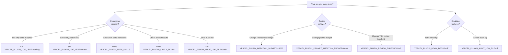
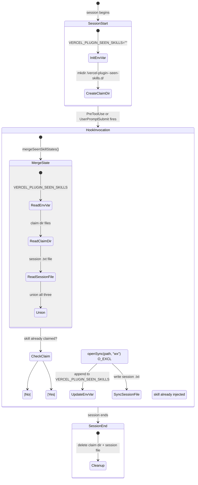

# 4. Operations & Debugging Guide

> **Audience**: Maintainers and contributors — anyone debugging skill injection, diagnosing issues, or operating the plugin in development.

This guide covers environment variable configuration, logging, the CLI diagnostic tools (`doctor` and `explain`), dedup troubleshooting, and session cleanup.

---

## Table of Contents

1. [Environment Variable Decision Tree](#environment-variable-decision-tree)
2. [Log Levels](#log-levels)
   - [off (default)](#off-default)
   - [summary](#summary)
   - [debug](#debug)
   - [trace](#trace)
3. [CLI: vercel-plugin explain](#cli-vercel-plugin-explain)
4. [CLI: vercel-plugin doctor](#cli-vercel-plugin-doctor)
5. [Dedup Troubleshooting](#dedup-troubleshooting)
   - [How Dedup Works](#how-dedup-works)
   - [Common Issues](#common-issues)
   - [Dedup Strategy Fallbacks](#dedup-strategy-fallbacks)
6. [Session Cleanup](#session-cleanup)
7. [User Story: Why Didn't My Skill Inject?](#user-story-why-didnt-my-skill-inject)
8. [Cross-References](#cross-references)

---

## Environment Variable Decision Tree

Rather than a flat table, use this decision tree to find the right variable for your situation:



### Complete Variable Reference

| Variable | Default | Category | Description |
|----------|---------|----------|-------------|
| `VERCEL_PLUGIN_LOG_LEVEL` | `off` | Debugging | Log verbosity: `off` / `summary` / `debug` / `trace` |
| `VERCEL_PLUGIN_DEBUG` | — | Debugging | Legacy: `1` maps to `debug` level |
| `VERCEL_PLUGIN_HOOK_DEBUG` | — | Debugging | Legacy: `1` maps to `debug` level |
| `VERCEL_PLUGIN_AUDIT_LOG_FILE` | — | Debugging | Path for audit log, or `off` to disable |
| `VERCEL_PLUGIN_SEEN_SKILLS` | `""` | State | Comma-delimited already-injected skills (managed by hooks) |
| `VERCEL_PLUGIN_LIKELY_SKILLS` | — | State | Profiler-detected skills (comma-delimited, +5 boost) |
| `VERCEL_PLUGIN_GREENFIELD` | — | State | `true` if project is empty (set by profiler) |
| `VERCEL_PLUGIN_TSX_EDIT_COUNT` | `0` | State | Current `.tsx` edit count (tracked by PreToolUse) |
| `VERCEL_PLUGIN_HOOK_DEDUP` | — | Control | `off` to disable dedup entirely |
| `VERCEL_PLUGIN_INJECTION_BUDGET` | `18000` | Tuning | PreToolUse byte budget |
| `VERCEL_PLUGIN_PROMPT_INJECTION_BUDGET` | `8000` | Tuning | UserPromptSubmit byte budget |
| `VERCEL_PLUGIN_REVIEW_THRESHOLD` | `3` | Tuning | TSX edits before react-best-practices injection |

---

## Log Levels

Logging is controlled by `VERCEL_PLUGIN_LOG_LEVEL` and outputs structured JSON to **stderr**. Each log entry includes an `invocationId`, event type, and timestamp.

### off (default)

No log output. Hooks run silently. Use this in production.

### summary

Shows high-level injection decisions — what was injected and why:

```json
{
  "invocationId": "abc123",
  "event": "complete",
  "hook": "pretooluse-skill-inject",
  "counts": {
    "matched": 4,
    "injected": 2,
    "deduped": 1,
    "capped": 1,
    "budgetDropped": 0
  },
  "injected": ["nextjs", "typescript"],
  "ts": 1710000000000
}
```

**When to use**: Quick check on what's being injected without noise.

### debug

Everything in `summary` plus:
- Skill routing decisions (why each skill was included/excluded)
- Priority calculations (base + vercel.json routing + profiler boost)
- Dedup state (which skills were already seen)
- Budget enforcement details (byte sizes, summary fallbacks)
- Pattern match details (which pattern matched which input)

```json
{
  "invocationId": "abc123",
  "event": "decision",
  "skill": "nextjs",
  "action": "inject",
  "reason": "pathPattern match: app/page.tsx",
  "effectivePriority": 10,
  "breakdown": { "base": 5, "profilerBoost": 5, "vercelJsonRouting": 0 },
  "bytes": 4200,
  "ts": 1710000000000
}
```

**When to use**: Understanding why a specific skill did or didn't inject.

### trace

Everything in `debug` plus:
- Every pattern test (including non-matches)
- YAML parsing steps
- File I/O operations
- Dedup claim operations
- Budget calculations per skill

**When to use**: Diagnosing parser bugs, pattern compilation issues, or performance bottlenecks. Very verbose.

---

## CLI: vercel-plugin explain

The `explain` command mirrors runtime matching logic exactly, showing which skills would match a target and whether they'd be injected within the budget.

### Usage

```bash
vercel-plugin explain <target> [options]

# Or via bun:
bun run scripts/explain.ts <target> [options]
```

### Options

| Flag | Description |
|------|-------------|
| `--file <path>` | Explicitly treat target as a file path |
| `--bash <command>` | Explicitly treat target as a bash command |
| `--json` | Machine-readable JSON output |
| `--project <path>` | Override plugin root directory |
| `--likely-skills s1,s2` | Simulate profiler boost for these skills |
| `--budget <bytes>` | Override injection budget (default: 12000) |

### Example: File path matching

```
$ vercel-plugin explain app/api/chat/route.ts

 Skill Matches for: app/api/chat/route.ts
 (detected as: file path)

 ┌─────────┬──────────┬───────────┬────────────────────────────┬───────────┐
 │ Skill   │ Priority │ Effective │ Matched Pattern            │ Injection │
 ├─────────┼──────────┼───────────┼────────────────────────────┼───────────┤
 │ ai-sdk  │ 8        │ 8         │ app/api/chat/** (file:full)│ full      │
 │ nextjs  │ 5        │ 5         │ app/** (file:full)         │ full      │
 │ ts-node │ 4        │ 4         │ **/*.ts (file:full)        │ dropped   │
 └─────────┴──────────┴───────────┴────────────────────────────┴───────────┘

 Budget: 2 of 3 skills injected (8,400 / 12,000 bytes)
 Dropped: ts-node (capped at 3 max skills)
```

### Example: Bash command matching

```
$ vercel-plugin explain --bash "next dev --turbo"

 Skill Matches for: next dev --turbo
 (detected as: bash command)

 ┌────────┬──────────┬───────────┬───────────────────────────────┬───────────┐
 │ Skill  │ Priority │ Effective │ Matched Pattern               │ Injection │
 ├────────┼──────────┼───────────┼───────────────────────────────┼───────────┤
 │ nextjs │ 5        │ 5         │ \bnext\s+(dev|build) (bash)   │ full      │
 └────────┴──────────┴───────────┴───────────────────────────────┴───────────┘

 Budget: 1 of 3 skills injected (4,200 / 12,000 bytes)
```

### Example: With profiler boost

```
$ vercel-plugin explain app/page.tsx --likely-skills nextjs

 ┌────────┬──────────┬───────────┬──────────────────┬───────────┐
 │ Skill  │ Priority │ Effective │ Matched Pattern  │ Injection │
 ├────────┼──────────┼───────────┼──────────────────┼───────────┤
 │ nextjs │ 5        │ 10        │ app/** (file)    │ full      │
 └────────┴──────────┴───────────┴──────────────────┴───────────┘

 Priority breakdown for nextjs: base(5) + profiler(+5) = 10
```

---

## CLI: vercel-plugin doctor

The `doctor` command runs self-diagnosis checks on the plugin installation.

### Usage

```bash
vercel-plugin doctor [options]

# Or via bun:
bun run doctor
```

### Options

| Flag | Description |
|------|-------------|
| `--json` | Machine-readable JSON output |
| `--project <path>` | Override plugin root directory |

### Checks Performed

| Check | What It Does | Failure Means |
|-------|-------------|---------------|
| **Skill validation** | Parses all `SKILL.md` frontmatter | Malformed YAML, missing required fields |
| **Build diagnostics** | Loads and validates skill map | Invalid patterns, deprecated fields |
| **Manifest parity** | Compares live scan vs `skill-rules.json` | Manifest is out of date — run `bun run build:manifest` |
| **Hook timeout risk** | Warns if skill/pattern count is high | >50 skills or >200 patterns may hit 5s timeout |
| **Dedup strategy** | Validates dedup env var format | Malformed `VERCEL_PLUGIN_SEEN_SKILLS` |
| **Subagent hooks** | Validates SubagentStart/Stop registration | Missing or misconfigured subagent hooks |

### Example Output

```
$ vercel-plugin doctor

 vercel-plugin doctor
 ─────────────────────────────

 ✓ 43 skills loaded, 0 errors
 ✓ Manifest matches live scan (43 skills)
 ✓ 187 total patterns (under 200 threshold)
 ✓ Dedup strategy: env-var (validated)
 ✓ 8 templates up-to-date
 ✓ Subagent hooks registered

 ⚠ Warnings:
   - skills/legacy-api: DEPRECATED_FIELD — filePattern is deprecated, use pathPatterns
   - Manifest drift: skills/new-feature missing from manifest
     Hint: Run `bun run build:manifest` to regenerate

 Summary: 0 errors, 2 warnings
```

---

## Dedup Troubleshooting

### How Dedup Works

The dedup system prevents the same skill from being injected twice in a Claude session. It uses three coordinated state sources:



### Common Issues

**Skill injecting twice (dedup not working)**:
1. Check `VERCEL_PLUGIN_SEEN_SKILLS` — is it being set? Run with `VERCEL_PLUGIN_LOG_LEVEL=debug` to see dedup state.
2. Check the claim directory exists: `ls /tmp/vercel-plugin-*-seen-skills.d/`
3. Check for stale claim dirs from crashed sessions: `ls -la /tmp/vercel-plugin-*`
4. Verify `session-start-seen-skills.mjs` ran (check SessionStart in logs)

**Skill not injecting (dedup too aggressive)**:
1. Check if the skill is in `VERCEL_PLUGIN_SEEN_SKILLS` — it may have been injected earlier in the session
2. Check the claim dir for an existing claim file for that skill
3. Run `VERCEL_PLUGIN_HOOK_DEDUP=off` to temporarily disable dedup and confirm the skill matches

**Stale temp files after crash**:
1. `session-end-cleanup.mjs` normally handles this, but crashes can leave orphans
2. Safe to manually delete: `rm -rf /tmp/vercel-plugin-*`

### Dedup Strategy Fallbacks

The dedup system tries strategies in order, falling back on failure:

| Strategy | How | When |
|----------|-----|------|
| **file** (preferred) | Atomic file claims via `O_EXCL` | Default — works when `/tmp` is writable |
| **env-var** | Reads/writes `VERCEL_PLUGIN_SEEN_SKILLS` | Fallback when claim dir fails |
| **memory-only** | In-process Set | Single hook invocation (no cross-hook persistence) |
| **disabled** | No dedup | `VERCEL_PLUGIN_HOOK_DEDUP=off` |

Run `vercel-plugin doctor` to see which strategy is active.

---

## Session Cleanup

The `session-end-cleanup.mjs` hook runs at SessionEnd and removes all session-scoped temporary files:

- **Claim directories**: `<tmpdir>/vercel-plugin-<sessionId>-seen-skills.d/`
- **Pending launch dirs**: `<tmpdir>/vercel-plugin-<sessionId>-pending-launches/`
- **Session files**: `<tmpdir>/vercel-plugin-<sessionId>-seen-skills.txt`

**Safety**: The hook validates session IDs (alphanumeric, underscore, dash only) and SHA-256 hashes unsafe IDs before using them in file paths. Cleanup failures are silently ignored — the hook always exits 0.

---

## User Story: Why Didn't My Skill Inject?

> **Scenario**: You added a new skill `edge-config` but it's not showing up when you edit `edge-config.json`.

**Step 1**: Check if the skill is in the manifest.

```bash
bun run doctor
# Look for: "Manifest drift: edge-config missing from manifest"
```

If missing, rebuild: `bun run build:manifest`

**Step 2**: Check if the pattern matches.

```bash
bun run scripts/explain.ts --file edge-config.json
# Should show edge-config in the results
```

If not matching, check your `pathPatterns` — maybe you need `"edge-config.*"` instead of `"edge-config.json"`.

**Step 3**: Check if it was already injected (dedup).

```bash
# In your Claude session, check the env:
echo $VERCEL_PLUGIN_SEEN_SKILLS
# If edge-config is listed, it was already injected earlier
```

**Step 4**: Check if it was dropped by budget.

```bash
bun run scripts/explain.ts --file edge-config.json --budget 18000
# Look at the "Injection" column — "dropped" means budget exceeded
```

If dropped, consider:
- Increasing priority (up to 8)
- Adding a concise `summary` for summary fallback
- Reducing the skill body size

**Step 5**: Enable debug logging for full visibility.

```bash
export VERCEL_PLUGIN_LOG_LEVEL=debug
# Now open Claude Code — check stderr for decision logs
```

The debug output shows exactly why each skill was included or excluded, with priority breakdowns and budget calculations.

---

## Cross-References

- **[Architecture Overview](./01-architecture-overview.md)** — System diagram, hook lifecycle, glossary
- **[Injection Pipeline Deep-Dive](./02-injection-pipeline.md)** — Pattern matching, ranking, budget enforcement internals
- **[Skill Authoring Guide](./03-skill-authoring.md)** — Creating skills, frontmatter schema, YAML parser gotchas
