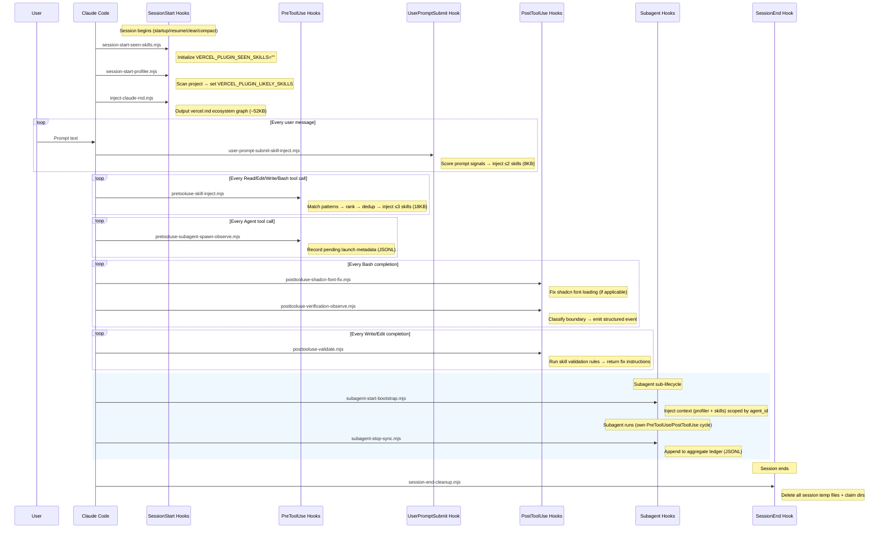
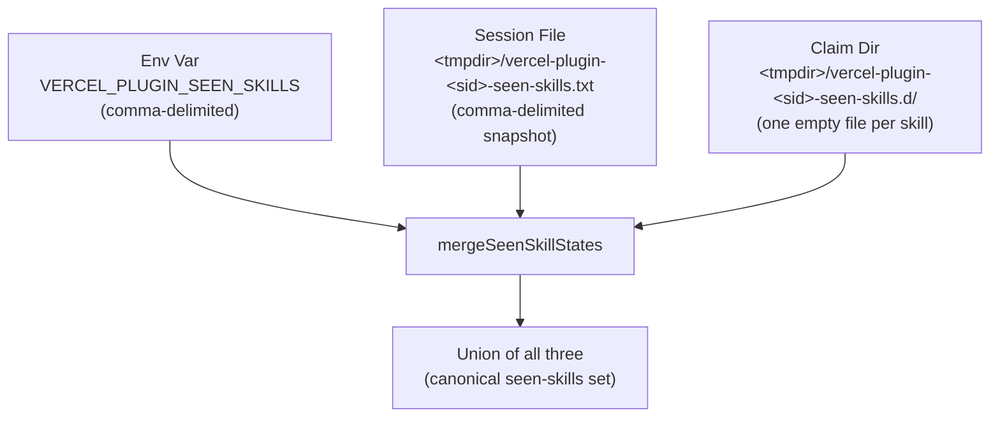
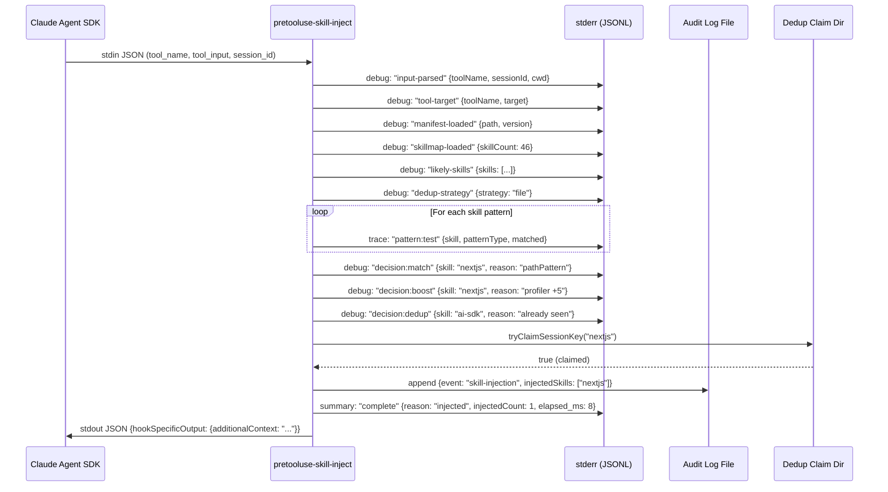
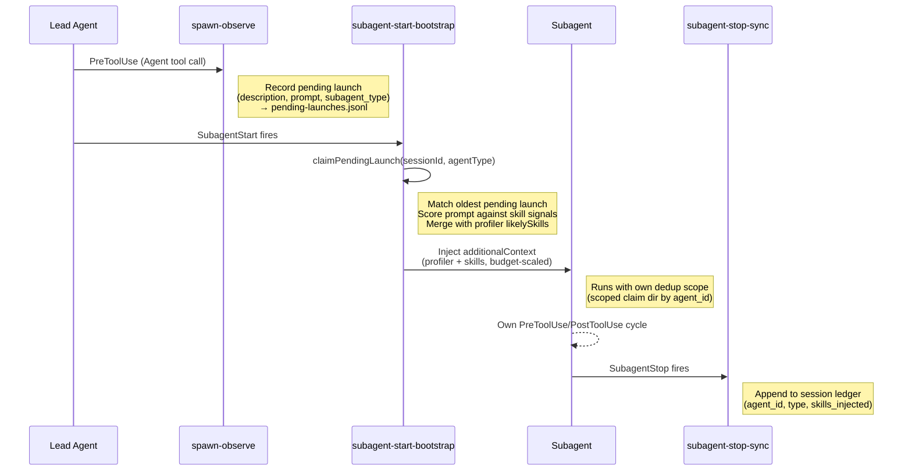

# 6. Runtime Internals Reference

> **Purpose**: Document the internal implementation details — hook I/O contracts, matching semantics, dedup state machines, audit log schemas, subagent coordination, and temp file ownership — at the code level.
>
> **Audience**: Maintainers and contributors who need to understand the internal mechanics of hook execution, pattern compilation, dedup state machines, subagent coordination, and observability infrastructure.
>
> **Prerequisites**: [01 Architecture Overview](./01-architecture-overview.md), [02 Injection Pipeline](./02-injection-pipeline.md), and [04 Operations & Debugging](./04-operations-debugging.md).
>
> **Previous page**: [← Reference](./05-reference.md) · This is the final page in the documentation.

This document covers implementation details that go beyond the pipeline overview in [02-injection-pipeline.md](./02-injection-pipeline.md) and the operational guide in [04-operations-debugging.md](./04-operations-debugging.md). Where those documents explain *what* happens, this document explains *how* and *why* at the code level.

---

## Table of Contents

1. [Session Lifecycle: Full Hook Invocation Sequence](#session-lifecycle-full-hook-invocation-sequence)
   - [Hook Registration Summary](#hook-registration-summary)
   - [Hook I/O Contracts](#hook-io-contracts)
2. [Matching Semantics](#matching-semantics)
   - [Glob-to-Regex Conversion](#glob-to-regex-conversion)
   - [Path Match Fallback Chain](#path-match-fallback-chain)
   - [Import Pattern Compilation and Flags](#import-pattern-compilation-and-flags)
   - [Bash Regex Matching](#bash-regex-matching)
   - [Manifest Pre-compilation (Version 2)](#manifest-pre-compilation-version-2)
3. [Intent Routing and Priority Arithmetic](#intent-routing-and-priority-arithmetic)
   - [Base Priority Range (4–8)](#base-priority-range-48)
   - [Profiler Boost (+5)](#profiler-boost-5)
   - [Vercel.json Key Routing (±10)](#verceljson-key-routing-10)
   - [Special-Case Boosts](#special-case-boosts)
   - [Route-Scoped Verified Policy Recall](#route-scoped-verified-policy-recall)
   - [Ranking Function](#ranking-function)
   - [Budget Enforcement](#budget-enforcement)
   - [Prompt Signal Scoring](#prompt-signal-scoring)
4. [Scoped Dedup System](#scoped-dedup-system)
   - [Three-Tier State Architecture](#three-tier-state-architecture)
   - [Atomic Claim Protocol](#atomic-claim-protocol)
   - [Scope Isolation for Subagents](#scope-isolation-for-subagents)
   - [State Merge Logic](#state-merge-logic)
   - [Strategy Cascade](#strategy-cascade)
   - [Path Safety and Sanitization](#path-safety-and-sanitization)
5. [Audit Logging and Observability](#audit-logging-and-observability)
   - [Audit Log File (JSONL)](#audit-log-file-jsonl)
   - [Audit Log JSONL Schema](#audit-log-jsonl-schema)
   - [Structured Logger (stderr)](#structured-logger-stderr)
   - [Log Level Resolution](#log-level-resolution)
   - [Log Event Taxonomy](#log-event-taxonomy)
   - [End-to-End Trace: Single Request Flow](#end-to-end-trace-single-request-flow)
6. [Subagent Lifecycle](#subagent-lifecycle)
   - [Spawn Observation (PreToolUse → Agent)](#spawn-observation-pretooluse--agent)
   - [Bootstrap Injection (SubagentStart)](#bootstrap-injection-subagentstart)
   - [Stop Sync and Ledger (SubagentStop)](#stop-sync-and-ledger-subagentstopmts)
   - [Fresh-Env Behavior](#fresh-env-behavior)
7. [Verification Observer](#verification-observer)
   - [Boundary Classification](#boundary-classification)
   - [Route Inference](#route-inference)
   - [Event Structure](#event-structure)
8. [Post-Write Validation](#post-write-validation)
   - [Validation Pipeline](#validation-pipeline)
   - [File-Hash Dedup](#file-hash-dedup)
9. [Session Cleanup](#session-cleanup)
10. [Temp File Inventory](#temp-file-inventory)

---

## Session Lifecycle: Full Hook Invocation Sequence

The following diagram shows every hook that fires across a complete session, including the subagent sub-lifecycle. Hooks are registered in `hooks/hooks.json` and executed by the Claude Agent SDK runtime.



### Hook Registration Summary

| Event | Hook File | Matcher | Timeout |
|-------|-----------|---------|---------|
| SessionStart | `session-start-seen-skills.mjs` | `startup\|resume\|clear\|compact` | — |
| SessionStart | `session-start-profiler.mjs` | `startup\|resume\|clear\|compact` | — |
| SessionStart | `inject-claude-md.mjs` | `startup\|resume\|clear\|compact` | — |
| PreToolUse | `pretooluse-skill-inject.mjs` | `Read\|Edit\|Write\|Bash` | 5 s |
| PreToolUse | `pretooluse-subagent-spawn-observe.mjs` | `Agent` | 5 s |
| UserPromptSubmit | `user-prompt-submit-skill-inject.mjs` | *(empty — all prompts)* | 5 s |
| PostToolUse | `posttooluse-shadcn-font-fix.mjs` | `Bash` | 5 s |
| PostToolUse | `posttooluse-verification-observe.mjs` | `Bash` | 5 s |
| PostToolUse | `posttooluse-validate.mjs` | `Write\|Edit` | 5 s |
| SubagentStart | `subagent-start-bootstrap.mjs` | `.+` | 5 s |
| SubagentStop | `subagent-stop-sync.mjs` | `.+` | 5 s |
| SessionEnd | `session-end-cleanup.mjs` | — | — |

All hooks output JSON conforming to `SyncHookJSONOutput` from `@anthropic-ai/claude-agent-sdk`. Observer hooks (spawn-observe, verification-observe, stop-sync) output empty `{}`.

### Hook I/O Contracts

Every hook reads JSON from **stdin** and writes JSON to **stdout**. The Claude Agent SDK provides the stdin envelope; hooks must return a `SyncHookJSONOutput`-conforming object. This section documents the exact shapes for each hook.

#### Common Stdin Fields

Most hooks receive these fields from the SDK (availability varies by event):

| Field | Type | Availability | Description |
|-------|------|-------------|-------------|
| `tool_name` | `string` | PreToolUse, PostToolUse | The tool being invoked (`Read`, `Edit`, `Write`, `Bash`, `Agent`) |
| `tool_input` | `object` | PreToolUse, PostToolUse | Tool-specific arguments (e.g., `file_path`, `command`) |
| `session_id` | `string?` | All events | Session identifier; fallback: `SESSION_ID` env var |
| `cwd` | `string?` | PreToolUse, PostToolUse, UserPromptSubmit | Working directory; fallback: `working_directory` field |
| `agent_id` | `string?` | PreToolUse, SubagentStart, SubagentStop | Agent identifier for subagent-scoped dedup |
| `prompt` | `string` | UserPromptSubmit | User's prompt text |
| `agent_type` | `string?` | SubagentStart, SubagentStop | Agent type label (e.g., `general-purpose`, `Explore`) |

#### SessionStart Hooks

**`session-start-seen-skills.mjs`** — No stdin parsing. Appends `export VERCEL_PLUGIN_SEEN_SKILLS=""` to `CLAUDE_ENV_FILE`. No stdout.

**`session-start-profiler.mjs`** — Reads `session_id` from stdin (optional). Scans project files and writes results to `CLAUDE_ENV_FILE`:

```bash
# Environment variables appended:
export VERCEL_PLUGIN_AGENT_BROWSER_AVAILABLE="0"  # or "1"
export VERCEL_PLUGIN_GREENFIELD="true"             # if empty project
export VERCEL_PLUGIN_LIKELY_SKILLS="nextjs,ai-sdk,vercel-storage"
export VERCEL_PLUGIN_BOOTSTRAP_HINTS="env-template,readme"
export VERCEL_PLUGIN_RESOURCE_HINTS="postgres,kv"
export VERCEL_PLUGIN_SETUP_MODE="1"                # if ≥3 bootstrap hints
```

Also writes a profile cache to `<tmpdir>/vercel-plugin-<sessionId>-profile.json`:

```json
{
  "projectRoot": "/path/to/project",
  "likelySkills": ["nextjs", "ai-sdk"],
  "greenfield": false,
  "bootstrapHints": ["env-template"],
  "resourceHints": ["postgres"],
  "setupMode": false,
  "agentBrowserAvailable": true,
  "timestamp": "2026-03-10T12:00:00.000Z"
}
```

**`inject-claude-md.mjs`** — No stdin. Writes plain markdown text to stdout (the `vercel.md` ecosystem graph, ~52 KB). If `VERCEL_PLUGIN_GREENFIELD=true`, appends a greenfield guidance section.

#### PreToolUse: `pretooluse-skill-inject.mjs`

**Stdin:**

```json
{
  "tool_name": "Read",
  "tool_input": {
    "file_path": "src/app/page.tsx",
    "content": "..."
  },
  "session_id": "abc-123",
  "cwd": "/path/to/project",
  "agent_id": "def-456"
}
```

For Bash tools, `tool_input.command` replaces `file_path`. The `agent_id` field is present only for subagents.

**Stdout (skill injected):**

```json
{
  "hookSpecificOutput": {
    "hookEventName": "PreToolUse",
    "additionalContext": "<!-- skill:nextjs -->\n...skill body...\n<!-- /skill:nextjs -->\n<!-- skillInjection: {\"version\":1,...} -->"
  }
}
```

**Stdout (no match):**

```json
{}
```

**Embedded metadata comment** (inside `additionalContext`):

```json
{
  "version": 1,
  "toolName": "Read",
  "toolTarget": "src/app/page.tsx",
  "matchedSkills": ["nextjs", "react-best-practices"],
  "injectedSkills": ["nextjs"],
  "summaryOnly": [],
  "droppedByCap": [],
  "droppedByBudget": ["react-best-practices"],
  "reasons": {
    "nextjs": {
      "trigger": "pattern-match",
      "reasonCode": "pathPattern matched: app/**/page.tsx"
    }
  }
}
```

For Bash tool calls, `toolTarget` is redacted for security.

#### PreToolUse: `pretooluse-subagent-spawn-observe.mjs`

**Stdin:**

```json
{
  "tool_name": "Agent",
  "tool_input": {
    "name": "researcher",
    "description": "Research API patterns",
    "prompt": "Find all API routes...",
    "subagent_type": "Explore",
    "resume": null
  },
  "session_id": "abc-123"
}
```

**Stdout:** Always `{}` (observer only). Records a pending launch to `<tmpdir>/vercel-plugin-<sessionId>-pending-launches.jsonl`.

#### UserPromptSubmit: `user-prompt-submit-skill-inject.mjs`

**Stdin:**

```json
{
  "prompt": "my deploy keeps failing with a timeout error",
  "session_id": "abc-123",
  "cwd": "/path/to/project"
}
```

Prompts shorter than 10 characters are rejected immediately.

**Stdout (skill injected):**

```json
{
  "hookSpecificOutput": {
    "hookEventName": "UserPromptSubmit",
    "additionalContext": "<!-- skill:deployments-cicd -->\n...body...\n<!-- /skill:deployments-cicd -->\n<!-- skillInjection: {\"version\":1,...} -->"
  }
}
```

**Stdout (no match):** `{}`

#### PostToolUse: `posttooluse-verification-observe.mjs`

**Stdin:**

```json
{
  "tool_name": "Bash",
  "tool_input": { "command": "curl http://localhost:3000/api/users" },
  "session_id": "abc-123",
  "cwd": "/path/to/project"
}
```

**Stdout:** Always `{}` (observer only). Emits a `verification.boundary_observed` log event to stderr.

#### PostToolUse: `posttooluse-validate.mjs`

**Stdin:**

```json
{
  "tool_name": "Write",
  "tool_input": { "file_path": "src/app/api/route.ts" },
  "session_id": "abc-123",
  "cwd": "/path/to/project"
}
```

**Stdout (violations found):**

```json
{
  "hookSpecificOutput": {
    "hookEventName": "PostToolUse",
    "additionalContext": "⚠️ Validation issues...\n<!-- postValidation: {\"version\":1,\"hook\":\"posttooluse-validate\",\"filePath\":\"...\",\"matchedSkills\":[...],\"errorCount\":1,\"warnCount\":0} -->"
  }
}
```

**Stdout (no violations):** `{}`

#### SubagentStart: `subagent-start-bootstrap.mjs`

**Stdin:**

```json
{
  "session_id": "abc-123",
  "cwd": "/path/to/project",
  "agent_id": "def-456",
  "agent_type": "general-purpose"
}
```

**Stdout:**

```json
{
  "hookSpecificOutput": {
    "hookEventName": "SubagentStart",
    "additionalContext": "<!-- vercel-plugin:subagent-bootstrap ... -->\n...profile + skill content..."
  }
}
```

Content is budget-scaled by agent type: Explore (~1 KB), Plan (~3 KB), general-purpose (~8 KB).

#### SubagentStop: `subagent-stop-sync.mjs`

**Stdin:**

```json
{
  "session_id": "abc-123",
  "agent_id": "def-456",
  "agent_type": "general-purpose",
  "agent_transcript_path": "/path/to/transcript"
}
```

**Stdout:** No output. Appends a ledger entry to `<tmpdir>/vercel-plugin-<sessionId>-subagent-ledger.jsonl`.

#### SessionEnd: `session-end-cleanup.mjs`

**Stdin:** `{ "session_id": "abc-123" }` (optional)

**Stdout:** No output. Deletes all `vercel-plugin-<sessionId>-*` files/dirs from `tmpdir()`.

---

## Matching Semantics

The injection engine uses three distinct pattern types. Each compiles differently and has different matching behavior.

### Glob-to-Regex Conversion

**Source**: `hooks/src/patterns.mts` → `globPatternToRegexSource()`

The plugin uses a custom glob-to-regex converter (no external dependencies). Conversion rules:

| Glob Token | Regex Output | Semantics |
|------------|-------------|-----------|
| `*` | `[^/]*` | Any characters except path separators |
| `**/` | `(?:[^/]+/)*` | Zero or more path segments (with boundary) |
| `**` (at end) | `.*` | Everything including slashes |
| `?` | `[^/]` | Single non-slash character |
| `{a,b,c}` | `(?:a\|b\|c)` | Alternation (requires commas) |
| `.` `(` `)` `+` etc. | `\.` `\(` `\)` `\+` | Escaped metacharacters |

The final regex is anchored: `^…pattern…$` (full-path match).

**Edge cases**:
- Empty patterns are rejected with an error
- Brace groups without commas are treated as literal `{}`
- Nested braces are handled recursively

### Path Match Fallback Chain

**Source**: `hooks/src/patterns.mts` → `matchPathWithReason()`

Path matching uses a three-step fallback strategy, stopping at the first hit:

```
1. Full-path match     e.g., "src/components/Button.tsx" vs "src/**/*.tsx"
       ↓ (no match)
2. Basename-only match e.g., "Button.tsx" vs "*.tsx"
       ↓ (no match)
3. Suffix segment scan e.g., try "Button.tsx", then "components/Button.tsx", etc.
```

All paths are normalized (backslashes → forward slashes) before matching.

### Import Pattern Compilation and Flags

**Source**: `hooks/src/patterns.mts` → `importPatternToRegex()`

Import patterns start as package names (e.g., `@vercel/postgres`) and compile to a regex that matches ESM, CommonJS, and dynamic imports:

```
(?:from\s+|require\s*\(\s*|import\s*\(\s*)['"]<escaped-package>(?:/[^'"]*)?['"]
```

This matches:
- ESM: `from 'package'` or `from "package"`
- CommonJS: `require('package')` or `require( 'package' )`
- Dynamic: `import('package')` or `import( 'package' )`
- Subpaths: `'package/subpath'` (via optional `(?:/[^'"]*)?`)

**Flags**: Hardcoded `"m"` (multiline) — enables `^`/`$` to match line boundaries. Case-sensitive by default.

Wildcards in patterns (`*`) expand to `[^'"]*` (any non-quote characters).

### Bash Regex Matching

**Source**: `hooks/src/patterns.mts` → `matchBashWithReason()`

Bash patterns are **raw JavaScript RegExp strings** — no transformation or escaping. They are passed directly to `new RegExp(p)`.

- Single-pass: tests each pattern against the full command string
- Returns on first match — no fallback strategies (unlike path matching)
- Invalid regex syntax throws at compile time

### Manifest Pre-compilation (Version 2)

**Source**: `scripts/build-manifest.ts` → `compileRegexSources()`

The manifest pre-compiles all patterns at build time to avoid runtime regex compilation in the hot path. The version 2 format uses **paired arrays** — index `i` in the pattern array corresponds to index `i` in the regex-source array:

```json
{
  "version": 2,
  "skills": {
    "skill-slug": {
      "priority": 6,
      "pathPatterns":      ["**/*.tsx"],
      "pathRegexSources":  ["^(?:[^/]+\\/)*[^/]*\\.tsx$"],
      "bashPatterns":      ["npm run dev"],
      "bashRegexSources":  ["npm run dev"],
      "importPatterns":    ["next"],
      "importRegexSources": [{ "source": "...", "flags": "m" }]
    }
  }
}
```

If a pattern fails to compile, it is dropped from **both** arrays together, preventing index desynchronization.

At runtime, `compileSkillPatterns(skillMap)` creates `CompiledPattern { pattern: string, regex: RegExp }` objects from the manifest. Compilation errors are reported via callbacks (`onPathGlobError`, `onBashRegexError`, `onImportPatternError`) but never crash the hook.

---

## Intent Routing and Priority Arithmetic

Every matched skill receives an **effective priority** computed from its base priority plus contextual adjustments. The following table shows all modifiers:

| Mechanism | Adjustment | Scope | Condition |
|-----------|-----------|-------|-----------|
| Base priority | 4–8 | All skills | Static in `SKILL.md` frontmatter |
| Profiler boost | **+5** | `VERCEL_PLUGIN_LIKELY_SKILLS` | Skill detected by project profiler |
| Vercel.json (match) | **+10** | 4 routing skills | Skill's key found in `vercel.json` |
| Vercel.json (no match) | **−10** | 4 routing skills | Skill's key absent from `vercel.json` |
| Setup-mode bootstrap | **+50** | `bootstrap` skill | Greenfield or ≥3 bootstrap hints |
| TSX review trigger | **+40** | `react-best-practices` | After N `.tsx` edits (default 3) |
| Dev-server verify | **+45** | `agent-browser-verify` | Dev server command detected |
| Policy recall | *splice at idx 1* | Any verified skill | Active story + target boundary + policy evidence |

### Base Priority Range (4–8)

Every skill declares a `metadata.priority` between 4 and 8 in its `SKILL.md` frontmatter. Higher values indicate the skill is more broadly useful or more critical to inject early.

### Profiler Boost (+5)

**Source**: `hooks/src/session-start-profiler.mts`

At SessionStart, the profiler scans the project for:

1. **File markers** (14 patterns): `next.config.js/mjs/ts/mts`, `turbo.json`, `vercel.json`, `.mcp.json`, `middleware.ts/js`, `components.json`, `.env.local`, `pnpm-workspace.yaml`
2. **Package dependencies** (~20 mapped): `next`, `ai`, `@ai-sdk/*`, `@vercel/*` (blob, kv, postgres, edge-config, analytics, speed-insights, flags, workflow, queue, sandbox, sdk), `turbo`, `@t3-oss/env-nextjs`
3. **Vercel.json keys**: `crons`, `rewrites`, `redirects`, `headers`, `functions`
4. **Bootstrap signals** (11 patterns): env templates, README, drizzle/prisma configs, setup scripts, auth/resource dependencies

Results are written to:
- `VERCEL_PLUGIN_LIKELY_SKILLS` — comma-delimited skill list
- `VERCEL_PLUGIN_GREENFIELD=true` — if project is empty/new
- `VERCEL_PLUGIN_BOOTSTRAP_HINTS` — setup signal names
- `VERCEL_PLUGIN_RESOURCE_HINTS` — resource dependency names
- `VERCEL_PLUGIN_SETUP_MODE=1` — if ≥3 bootstrap hints detected

The `observability` skill is always added for non-greenfield projects.

### Vercel.json Key Routing (±10)

**Source**: `hooks/src/vercel-config.mts`

Only applies to four skills: `cron-jobs`, `deployments-cicd`, `routing-middleware`, `vercel-functions`.

The key-to-skill mapping:

| vercel.json Key | Skill |
|----------------|-------|
| `redirects`, `rewrites`, `headers`, `cleanUrls`, `trailingSlash` | `routing-middleware` |
| `crons` | `cron-jobs` |
| `functions`, `regions` | `vercel-functions` |
| `builds`, `buildCommand`, `installCommand`, `outputDirectory`, `framework`, `devCommand`, `ignoreCommand` | `deployments-cicd` |

If the skill's associated key **exists** in `vercel.json` → +10. If the skill is one of the four routing skills but its key is **absent** → −10.

### Special-Case Boosts

- **Setup-mode bootstrap (+50)**: When `VERCEL_PLUGIN_SETUP_MODE=1`, the `bootstrap` skill receives `max(basePriority + 50, maxOtherPriority + 1)`, ensuring it always ranks first.
- **TSX review trigger (+40)**: After `VERCEL_PLUGIN_REVIEW_THRESHOLD` (default 3) `.tsx` edits, injects `react-best-practices` with a +40 boost. Counter resets after injection.
- **Dev-server verify (+45)**: On `npm run dev`, `next dev`, `vercel dev`, etc., injects `agent-browser-verify` + `verification` companion. Capped at 2 injections per session (loop guard).
- **Vercel env help**: One-time injection when `vercel env add/update/pull` commands are detected.

### Route-Scoped Verified Policy Recall

**Source**: `hooks/src/policy-recall.mts` → `selectPolicyRecallCandidates()`

Policy recall is a **post-ranking injection stage** (Stage 4.95) that fires between ranking and skill body loading. It is fundamentally different from policy boosts:

| Aspect | Policy Boost | Policy Recall |
|--------|-------------|---------------|
| Input | Skill already matched by patterns | Skill **not** matched by patterns |
| Effect | Adjusts `effectivePriority` | Splices skill into `rankedSkills` array |
| Trace field | `policyBoost` (number) | `synthetic: true`, `pattern.type: "policy-recall"` |
| Reason code | `"policy-boost"` | `"route-scoped-verified-policy-recall"` |
| Trigger | Always (when policy data exists) | Only when active verification story + target boundary exist |

**Selector algorithm** (`selectPolicyRecallCandidates`):

1. Generate scenario key candidates via `scenarioKeyCandidates()` — exact route, wildcard (`*`), legacy 4-part key
2. For each candidate key (in precedence order), look up the policy bucket
3. Filter entries: `exposures >= 3`, `successRate >= 0.65`, `policyBoost >= 2`, not in `excludeSkills`
4. Sort: `recallScore` DESC → `exposures` DESC → `skill` ASC
5. Return first qualifying bucket's top `maxCandidates` entries (default 1) — no cross-bucket merging

**Recall score formula**:
```
recallScore = derivePolicyBoost(stats) × 1000
            + round(successRate × 100) × 10
            + directiveWins × 5
            + wins
            − staleMisses
```

Where `successRate = (wins + directiveWins × 0.25) / max(exposures, 1)`.

**Insertion semantics**: The recalled skill is spliced at `index = rankedSkills.length > 0 ? 1 : 0`, ensuring it never preempts the strongest direct match. It then flows through normal budget enforcement and cap logic.

**Synthetic trace marking**: All recalled skills are added to the `syntheticSkills` set and appear in the routing decision trace with:
```json
{
  "skill": "<name>",
  "synthetic": true,
  "pattern": { "type": "policy-recall", "value": "route-scoped-verified-policy-recall" },
  "summaryOnly": false
}
```

**Log events**:
- `policy-recall-injected` (debug): Emitted per recalled skill with `skill`, `scenario`, `insertionIndex`, `exposures`, `wins`, `directiveWins`, `successRate`, `policyBoost`, `recallScore`
- `policy-recall-skipped` (debug): Emitted when preconditions fail, with `reason`: `"no_active_verification_story"` or `"no_target_boundary"`
- `policy-recall-lookup` (debug): Emitted before any recalled skill is inserted, with `requestedScenario`, `checkedScenarios[]`, `selectedBucket`, `selectedSkills[]`, `rejected[]`, and `hintCodes[]`

### Routing Doctor (`session-explain --json`)

`session-explain` includes an additive `doctor` object that explains the latest routing decision without changing routing behavior.

```json
{
  "doctor": {
    "latestDecisionId": "abc123",
    "latestScenario": "PreToolUse|flow-verification|clientRequest|Bash|/settings",
    "latestRanked": [],
    "policyRecall": {
      "selectedBucket": "PreToolUse|flow-verification|clientRequest|Bash|/settings",
      "selected": [],
      "rejected": [],
      "hints": []
    },
    "hints": []
  }
}
```

The contract is additive-only and intended for downstream agents, CI diagnostics, and local operator debugging.

### Ranking Function

**Source**: `hooks/src/patterns.mts` → `rankEntries()`

After all priority adjustments:

```
Sort by: effectivePriority DESC → base priority DESC → skill name ASC (tiebreaker)
```

### Budget Enforcement

Two independent budgets:

| Hook | Max Skills | Max Bytes | Env Override |
|------|-----------|-----------|-------------|
| PreToolUse | 5 | 18,000 | `VERCEL_PLUGIN_INJECTION_BUDGET` |
| UserPromptSubmit | 2 | 8,000 | `VERCEL_PLUGIN_PROMPT_INJECTION_BUDGET` |

Enforcement logic in `injectSkills()`:
1. The first matched skill is **always** injected in full (never dropped)
2. Subsequent skills are checked against remaining budget
3. If full body exceeds budget but a `summary` exists → inject summary instead (wrapped in `<!-- skill:name mode:summary -->` markers)
4. If neither fits → skill is dropped entirely

Return metadata categorizes every matched skill into: `loaded`, `summaryOnly`, `droppedByCap`, or `droppedByBudget`.

### Prompt Signal Scoring

**Source**: `hooks/src/prompt-patterns.mts` → `matchPromptWithReason()`

Prompt text is normalized (lowercased, contractions expanded, whitespace collapsed) then scored:

| Signal Type | Points | Semantics |
|-------------|--------|-----------|
| `phrases` | **+6** each | Exact substring match (case-insensitive) |
| `allOf` | **+4** per group | All terms in group must match |
| `anyOf` | **+1** each, **cap +2** | Any term matches, capped total |
| `noneOf` | **−∞** | Hard suppress (score → `-Infinity`) |

Default `minScore`: 6. A skill is matched if `score >= minScore`.

**Lexical fallback** (`scorePromptWithLexical()`): If exact scoring fails to reach threshold, a lexical skill index is searched with an adaptive boost multiplier:
- `1.5×` if exact score = 0 (no signal overlap at all)
- `1.35×` if exact score > 0 but < `minScore/2` (weak signal)
- `1.1×` if exact score ≥ `minScore/2` but < `minScore` (near-threshold)

**Troubleshooting intent routing** (`classifyTroubleshootingIntent()`): Three detection families:
- **Browser-only** (blank page, white screen, console errors) → `agent-browser-verify` + `investigation-mode`
- **Flow-verification** ("X but Y" patterns — loads but, submits but) → `verification`
- **Stuck-investigation** (hung, frozen, timeout, spinning) → `investigation-mode`

Test framework mentions (`jest|vitest|playwright test|cypress test|mocha|karma|testing library`) suppress all verification-family skills.

---

## Scoped Dedup System

The dedup system prevents the same skill from being injected twice in a session. It must handle concurrent hook invocations, subagent isolation, and env-var race conditions.

### Three-Tier State Architecture



| Tier | Storage | Persistence | Concurrency |
|------|---------|-------------|-------------|
| Env var | `VERCEL_PLUGIN_SEEN_SKILLS` | Process lifetime | Race-prone across hooks |
| Session file | `…-seen-skills.txt` | Disk (session-scoped) | Overwrite-last-wins |
| Claim dir | `…-seen-skills.d/` | Disk (session-scoped) | **Atomic** via O_EXCL |

### Atomic Claim Protocol

**Source**: `hooks/src/hook-env.mts` → `tryClaimSessionKey()`

```typescript
openSync(path, "wx")  // O_CREAT | O_EXCL — fails if file exists
```

- Creates an empty file named `encodeURIComponent(skillSlug)` inside the claim dir
- Returns `true` on success (skill claimed), `false` on EEXIST (already claimed)
- Prevents concurrent hook invocations from double-injecting the same skill
- `syncSessionFileFromClaims()` reads the claim dir and writes a comma-delimited snapshot to the session file

### Scope Isolation for Subagents

Each agent gets its own dedup scope identified by `agent_id` (or `"main"` for the lead agent):

```
Lead agent:    vercel-plugin-<sessionId>-seen-skills.d/
Subagent A:    vercel-plugin-<sessionId>-<agentAHash>-seen-skills.d/
Subagent B:    vercel-plugin-<sessionId>-<agentBHash>-seen-skills.d/
```

This means:
- Subagents can re-inject skills that the lead agent already claimed
- Sibling subagents can re-inject each other's skills
- Only claims within the same scope prevent re-injection

### State Merge Logic

**Source**: `hooks/src/patterns.mts` → `mergeScopedSeenSkillStates()`

```
if (scopeId === "main"):
    merge(envValue, fileValue, claimValue)     // All three tiers
else:
    merge(fileValue, claimValue)               // Exclude parent env var
```

Subagents exclude the env var because it contains the **parent's** accumulated state — using it would suppress skills the subagent hasn't seen yet.

### Strategy Cascade

The dedup system selects a strategy based on available infrastructure:

```
1. "file"        — Atomic claim dir (preferred, survives across invocations)
       ↓ (tmpdir unavailable or errors)
2. "env-var"     — VERCEL_PLUGIN_SEEN_SKILLS only (fallback, race-prone)
       ↓ (env var unavailable)
3. "memory-only" — In-process Set (single invocation only)
       ↓ (explicit opt-out)
4. "disabled"    — VERCEL_PLUGIN_HOOK_DEDUP=off (no dedup at all)
```

Strategy selection is logged at `debug` level for diagnostics.

### Path Safety and Sanitization

All temp file paths are validated:
1. Session IDs matching `^[a-zA-Z0-9_-]+$` are used directly
2. Unsafe IDs are SHA256-hashed to prevent path traversal
3. Skill keys in claim filenames use `encodeURIComponent()`
4. Resolved paths are verified to stay within `tmpdir()` — an error is thrown on escape attempts

All dedup file I/O functions **swallow errors silently** (try/catch, stderr logging only at debug level). This prevents hook timeouts from transient filesystem issues.

---

## Audit Logging and Observability

Two independent logging systems capture runtime behavior: a persistent **audit log file** (JSONL on disk) and ephemeral **structured logging** (JSON to stderr). This section documents both systems, provides the formal JSONL schema, and catalogs every log event.

### Audit Log File (JSONL)

**Source**: `hooks/src/hook-env.mts` → `appendAuditLog()`

A JSONL file (one JSON object per line) recording every skill injection decision. This is the only persistent record of plugin behavior across sessions.

**Path resolution priority**:
1. `VERCEL_PLUGIN_AUDIT_LOG_FILE` env var (relative to project root)
2. If set to `"off"` → disabled
3. Default: `~/.claude/projects/<projectSlug>/vercel-plugin/skill-injections.jsonl`

The parent directory is created automatically (`mkdirSync` with `recursive: true`). Write errors are logged to stderr but never propagate — audit logging is best-effort.

#### Audit Log JSONL Schema

Every line is a self-contained JSON object. The `timestamp` field is always injected by `appendAuditLog()`.

**PreToolUse record** (`event: "skill-injection"`):

```json
{
  "timestamp": "2026-03-10T12:00:00.000Z",
  "event": "skill-injection",
  "toolName": "Read",
  "toolTarget": "src/app/page.tsx",
  "matchedSkills": ["nextjs", "react-best-practices"],
  "injectedSkills": ["nextjs"],
  "summaryOnly": [],
  "droppedByCap": [],
  "droppedByBudget": ["react-best-practices"]
}
```

**UserPromptSubmit record** (`event: "prompt-skill-injection"`):

```json
{
  "timestamp": "2026-03-10T12:01:00.000Z",
  "event": "prompt-skill-injection",
  "hookEvent": "UserPromptSubmit",
  "matchedSkills": ["deployments-cicd", "vercel-functions"],
  "injectedSkills": ["deployments-cicd"],
  "summaryOnly": [],
  "droppedByCap": ["vercel-functions"],
  "droppedByBudget": []
}
```

**Field reference:**

| Field | Type | Description |
|-------|------|-------------|
| `timestamp` | `string` (ISO 8601) | When the record was written |
| `event` | `string` | Record type: `"skill-injection"` (PreToolUse) or `"prompt-skill-injection"` (UserPromptSubmit) |
| `toolName` | `string` | Tool that triggered injection (`Read`, `Edit`, `Write`, `Bash`) — PreToolUse only |
| `toolTarget` | `string` | File path or redacted command — PreToolUse only. Bash commands are always `"[redacted]"` |
| `hookEvent` | `string` | `"UserPromptSubmit"` — UserPromptSubmit only |
| `matchedSkills` | `string[]` | All skills whose patterns/signals matched |
| `injectedSkills` | `string[]` | Skills whose full body was injected |
| `summaryOnly` | `string[]` | Skills injected as summary (over budget but summary fits) |
| `droppedByCap` | `string[]` | Skills dropped by the per-invocation cap (5 PreToolUse, 2 UserPromptSubmit) |
| `droppedByBudget` | `string[]` | Skills dropped because neither body nor summary fits within remaining budget |

**Analyzing audit logs:**

```bash
# Count injections per skill
cat ~/.claude/projects/*/vercel-plugin/skill-injections.jsonl | \
  jq -r '.injectedSkills[]' | sort | uniq -c | sort -rn

# Find budget-dropped skills
cat ~/.claude/projects/*/vercel-plugin/skill-injections.jsonl | \
  jq 'select(.droppedByBudget | length > 0)'

# Injection timeline for a specific tool target
cat ~/.claude/projects/*/vercel-plugin/skill-injections.jsonl | \
  jq 'select(.toolTarget == "src/app/page.tsx")'
```

### Structured Logger (stderr)

**Source**: `hooks/src/logger.mts`

All hooks emit structured JSON to stderr at configurable verbosity levels. Logs are ephemeral — they only exist while the process runs.

**Log line format**:
```json
{
  "invocationId": "a3f1c02e",
  "event": "decision:match",
  "timestamp": "2026-03-10T12:00:00.000Z",
  "skill": "nextjs",
  "matchType": "path",
  "pattern": "**/*.tsx"
}
```

The `invocationId` (8-char hex) is shared across all hooks in the same process (stored in `globalThis`), enabling correlation of events within a single hook invocation.

**Logger methods**:

| Method | Min Level | Use Case |
|--------|----------|----------|
| `summary(event, data)` | `summary` | High-level injection decisions |
| `complete(reason, counts, timing)` | `summary` | End-of-hook summary with counts |
| `debug(event, data)` | `debug` | Match reasons, dedup decisions, priority adjustments |
| `trace(event, data)` | `trace` | Per-pattern evaluation details |
| `issue(code, message, hint, ctx)` | `summary` | Errors and warnings with fix hints |

**CompleteCounts fields**: `matchedCount`, `injectedCount`, `dedupedCount`, `cappedCount`, `tsxReviewTriggered`, `devServerVerifyTriggered`, `matchedSkills`, `injectedSkills`, `droppedByCap`, `droppedByBudget`, `boostsApplied`.

### Log Level Resolution

**Source**: `hooks/src/logger.mts` → `resolveLogLevel()`

```
1. VERCEL_PLUGIN_LOG_LEVEL env var (explicit: "off" | "summary" | "debug" | "trace")
2. VERCEL_PLUGIN_DEBUG=1 → "debug" (legacy)
3. VERCEL_PLUGIN_HOOK_DEBUG=1 → "debug" (legacy)
4. Default: "off"
```

Hierarchy: `off` < `summary` < `debug` < `trace`. Each level includes all events from lower levels.

### Log Event Taxonomy

Every structured log event emitted by the plugin, organized by source hook and level. All events include the standard `invocationId`, `event`, and `timestamp` fields.

#### PreToolUse (`pretooluse-skill-inject`)

| Event | Level | Payload Fields | Description |
|-------|-------|---------------|-------------|
| `complete` | summary | `reason`, `matchedCount`, `injectedCount`, `dedupedCount`, `cappedCount`, `matchedSkills`, `injectedSkills`, `droppedByCap`, `droppedByBudget`, `boostsApplied`, `elapsed_ms`, `timing_ms` | End-of-hook summary |
| `issue` | summary | `code`, `message`, `hint`, `context` | Error or warning (see issue codes below) |
| `input-parsed` | debug | `toolName`, `sessionId`, `cwd`, `scopeId` | Stdin successfully parsed |
| `tool-target` | debug | `toolName`, `target` | Tool target identified (Bash commands redacted) |
| `manifest-loaded` | debug | `path`, `generatedAt`, `version` | Manifest loaded from disk |
| `skillmap-loaded` | debug | `skillCount` | Skill map built (with or without manifest) |
| `likely-skills` | debug | `skills` | Profiler-detected skills |
| `setup-mode` | debug | `active`, `bootstrapSkill` | Setup mode status |
| `dedup-strategy` | debug | `strategy`, `sessionId`, `seenEnv` | Dedup strategy selected |
| `decision:match` | debug | `hook`, `skill`, `score`, `reason` | A skill matched the trigger |
| `decision:dedup` | debug | `hook`, `skill`, `reason` | A skill was skipped (already seen) |
| `decision:boost` | debug | `hook`, `skill`, `score`, `reason` | A priority boost was applied |
| `decision:budget` | debug | `hook`, `skill`, `reason` | A skill was dropped/summarized for budget |
| `decision:suppress` | debug | `hook`, `skill`, `reason` | A skill was suppressed (e.g., noneOf) |
| `tsx-edit-count` | debug | `count`, `threshold` | Current TSX edit counter |
| `tsx-review-triggered` | debug | `count` | TSX review threshold reached |
| `tsx-review-not-fired` | debug | `count`, `threshold`, `reason` | TSX review not triggered |
| `dev-server-verify-triggered` | debug | `command`, `iteration` | Dev server detection fired |
| `dev-server-verify-not-fired` | debug | `reason`, `iteration` | Dev server detection skipped |
| `pattern:test` | trace | `skill`, `patternType`, `pattern`, `input`, `matched` | Individual pattern evaluation |

#### UserPromptSubmit (`user-prompt-submit-skill-inject`)

| Event | Level | Payload Fields | Description |
|-------|-------|---------------|-------------|
| `complete` | summary | `reason`, `matchedCount`, `injectedCount`, `dedupedCount`, `cappedCount`, `elapsed_ms`, `timing_ms` | End-of-hook summary |
| `stdin-empty` | debug | — | No stdin received |
| `prompt-too-short` | debug | `length` | Prompt under 10 chars |
| `input-parsed` | debug | `sessionId`, `cwd`, `promptLength` | Stdin successfully parsed |
| `normalized-prompt-empty` | debug | — | Prompt empty after normalization |
| `prompt-matches` | debug | `totalWithSignals`, `matched` (array of `{skill, score}`) | Skills that met minScore |
| `prompt-dedup` | debug | `rankedSkills`, `droppedByCap`, `previouslyInjected` | Post-dedup skill list |
| `prompt-selection` | debug | `selectedSkills`, `droppedByCap`, `droppedByBudget`, `dedupStrategy`, `filteredByDedup`, `budgetBytes`, `timingMs` | Final selection |
| `decision:troubleshooting_intent_routed` | debug | `intent`, `skills`, `reason` | Troubleshooting classifier matched |
| `decision:verification_family_suppressed` | debug | `reason` | Test framework detected, verification skills suppressed |
| `decision:investigation_intent_detected` | debug | `skills` (array of `{skill, score}`) | Investigation intent detected |
| `decision:companion_selected` | debug | `skill`, `companion`, `reason` | Investigation companion chosen |
| `prompt:score` | debug | `skill`, `score`, `breakdown` | Scoring breakdown for a skill |
| `prompt-signal-eval` | trace | `skill`, `matched`, `score`, `reason` | Per-skill signal evaluation |
| `prompt-analysis-full` | trace | (full `PromptAnalysisReport`) | Complete analysis report |

#### PostToolUse (`posttooluse-verification-observe`)

| Event | Level | Payload Fields | Description |
|-------|-------|---------------|-------------|
| `verification.boundary_observed` | summary | `boundary`, `verificationId`, `command`, `matchedPattern`, `inferredRoute`, `timestamp` | Bash command classified as verification boundary |
| `complete` | summary | `reason`, `matchedCount`, `injectedCount` | End-of-hook summary |
| `verification-observe-skip` | debug | `reason`, `command` | No boundary match or no bash input |

#### PostToolUse (`posttooluse-validate`)

| Event | Level | Payload Fields | Description |
|-------|-------|---------------|-------------|
| `posttooluse-validate-output` | summary | `filePath`, `matchedSkills`, `errorCount`, `warnCount` | Validation produced output |
| `complete` | summary | `reason`, `matchedCount`, `injectedCount` | End-of-hook summary |
| `posttooluse-validate-skip` | debug | `reason`, `toolName`, `filePath`, `hash`, `sessionId` | Validation skipped (various reasons) |
| `posttooluse-validate-input` | debug | `toolName`, `filePath`, `sessionId` | Input parsed |
| `posttooluse-validate-loaded` | debug | `totalSkills`, `skillsWithRules` | Validation rules loaded |
| `posttooluse-validate-matched` | debug | `matchedSkills` | Skills matched for validation |
| `posttooluse-validate-violations` | debug | `total`, `errors`, `warns` | Violation counts |
| `posttooluse-validate-no-output` | debug | `reason` | No actionable violations |
| `posttooluse-validate-match` | trace | `skill`, `matchType`, `pattern` | Individual skill-file match |
| `posttooluse-validate-rule-skip` | trace | `skill`, `pattern`, `reason` | Rule skipped (skipIfFileContains matched) |
| `posttooluse-validate-regex-fail` | debug | `skill`, `pattern` | Validation regex failed to compile |

#### SubagentStart (`subagent-start-bootstrap`)

| Event | Level | Payload Fields | Description |
|-------|-------|---------------|-------------|
| `subagent-start-bootstrap:complete` | summary | `agent_id`, `agent_type`, `claimed_skills`, `budget_used`, `budget_max`, `budget_category`, `pending_launch_matched` | Bootstrap finished |
| `subagent-start-bootstrap` | debug | `agentId`, `agentType`, `sessionId` | Bootstrap started |
| `subagent-start-bootstrap:profile-cache-hit` | debug | `sessionId`, `skills` | Profiler cache found |
| `subagent-start-bootstrap:profile-cache-miss` | debug | `sessionId` | Profiler cache not found |
| `subagent-start-bootstrap:prompt-skill-match` | debug | `promptLength`, `matchedSkills` | Prompt scored against skill signals |
| `subagent-start-bootstrap:pending-launch` | debug | `sessionId`, `agentType`, `claimedLaunch`, `promptMatchedSkills`, `likelySkills` | Pending launch routing result |
| `subagent-start-bootstrap:dedup-claims` | debug | `sessionId`, `agentId`, `scopeId`, `claimed` | Skills claimed for subagent scope |

#### SubagentStop (`subagent-stop-sync`)

| Event | Level | Payload Fields | Description |
|-------|-------|---------------|-------------|
| `subagent-stop-sync:complete` | summary | `agent_id`, `agent_type`, `skills_injected`, `ledger_entry_written` | Stop sync finished |
| `subagent-stop-sync` | debug | `sessionId`, `agentId`, `agentType` | Stop sync started |

#### PreToolUse (`pretooluse-subagent-spawn-observe`)

| Event | Level | Payload Fields | Description |
|-------|-------|---------------|-------------|
| `pretooluse-subagent-spawn-observe-recorded` | debug | `sessionId`, `subagentType`, `name` | Pending launch recorded |
| `pretooluse-subagent-spawn-observe-skip` | debug | `reason`, `toolName` | Observation skipped |

#### Issue Codes

Issue events (emitted at `summary` level via `logger.issue()`) use these codes:

| Code | Hook | Meaning |
|------|------|---------|
| `STDIN_EMPTY` | PreToolUse | No data on stdin |
| `STDIN_PARSE_FAIL` | PreToolUse | stdin is not valid JSON |
| `SKILLMD_PARSE_FAIL` | PreToolUse | SKILL.md YAML frontmatter failed to parse |
| `SKILLMAP_VALIDATE_FAIL` | PreToolUse | Skill map validation found errors |
| `SKILLMAP_LOAD_FAIL` | PreToolUse | Could not load skill map from manifest or filesystem |
| `SKILLMAP_EMPTY` | PreToolUse | Skill map loaded but contains zero skills |
| `PATH_REGEX_COMPILE_FAIL` | PreToolUse | Pre-compiled path regex failed to construct |
| `BASH_REGEX_COMPILE_FAIL` | PreToolUse | Pre-compiled bash regex failed to construct |
| `IMPORT_REGEX_COMPILE_FAIL` | PreToolUse | Pre-compiled import regex failed to construct |
| `PATH_GLOB_INVALID` | PreToolUse | Path glob pattern is invalid |
| `BASH_REGEX_INVALID` | PreToolUse | Bash regex pattern is invalid |
| `IMPORT_PATTERN_INVALID` | PreToolUse | Import pattern is invalid |
| `DEDUP_CLAIM_FAIL` | PreToolUse, UserPromptSubmit | Could not create claim file (permissions, disk full) |

For full error descriptions with common causes, fix steps, and verification commands, see [04-operations-debugging.md § Error Catalog](./04-operations-debugging.md#error-catalog). For symptom-based troubleshooting (skill not injecting, prompt signal mismatch, wrong subagent context, audit log issues, manifest drift), see [04-operations-debugging.md § Troubleshooting Playbooks](./04-operations-debugging.md#symptom-based-troubleshooting-playbooks).

### End-to-End Trace: Single Request Flow

This diagram shows every log event emitted during a single PreToolUse invocation where one skill is injected, from stdin parse through stdout write:



---

## Subagent Lifecycle

When Claude spawns a subagent (via the Agent tool), four hooks coordinate to transfer context, prevent re-injection waste, and record observability data.



### Spawn Observation (PreToolUse → Agent)

**Source**: `hooks/src/pretooluse-subagent-spawn-observe.mts`

Intercepts Agent tool calls and records metadata for later correlation:

```typescript
interface PendingLaunch {
  description: string;
  prompt: string;
  subagent_type: string;
  resume?: string;
  name?: string;
  createdAt: number;
}
```

Storage: `<tmpdir>/vercel-plugin-<sessionId>-pending-launches.jsonl`

Uses file-based locking (`.lock` file with 2s wait timeout, 10ms polling, 5s stale-lock clearance) and atomic write via temp file + rename.

### Bootstrap Injection (SubagentStart)

**Source**: `hooks/src/subagent-start-bootstrap.mts`

Injects project context into spawned subagents, **scaled by agent type budget**:

| Agent Type | Budget | Content |
|-----------|--------|---------|
| **Explore** | ~1 KB | Project profile + skill name list only |
| **Plan** | ~3 KB | Profile + skill summaries + deployment constraints |
| **general-purpose** | ~8 KB | Profile + top skills with full SKILL.md bodies |
| Other/custom | ~8 KB | Treated as general-purpose |

**Context assembly**:
1. Read cached profiler results (`profile.json`) — fall back to `VERCEL_PLUGIN_LIKELY_SKILLS`
2. Claim pending launch via `claimPendingLaunch(sessionId, agentType)` — matches against pending records and scores the launch prompt against skill `promptSignals`
3. Merge profiler skills + prompt-matched skills (prompt scores highest, deduplicated)
4. Build wrapped context with `<!-- vercel-plugin:subagent-bootstrap ... -->` markers
5. Persist dedup claims scoped by `agentId` via `tryClaimSessionKey()`

### Stop Sync and Ledger (SubagentStop)

**Source**: `hooks/src/subagent-stop-sync.mts`

Records subagent metadata to a session-scoped JSONL ledger:

**Ledger file**: `<tmpdir>/vercel-plugin-<sessionId>-subagent-ledger.jsonl`

```json
{
  "timestamp": "2026-03-10T12:05:00.000Z",
  "session_id": "abc-123",
  "agent_id": "def-456",
  "agent_type": "general-purpose",
  "agent_transcript_path": "/path/to/transcript"
}
```

Also counts injected skills by reading the scoped claim dir (`listSessionKeys(sessionId, "seen-skills", agentId)`) and logs `skills_injected` as a summary metric.

### Fresh-Env Behavior

Subagents spawned in a fresh environment (no inherited `VERCEL_PLUGIN_SEEN_SKILLS`) fall back to file-based dedup:

- Lead agent uses env var (comma-delimited string) as primary dedup state
- Subagent with empty/missing env var reads the **claim directory** directly
- Subagent dedup scope is isolated by `agentId` — sibling subagents and the parent each have independent claim dirs

This means a subagent can re-inject skills that the lead agent already injected, which is intentional: subagents need their own context and should not be starved of skills just because the parent saw them first.

---

## Verification Observer

**Source**: `hooks/src/posttooluse-verification-observe.mts`

An observer hook (PostToolUse on Bash) that classifies completed bash commands into verification boundaries and emits structured log events. It does **not** modify tool output — it is purely observational.

### Boundary Classification

Eight pattern groups map bash commands to four boundary types:

| Boundary | Matched Patterns | Examples |
|----------|-----------------|----------|
| `uiRender` | browser, screenshot, puppeteer, playwright, chromium, firefox, webkit, `open http://…` | `npx playwright test`, `open https://localhost:3000` |
| `clientRequest` | curl, wget, httpie, `fetch(`, `npx undici` | `curl http://localhost:3000/api`, `wget https://…` |
| `serverHandler` | tail/less/cat on `.log`, `tail -f`, `journalctl -f`, vercel logs/inspect, lsof/netstat/ss on ports | `tail -f app.log`, `vercel logs project`, `lsof -i :3000` |
| `environment` | printenv, env, `echo $VAR`, `vercel env`, `cat .env`, `node -e process.env` | `printenv DATABASE_URL`, `vercel env pull` |
| `unknown` | *(no pattern matched)* | `git status`, `npm install` |

### Route Inference

Routes are inferred in priority order:

1. **From recent edits** (`VERCEL_PLUGIN_RECENT_EDITS` env var): Extracts routes from file paths like `app/settings/page.tsx` → `/settings`. Strips file suffixes (`page`, `route`, `layout`, `loading`, `error`) and converts `[id]` to `:id`.
2. **From URLs in command**: Parses `http://localhost:3000/api/users` → `/api/users`
3. Returns `null` if no route found

### Event Structure

Emitted at `summary` log level:

```json
{
  "event": "verification.boundary_observed",
  "boundary": "clientRequest",
  "verificationId": "uuid-v4",
  "command": "curl http://localhost:3000/api/users",
  "matchedPattern": "curl/wget/httpie",
  "inferredRoute": "/api/users",
  "timestamp": "2026-03-10T12:03:00.000Z"
}
```

The `verificationId` (UUIDv4) enables correlation of boundary observations with other session events.

---

## Post-Write Validation

**Source**: `hooks/src/posttooluse-validate.mts`

Runs skill-defined validation rules against files after Write/Edit operations.

### Validation Pipeline

```
Parse Input → Load Rules → Match File → Run Validation → Format Output
```

1. **Parse input**: Extract `toolName`, `filePath`, `sessionId`, `cwd` from hook stdin. Skip if not Write/Edit or no `file_path`.
2. **Load rules**: Scan all skills' `validate:` arrays from SKILL.md frontmatter. Compile path and import patterns.
3. **Match file**: Test file path against skill `pathPatterns` (glob) and file content against `importPatterns` (regex). Returns list of matched skills with validation rules.
4. **Run validation**: For each matched skill and rule:
   - Check `skipIfFileContains` (soft skip if file content matches this regex)
   - Compile rule `pattern` to RegExp with `global` flag
   - Test each line of file content
   - Collect violations: `{ skill, line, message, severity, matchedText }`
5. **Format output**: Error-severity violations → `additionalContext` with fix instructions. Warn-severity → suggestions in debug mode only. Grouped by skill.

**Validation rule schema** (from SKILL.md frontmatter):
```yaml
validate:
  - pattern: "hardcoded-secret-regex"
    message: "Do not hardcode secrets; use environment variables"
    severity: "error"
    skipIfFileContains: "process\\.env"
```

### File-Hash Dedup

Prevents re-validating unchanged files:
- Computes MD5 hash of file content (first 12 chars)
- Tracks validated `path:hash` pairs in `VERCEL_PLUGIN_VALIDATED_FILES` env var and session file (`…-validated-files.txt`)
- Skips validation if the same `path:hash` pair was already validated in this session

---

## Session Cleanup

**Source**: `hooks/src/session-end-cleanup.mts`

At SessionEnd, the cleanup hook deletes all session-scoped temp files:

```typescript
const prefix = `vercel-plugin-${tempSessionIdSegment(sessionId)}-`
// Glob tmpdir for entries starting with prefix
// Directories (*.d, *-pending-launches) → rmSync({ recursive: true, force: true })
// Files → unlinkSync()
```

Cleanup is **best-effort** — all errors are silently ignored. The hook always exits 0.

---

## Temp File Inventory

All session-scoped files live in `os.tmpdir()` with the prefix `vercel-plugin-<sessionId>-`:

| File/Dir | Format | Purpose | Created By |
|----------|--------|---------|------------|
| `…-seen-skills.d/` | Dir of empty files | Atomic dedup claims | `tryClaimSessionKey()` |
| `…-seen-skills.txt` | Comma-delimited | Dedup snapshot (synced from claims) | `syncSessionFileFromClaims()` |
| `…-<agentHash>-seen-skills.d/` | Dir of empty files | Scoped subagent dedup claims | `subagent-start-bootstrap` |
| `…-<agentHash>-seen-skills.txt` | Comma-delimited | Scoped subagent dedup snapshot | `subagent-start-bootstrap` |
| `…-profile.json` | JSON | Cached profiler results | `session-start-profiler` |
| `…-pending-launches.jsonl` | JSONL | Pending subagent spawn metadata | `pretooluse-subagent-spawn-observe` |
| `…-pending-launches.jsonl.lock` | Lock file | File-based lock for pending launches | `pretooluse-subagent-spawn-observe` |
| `…-subagent-ledger.jsonl` | JSONL | Aggregate subagent stop metadata | `subagent-stop-sync` |
| `…-validated-files.txt` | Comma-delimited | Validated file:hash pairs | `posttooluse-validate` |

All entries are cleaned up by `session-end-cleanup.mjs` at SessionEnd.
