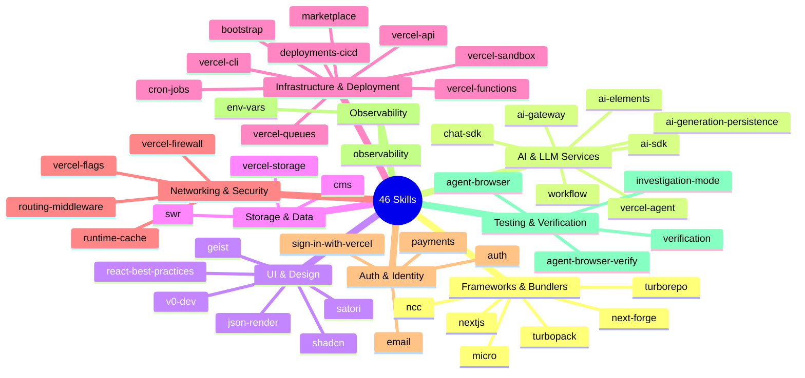

# Vercel Plugin for Claude Code — Documentation

The Vercel Plugin is an **event-driven skill injection system** for Claude Code. It automatically detects what a developer is working on — by watching file operations, bash commands, imports, and prompt text — and injects precisely the right Vercel platform knowledge into Claude's context window, without any manual configuration. The plugin manages **46 skills** covering the full Vercel ecosystem (Next.js, AI SDK, Functions, Storage, Deployments, and more), delivered through a lifecycle of hooks that fire at key moments during a Claude Code session.

---

## Table of Contents

| # | Section | Audience | What You'll Learn |
|---|---------|----------|-------------------|
| 1 | [Architecture Overview](./01-architecture-overview.md) | Everyone | System diagram, core concepts, hook lifecycle sequence, complete hook inventory, data flow from SKILL.md to injection, glossary |
| 2 | [Injection Pipeline Deep-Dive](./02-injection-pipeline.md) | Plugin users | Pattern matching mechanics, ranking algorithm, budget enforcement, prompt signal scoring, dedup system, special triggers |
| 3 | [Skill Authoring Guide](./03-skill-authoring.md) | Skill authors | Step-by-step tutorial for creating a new skill, frontmatter reference, validation rules, template include engine |
| 4 | [Operations & Debugging](./04-operations-debugging.md) | Maintainers | Environment variable tuning, log levels, `doctor`/`explain` CLI tools, dedup troubleshooting, debugging decision tree |
| 5 | [Reference](./05-reference.md) | All | Complete hook registry table, env var reference, SKILL.md frontmatter spec, YAML parser edge cases, full skill catalog, budget constants |

**Additional guides:**

- [Architecture Patterns](./architecture.md) — detailed architecture and design patterns
- [Developer Guide](./developer-guide.md) — developer workflow and setup
- [Skill Authoring (extended)](./skill-authoring.md) — comprehensive skill creation reference
- [Hook Lifecycle](./hook-lifecycle.md) — complete hook execution sequence with timing details
- [Skill Injection](./skill-injection.md) — pattern matching, ranking, and budget mechanics
- [CLI Reference](./cli-reference.md) — `explain` and `doctor` command usage
- [Glossary](./glossary.md) — definitions of 25+ project-specific terms
- [Observability Guide](./observability.md) — log levels, structured logging, audit logs, and dedup debugging

---

## Quick Start for New Contributors

```bash
# 1. Clone the repository
git clone <repo-url> vercel-plugin
cd vercel-plugin

# 2. Install dependencies (requires Bun)
bun install

# 3. Build everything (hooks + manifest + from-skills templates)
bun run build

# 4. Run the full test suite (typecheck + 32 test files)
bun test

# 5. Validate skill structure and manifest parity
bun run validate

# 6. Self-diagnosis (manifest parity, hook timeouts, dedup health)
bun run doctor

# 7. See which skills match a file or command
bun run explain app/api/route.ts
bun run explain "vercel deploy --prod"
```

**Day-to-day workflow:**

| Task | Command |
|------|---------|
| Edit a hook source file (`.mts`) | `bun run build:hooks` (auto-runs on pre-commit) |
| Edit a skill's SKILL.md | `bun run build:manifest` to regenerate the manifest |
| Edit a `.md.tmpl` template | `bun run build:from-skills` to recompile |
| Run a single test | `bun test tests/<file>.test.ts` |
| Update golden snapshots | `bun run test:update-snapshots` |
| Typecheck only | `bun run typecheck` |

---

## How It Works (30-Second Version)

```
Developer opens Claude Code in a Next.js project
        ↓
SessionStart hooks scan the project → identify likely skills (nextjs, ai-sdk, ...)
        ↓
Developer types: "Add a cron job for weekly emails"
        ↓
UserPromptSubmit hook scores prompt → injects cron-jobs skill
        ↓
Claude reads vercel.json
        ↓
PreToolUse hook matches file path → injects relevant config skills
        ↓
SessionEnd hook cleans up temp files
```

All of this happens transparently. The developer gets expert Vercel guidance without asking for it.

---

## Skill Catalog by Category

The plugin ships 46 skills organized into 10 categories. Each skill is a self-contained `skills/<name>/SKILL.md` file with YAML frontmatter (patterns, priority, validation rules) and a markdown body (the knowledge injected into Claude's context).



---

## Key Files

| File | Purpose |
|------|---------|
| `hooks/hooks.json` | Hook registry — all lifecycle event bindings |
| `generated/skill-manifest.json` | Pre-compiled skill index (glob→regex, frontmatter) |
| `skills/*/SKILL.md` | Skill definitions (YAML frontmatter + markdown body) |
| `hooks/src/*.mts` | Hook source code (TypeScript, compiled to `.mjs`) |
| `CLAUDE.md` | Developer quick-reference guide |

---

## Glossary

| Term | Definition |
|------|-----------|
| **Hook** | A TypeScript function registered in `hooks/hooks.json` that fires on a specific Claude Code lifecycle event (`SessionStart`, `PreToolUse`, `UserPromptSubmit`, `PostToolUse`, `SessionEnd`). Hooks are the injection engine — they decide *what* knowledge Claude receives and *when*. |
| **Skill** | A self-contained knowledge module in `skills/<name>/SKILL.md`. Each skill has YAML frontmatter (defining when to inject) and a markdown body (the content injected into Claude's context). Skills are the unit of domain knowledge. |
| **Injection** | The act of inserting a skill's markdown body into Claude's `additionalContext` during a hook invocation. Injection is gated by pattern matching, priority ranking, dedup checks, and budget limits. |
| **Dedup** | The deduplication system that prevents the same skill from being injected more than once per session. Uses a three-layer state merge: atomic file claims (`O_EXCL`), an env var (`VERCEL_PLUGIN_SEEN_SKILLS`), and a session file — all unioned by `mergeSeenSkillStates()`. |
| **Claim** | An atomic file created in the claim directory (`<tmpdir>/vercel-plugin-<sessionId>-seen-skills.d/`) to mark a skill as already injected. Created with `openSync(path, "wx")` (O_EXCL) to guarantee exactly-once semantics even under concurrent hook invocations. |
| **Budget** | The maximum byte size of skill content that can be injected in a single hook invocation. PreToolUse allows up to **3 skills / 18 KB**; UserPromptSubmit allows up to **2 skills / 8 KB**. If a skill's body exceeds the remaining budget, its `summary` field is injected as a compact fallback. |
| **Profiler** | The `session-start-profiler` hook that runs at session startup. It scans `package.json` dependencies, config files (`vercel.json`, `next.config.*`, etc.), and project structure to pre-identify *likely skills*, giving them a **+5 priority boost** in subsequent ranking. |
| **Greenfield** | A project state detected by the profiler when the working directory is empty or has no meaningful source files. In greenfield mode, the `bootstrap` skill is automatically prioritized to help scaffold a new project. |
| **Manifest** | The pre-compiled skill index at `generated/skill-manifest.json`. Built by `scripts/build-manifest.ts`, it converts glob patterns to regex at build time so hooks can match file paths without parsing SKILL.md files at runtime. Version 2 format with paired arrays (`pathPatterns` ↔ `pathRegexSources`). |
