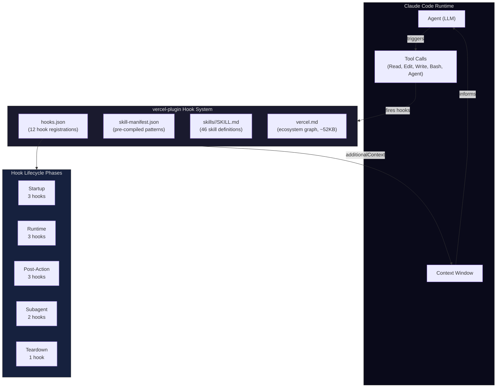
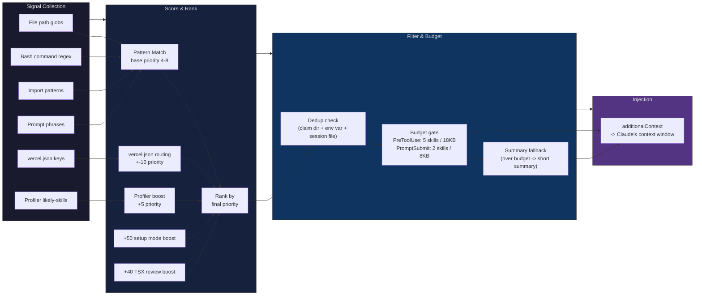
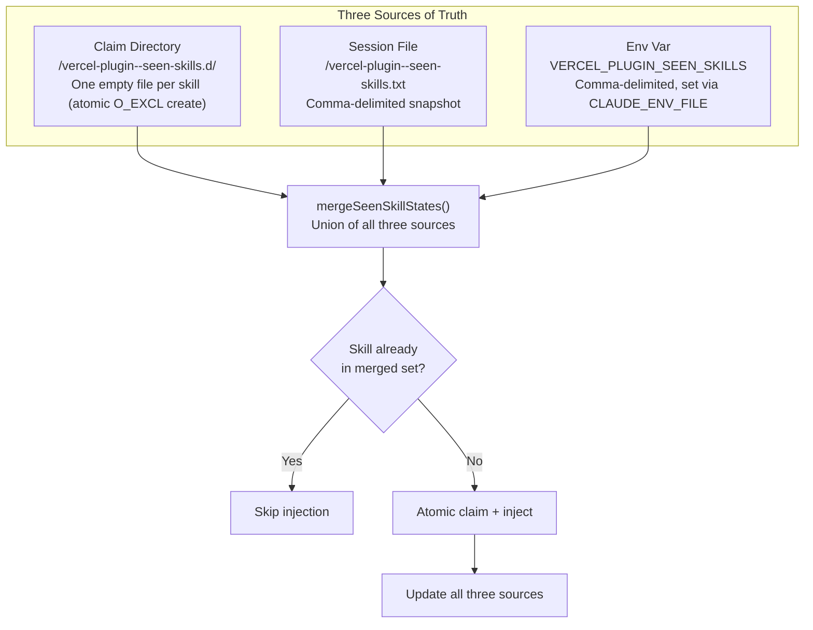
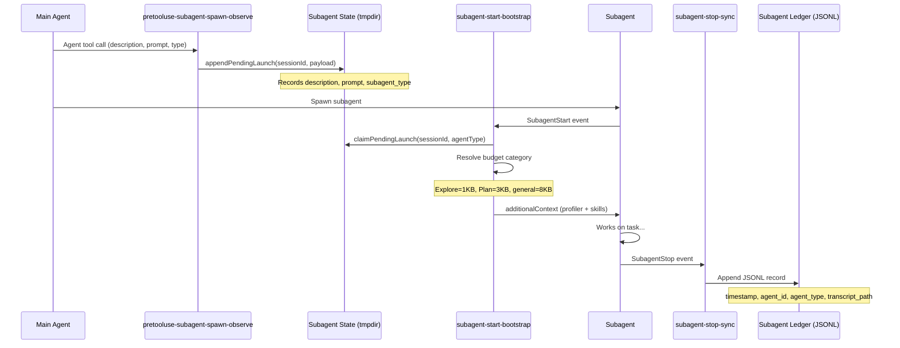
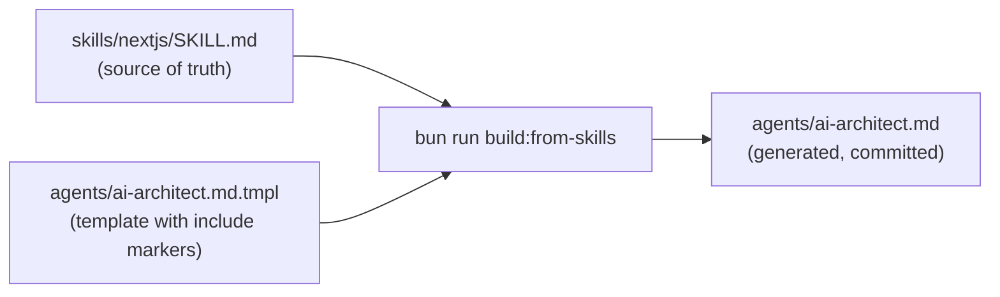
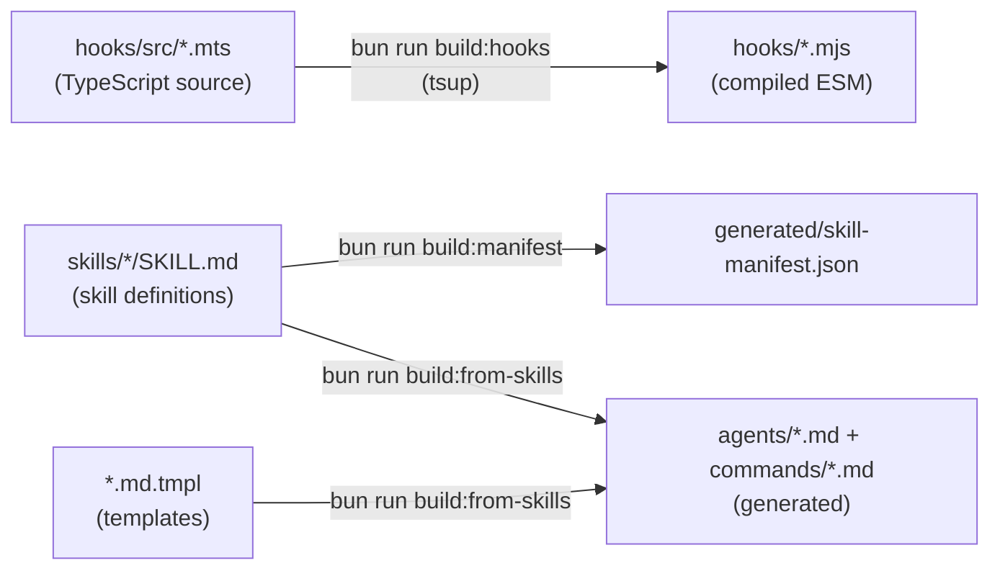

# Architecture Overview

## What Is vercel-plugin?

**vercel-plugin** is a **hook-driven context router** for Claude Code. It solves a fundamental problem in AI-assisted development: the agent needs domain knowledge to be useful, but has a finite context window.

Two failure modes arise without it:

| Failure Mode | What Happens | Effect |
|---|---|---|
| **Too much context** | Every skill is injected upfront | The context window fills with irrelevant instructions; the agent loses focus and makes mistakes |
| **Too little context** | No skills are injected | The agent lacks Vercel-specific knowledge; it hallucinates APIs, skips best practices, and produces broken deployments |

vercel-plugin threads the needle by **injecting only the right skills at the right time**, driven by what the developer is actually doing — the files they touch, the commands they run, and the questions they ask.

---

## High-Level System Architecture



### How It Works

1. **Claude Code** registers all hooks from `hooks/hooks.json` at startup
2. When the agent takes an action (reads a file, runs a command, submits a prompt), Claude Code fires the corresponding hook(s)
3. Each hook receives JSON on stdin describing the action, evaluates pattern matches, and decides whether to inject skill content
4. Matched skills are returned as `additionalContext` in the hook's JSON stdout, which Claude Code appends to the agent's context for the current turn

---

## Hook Registration Flow

All 12 hooks are declared in `hooks/hooks.json`. Each entry maps a lifecycle event + regex matcher to a Node.js command with an optional timeout.

```mermaid
flowchart TB
    subgraph Startup ["SessionStart Phase"]
        SS1["session-start-seen-skills.mjs<br/>Initializes dedup state"]
        SS2["session-start-profiler.mjs<br/>Scans project → sets LIKELY_SKILLS"]
        SS3["inject-claude-md.mjs<br/>Outputs vercel.md ecosystem graph"]
    end

    subgraph Runtime ["Runtime Phase"]
        PTU["pretooluse-skill-inject.mjs<br/>Read | Edit | Write | Bash<br/>Main injection engine"]
        PSO["pretooluse-subagent-spawn-observe.mjs<br/>Agent<br/>Records pending subagent launches"]
        UPS["user-prompt-submit-skill-inject.mjs<br/>All prompts<br/>Prompt signal scoring"]
    end

    subgraph PostAction ["Post-Action Phase"]
        PTV["posttooluse-validate.mjs<br/>Write | Edit<br/>Skill validation rules"]
        PTF["posttooluse-shadcn-font-fix.mjs<br/>Bash<br/>Shadcn font fix"]
        PVO["posttooluse-verification-observe.mjs<br/>Bash<br/>Verification boundary observer"]
    end

    subgraph SubagentLC ["Subagent Lifecycle"]
        SAB["subagent-start-bootstrap.mjs<br/>Any subagent<br/>Injects context by agent type budget"]
        SAS["subagent-stop-sync.mjs<br/>Any subagent<br/>Writes ledger + syncs dedup state"]
    end

    subgraph Teardown ["Teardown Phase"]
        SEC["session-end-cleanup.mjs<br/>Deletes all temp files"]
    end

    Startup --> Runtime
    Runtime --> PostAction
    PostAction --> SubagentLC
    SubagentLC --> Teardown

    style Startup fill:#1a1a2e,stroke:#16213e,color:#e0e0e0
    style Runtime fill:#16213e,stroke:#0f3460,color:#e0e0e0
    style PostAction fill:#0f3460,stroke:#533483,color:#e0e0e0
    style SubagentLC fill:#533483,stroke:#e94560,color:#e0e0e0
    style Teardown fill:#e94560,stroke:#e94560,color:#e0e0e0
```



### Hook Registry Table

| # | Event | Hook File | Matcher | Timeout | Purpose |
|---|-------|-----------|---------|---------|---------|
| 1 | SessionStart | `session-start-seen-skills.mjs` | `startup\|resume\|clear\|compact` | — | Initialize dedup env var |
| 2 | SessionStart | `session-start-profiler.mjs` | `startup\|resume\|clear\|compact` | — | Profile project, set LIKELY_SKILLS |
| 3 | SessionStart | `inject-claude-md.mjs` | `startup\|resume\|clear\|compact` | — | Inject vercel.md ecosystem graph |
| 4 | PreToolUse | `pretooluse-skill-inject.mjs` | `Read\|Edit\|Write\|Bash` | 5s | Main skill injection engine |
| 5 | PreToolUse | `pretooluse-subagent-spawn-observe.mjs` | `Agent` | 5s | Record pending subagent launches |
| 6 | UserPromptSubmit | `user-prompt-submit-skill-inject.mjs` | _(all prompts)_ | 5s | Prompt signal scoring + injection |
| 7 | PostToolUse | `posttooluse-shadcn-font-fix.mjs` | `Bash` | 5s | Fix shadcn font loading |
| 8 | PostToolUse | `posttooluse-verification-observe.mjs` | `Bash` | 5s | Observe verification boundaries |
| 9 | PostToolUse | `posttooluse-validate.mjs` | `Write\|Edit` | 5s | Run skill validation rules |
| 10 | SubagentStart | `subagent-start-bootstrap.mjs` | `.+` _(any)_ | 5s | Bootstrap subagent with context |
| 11 | SubagentStop | `subagent-stop-sync.mjs` | `.+` _(any)_ | 5s | Write ledger, sync dedup |
| 12 | SessionEnd | `session-end-cleanup.mjs` | — | — | Delete temp files |

---

## Skill Injection Pipeline

This is the core data flow — how the plugin decides which skills to inject and in what order.



### Pipeline Walkthrough

1. **Signal Collection** — When the agent performs an action (opens a file, runs a command, submits a prompt), the relevant hook extracts signals: file paths are matched against glob patterns, bash commands against regex, imports against package names, and prompt text against phrase/allOf/anyOf scoring.

2. **Score & Rank** — Each matched skill starts with its base `priority` (typically 4-8). Multiple boosters can raise it:

   | Booster | Value | Source |
   |---------|-------|--------|
   | Profiler | +5 | `VERCEL_PLUGIN_LIKELY_SKILLS` (detected at session start) |
   | vercel.json routing | up to +-10 | Keys in project's `vercel.json` |
   | Setup mode | +50 | `VERCEL_PLUGIN_SETUP_MODE=1` (greenfield/bootstrap projects) |
   | TSX review | +40 | After N `.tsx` edits (default 3) |
   | Dev server detect | boost | When dev server patterns appear in bash |

3. **Filter & Budget** — Skills are deduplicated (no skill injects twice per session), then the top candidates are checked against the byte budget. If the full skill body would exceed the budget, the plugin falls back to injecting just the `summary` field instead.

4. **Injection** — Surviving skills are returned as `additionalContext` in the hook's JSON output, which Claude Code appends to the agent's context for the current turn.

---

## Dedup Contract

A skill should never be injected twice in the same session. The dedup system uses three redundant sources of truth, merged on every hook invocation.



### Claim Mechanics

- **Atomic claims**: `openSync(path, "wx")` with the `O_EXCL` flag ensures that if two hooks race to claim the same skill, exactly one succeeds and the other gets `EEXIST`.
- **Session file**: A comma-delimited text file synced from the claim directory. Acts as a fast-read cache.
- **Env var**: `VERCEL_PLUGIN_SEEN_SKILLS` persists across hook invocations via `CLAUDE_ENV_FILE`. Initialized to `""` by session-start.
- **State merge**: `mergeSeenSkillStates()` unions all three sources on every hook call, tolerating partial failures.
- **Scoped claims**: Subagent dedup claims are scoped by `agentId` to prevent sibling subagents from cross-contaminating each other's state.

### Dedup Strategies

The system uses a fallback chain (visible in debug logs):

| Strategy | Mechanism | When Used |
|----------|-----------|-----------|
| `file` | Atomic file claims in tmpdir | Default — most reliable |
| `env-var` | `VERCEL_PLUGIN_SEEN_SKILLS` only | Fallback if tmpdir is unavailable |
| `memory-only` | In-memory set for single invocation | Fallback if env file is unavailable |
| `disabled` | No dedup | When `VERCEL_PLUGIN_HOOK_DEDUP=off` |

### Cleanup

`session-end-cleanup.mjs` deletes the claim directory, session files, pending launch dirs, and profile cache when the session ends. If the session crashes, the OS tmpdir cleanup eventually reclaims the files.

---

## Prompt Signal Scoring

The `UserPromptSubmit` hook uses a scoring system to match user prompts to skills. Each skill's `promptSignals` frontmatter defines four signal types:

| Signal | Score | Behavior |
|--------|-------|----------|
| `phrases` | **+6** each | Exact substring match (case-insensitive). The primary signal. |
| `allOf` | **+4** per group | All terms in a group must appear. For compound concepts like "deploy" + "preview". |
| `anyOf` | **+1** each, **capped at +2** | Optional boosters. Broad terms that add confidence. |
| `noneOf` | **-Infinity** | Hard suppress. If any term matches, the skill is excluded entirely. |

A skill is injected only if its total score meets `minScore` (default: 6). This means a single phrase match is enough, or an allOf group (+4) plus two anyOf matches (+2) = 6.

### Additional Prompt Routing

- **Troubleshooting intent classification**: The prompt hook detects frustration/debug signals and routes to `investigation-mode` + a companion skill (`workflow`, `agent-browser-verify`, or `vercel-cli`).
- **Test framework suppression**: When a prompt mentions test frameworks, verification-family skills are suppressed to avoid conflicting instructions.
- **Investigation companion selection**: When `investigation-mode` triggers, the second slot goes to the best-scoring companion from a priority list.

---

## Subagent Architecture

When the main agent spawns subagents, the plugin manages their skill context independently.



### Budget Categories

Subagent context is sized by agent type to avoid wasting context on lightweight agents:

| Agent Type | Budget | Content |
|------------|--------|---------|
| `Explore` | 1KB (minimal) | Project profile + skill names only |
| `Plan` | 3KB (light) | Profile + skill summaries + deployment constraints |
| `general-purpose` | 8KB (standard) | Profile + full skill bodies |
| Other/custom | 8KB (standard) | Treated as general-purpose |

---

## Skill Structure

The plugin ships 46 skills in `skills/<name>/SKILL.md`. Each skill is a self-contained markdown document with YAML frontmatter that declares its triggers and metadata:

```yaml
---
name: skill-slug
description: "One-line description"
summary: "Brief fallback injected when budget is exceeded"
metadata:
  priority: 6                    # Base priority (4-8 range)
  pathPatterns: ["**/*.prisma"]  # File glob triggers
  bashPatterns: ["prisma\\s"]   # Bash command regex triggers
  importPatterns: ["@prisma/client"]  # Import/require triggers
  promptSignals:
    phrases: ["prisma schema"]  # +6 each
    allOf: [["database", "orm"]] # +4 per group
    anyOf: ["migration"]        # +1 each (cap +2)
    noneOf: ["mongodb"]         # Hard exclude
    minScore: 6
  validate:
    - pattern: "executeRaw\\("
      message: "Use $queryRaw for type safety"
      severity: "warn"
      skipIfFileContains: "\\$queryRaw"
---
# Skill Title

Markdown body injected as additionalContext...
```

---

## Manifest

`generated/skill-manifest.json` is built by `scripts/build-manifest.ts` from all `SKILL.md` frontmatter. It pre-compiles glob patterns to regex at build time so hooks don't parse YAML or convert globs at runtime.

The manifest uses a **version 2 paired-array format**: `pathPatterns[i]` corresponds to `pathRegexSources[i]`, ensuring globs and their compiled regex stay aligned.

Hooks prefer the manifest over scanning `SKILL.md` files directly. Run `bun run build:manifest` to regenerate after changing any skill frontmatter.

---

## YAML Parser Semantics

The plugin uses a custom inline `parseSimpleYaml` (in `skill-map-frontmatter.mjs`), **not** the `js-yaml` library. This has intentional behavioral differences:

| Input | js-yaml | vercel-plugin parser | Rationale |
|-------|---------|---------------------|-----------|
| Bare `null` | JavaScript `null` | String `"null"` | Skill frontmatter values should always be strings for pattern matching |
| Bare `true` / `false` | JavaScript boolean | String `"true"` / `"false"` | Same reason — no type coercion |
| Unclosed `[` | Parse error | Scalar string (no error) | Graceful degradation for malformed arrays |
| Tab indentation | Allowed | **Explicit error** | Prevents hard-to-debug YAML whitespace issues |

These choices are deliberate. The parser is optimized for the narrow use case of skill frontmatter where all values are ultimately used as string patterns or display text.

---

## Template Include Engine

Agents and commands derive their instructions from skills via `.md.tmpl` templates. This keeps skills as the single source of truth — no copy-pasting skill content into agent definitions.



Two include formats:

```
{{include:skill:<name>:<heading>}}            — extracts a section by heading
{{include:skill:<name>:frontmatter:<field>}}  — extracts a frontmatter value
```

**Build**: `bun run build:from-skills` resolves includes and writes output files. 8 templates currently exist across `agents/` and `commands/`.

**Check**: `bun run build:from-skills:check` verifies outputs are up-to-date (exits non-zero on drift).

---

## Build Pipeline



All three steps are combined in `bun run build`. A pre-commit hook auto-compiles `.mts` files when staged.

---

## Environment Variables

| Variable | Default | Source (Writer) | Reader(s) | Description |
|----------|---------|-----------------|-----------|-------------|
| `VERCEL_PLUGIN_LOG_LEVEL` | `off` | User / shell | `logger.mts` | Logging verbosity: `off` / `summary` / `debug` / `trace` |
| `VERCEL_PLUGIN_DEBUG` | — | User / shell | `logger.mts` | Legacy: `1` maps to `debug` level |
| `VERCEL_PLUGIN_HOOK_DEBUG` | — | User / shell | `logger.mts` | Legacy: `1` maps to `debug` level |
| `VERCEL_PLUGIN_SEEN_SKILLS` | `""` | `session-start-seen-skills` | `pretooluse-skill-inject`, `user-prompt-submit-skill-inject` | Comma-delimited list of already-injected skills |
| `VERCEL_PLUGIN_HOOK_DEDUP` | — | User / shell | `pretooluse-skill-inject`, `user-prompt-submit-skill-inject`, `prompt-analysis` | Set to `off` to disable dedup entirely |
| `VERCEL_PLUGIN_LIKELY_SKILLS` | — | `session-start-profiler` | `pretooluse-skill-inject`, `subagent-start-bootstrap` | Comma-delimited profiler-detected skills (+5 boost) |
| `VERCEL_PLUGIN_GREENFIELD` | — | `session-start-profiler` | `inject-claude-md` | `true` when profiler detects an empty project |
| `VERCEL_PLUGIN_SETUP_MODE` | — | `session-start-profiler` | `pretooluse-skill-inject` | `1` when bootstrap hints >= 3 (+50 priority boost) |
| `VERCEL_PLUGIN_BOOTSTRAP_HINTS` | — | `session-start-profiler` | — | Comma-delimited bootstrap signal names |
| `VERCEL_PLUGIN_RESOURCE_HINTS` | — | `session-start-profiler` | — | Comma-delimited resource category names |
| `VERCEL_PLUGIN_AGENT_BROWSER_AVAILABLE` | — | `session-start-profiler` | `pretooluse-skill-inject` | `1` if `agent-browser` CLI is on PATH |
| `VERCEL_PLUGIN_INJECTION_BUDGET` | `18000` | User / shell | `pretooluse-skill-inject` | PreToolUse byte budget |
| `VERCEL_PLUGIN_PROMPT_INJECTION_BUDGET` | `8000` | User / shell | `user-prompt-submit-skill-inject` | UserPromptSubmit byte budget |
| `VERCEL_PLUGIN_REVIEW_THRESHOLD` | `3` | User / shell | `pretooluse-skill-inject` | TSX edits before `react-best-practices` injection |
| `VERCEL_PLUGIN_TSX_EDIT_COUNT` | `0` | `pretooluse-skill-inject` | `pretooluse-skill-inject` | Current `.tsx` edit count |
| `VERCEL_PLUGIN_DEV_VERIFY_COUNT` | `0` | `pretooluse-skill-inject` | `pretooluse-skill-inject` | Dev server verification event count |
| `VERCEL_PLUGIN_DEV_COMMAND` | — | `pretooluse-skill-inject` | `pretooluse-skill-inject` | Detected dev server command |
| `VERCEL_PLUGIN_VALIDATED_FILES` | — | `posttooluse-validate` | `posttooluse-validate` | Comma-delimited `path:hash` pairs of validated files |
| `VERCEL_PLUGIN_RECENT_EDITS` | — | `pretooluse-skill-inject` | `posttooluse-verification-observe` | Comma-delimited recent file edit paths |
| `VERCEL_PLUGIN_AUDIT_LOG_FILE` | — | User / shell | `hook-env` | Audit log file path, or `off` to disable |
| `VERCEL_PLUGIN_LEXICAL_RESULT_MIN_SCORE` | `5.0` | User / shell | `lexical-index` | Minimum score for lexical fallback results |
| `CLAUDE_ENV_FILE` | — | Claude Code | All hooks | Path to env file for persisting vars across hook invocations |
| `CLAUDE_PLUGIN_ROOT` | — | Claude Code | All hooks | Root directory of the plugin installation |
| `CLAUDE_PROJECT_ROOT` | — | Claude Code | `session-start-profiler` | Root directory of the user's project |
| `SESSION_ID` | — | Claude Code | Multiple hooks | Fallback session ID from Claude Code |

---

## User Stories

### "I'm building a Next.js app with Prisma"

1. **Session starts** — The profiler scans `package.json`, finds `next` and `@prisma/client` -> sets `VERCEL_PLUGIN_LIKELY_SKILLS=nextjs,vercel-storage`.
2. **Developer opens `schema.prisma`** — PreToolUse matches `**/*.prisma` glob -> injects the `vercel-storage` skill with Prisma best practices.
3. **Developer edits `app/page.tsx`** — PreToolUse matches `.tsx` path -> TSX edit counter increments. After 3 edits, `react-best-practices` is injected.
4. **Developer writes to `schema.prisma`** — PostToolUse validate runs rules from the skill, catching unsafe `executeRaw` usage.
5. **Developer asks "how do I deploy to preview?"** — UserPromptSubmit scores against `promptSignals` and injects the `deployments-cicd` skill.

### "I'm starting a brand new project"

1. **Session starts** — The profiler finds no `package.json`, no config files -> sets `VERCEL_PLUGIN_GREENFIELD=true` and `VERCEL_PLUGIN_SETUP_MODE=1`.
2. **inject-claude-md** outputs greenfield execution mode instructions: skip planning, choose defaults immediately, start executing.
3. **Developer asks "bootstrap a Next.js app with auth"** — UserPromptSubmit matches phrases from `bootstrap` and `auth` skills -> both are injected (within the 2-skill / 8KB budget).
4. **Developer runs `npx create-next-app`** — PreToolUse matches the bash pattern -> injects `nextjs` skill with setup mode boost (+50).

### "I'm debugging a slow API route"

1. **Developer opens `app/api/data/route.ts`** — PreToolUse matches the path -> injects `vercel-functions` skill.
2. **Developer asks "why is my API slow?"** — UserPromptSubmit matches `observability` skill phrases -> injects it alongside function guidance.
3. **Developer runs `vercel logs`** — PreToolUse matches the bash pattern -> injects `vercel-cli` skill (if not already seen, per dedup).
4. **Developer runs `curl localhost:3000/api/data`** — PostToolUse verification observer classifies this as a `clientRequest` boundary and emits a structured log event.

### "Agent spawns a research subagent"

1. **Developer triggers a complex task** — Main agent decides to spawn an `Explore` subagent.
2. **PreToolUse (Agent matcher)** — `pretooluse-subagent-spawn-observe` records the pending launch with description and prompt text.
3. **SubagentStart** — `subagent-start-bootstrap` reads the pending launch, runs prompt signal matching against the subagent's description, and injects a 1KB minimal context (Explore budget).
4. **Subagent completes** — `subagent-stop-sync` writes a JSONL ledger entry with agent metadata and transcript path.

---

## Source Code Map

```
hooks/
├── hooks.json                        # Hook registry (lifecycle -> matcher -> command)
├── src/
│   ├── hook-env.mts                  # Shared runtime helpers (env, paths, file I/O)
│   ├── logger.mts                    # Structured JSON logging (off/summary/debug/trace)
│   ├── skill-map-frontmatter.mts     # Custom YAML parser + buildSkillMap()
│   ├── patterns.mts                  # Glob->regex, ranking, atomic claims, seen-skills
│   ├── prompt-patterns.mts           # Prompt signal compiler + scorer
│   ├── prompt-analysis.mts           # Dry-run analysis reports for prompt matching
│   ├── vercel-config.mts             # vercel.json key->skill routing (+-10 priority)
│   ├── unified-ranker.mts            # Combined ranking across all signal types
│   ├── lexical-index.mts             # Lexical fallback scoring for unmatched prompts
│   ├── stemmer.mts                   # Word stemming for lexical matching
│   ├── shared-contractions.mts       # Contraction expansion for text normalization
│   ├── subagent-state.mts            # Subagent pending launch state management
│   ├── session-start-seen-skills.mts # Hook: initialize dedup env var
│   ├── session-start-profiler.mts    # Hook: profile project -> set LIKELY_SKILLS
│   ├── inject-claude-md.mts          # Hook: inject vercel.md ecosystem graph
│   ├── pretooluse-skill-inject.mts   # Hook: main injection engine
│   ├── pretooluse-subagent-spawn-observe.mts  # Hook: record pending subagent launches
│   ├── user-prompt-submit-skill-inject.mts    # Hook: prompt signal scoring + injection
│   ├── posttooluse-validate.mts      # Hook: skill validation rules
│   ├── posttooluse-verification-observe.mts   # Hook: verification boundary observer
│   ├── subagent-start-bootstrap.mts  # Hook: bootstrap subagent context
│   ├── subagent-stop-sync.mts        # Hook: write ledger, sync dedup
│   └── session-end-cleanup.mts       # Hook: delete temp files
├── posttooluse-shadcn-font-fix.mjs   # Standalone hook (no .mts source)
├── *.mjs                             # Compiled output (committed, ESM)

skills/
├── <name>/SKILL.md                   # 46 skill definitions with YAML frontmatter

generated/
├── skill-manifest.json               # Pre-compiled manifest (globs -> regex)
├── build-from-skills.manifest.json   # Template include build manifest

scripts/
├── build-manifest.ts                 # Manifest builder
├── build-from-skills.ts              # Template include engine

src/cli/
├── explain.ts                        # `vercel-plugin explain` command
├── doctor.ts                         # `vercel-plugin doctor` command
```

---

## CLI Tools

### `vercel-plugin explain <target>`

Shows which skills match a file path or bash command, with priority breakdown and budget simulation.

```bash
# Explain what fires for a file
vercel-plugin explain app/api/auth/route.ts

# Explain what fires for a bash command
vercel-plugin explain "vercel deploy --prod"

# JSON output with budget simulation
vercel-plugin explain app/page.tsx --json --budget 8000
```

### `vercel-plugin doctor`

Self-diagnosis: validates manifest parity, checks hook timeout risk, tests dedup correctness, and reports skill map errors.

```bash
vercel-plugin doctor
```
