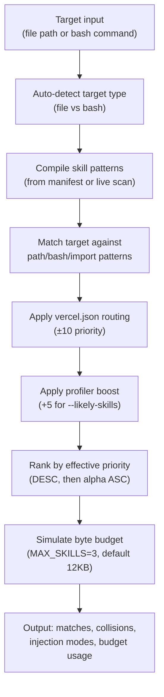

# CLI Reference

The vercel-plugin CLI provides two commands for debugging and validating the skill injection system: `explain` and `doctor`.

**Entry point:** `src/cli/index.ts`

```bash
vercel-plugin <command> [options]
```

---

## Table of Contents

- [`explain` — Skill matching debugger](#explain)
- [`doctor` — Self-diagnosis](#doctor)
- [Exit codes](#exit-codes)
- [Examples & user stories](#examples--user-stories)

---

## `explain`

Shows which skills match a given file path or bash command, with priority breakdown, budget simulation, and collision detection. Mirrors the runtime selection pipeline used by `pretooluse-skill-inject.mjs`.

### Usage

```bash
vercel-plugin explain <target> [options]
```

The `<target>` is a file path or bash command string. The CLI auto-detects the target type based on heuristics:

- Contains spaces + starts with a known CLI tool (`vercel`, `npm`, `bun`, etc.) → **bash**
- Contains flag-like patterns (`--flag`) → **bash**
- Otherwise → **file path**

### Flags

| Flag | Type | Default | Description |
|------|------|---------|-------------|
| `--json` | boolean | `false` | Machine-readable JSON output (full `ExplainResult` structure) |
| `--project <path>` | string | auto-detected | Plugin root directory. Must contain a `skills/` directory |
| `--likely-skills <s1,s2>` | string | — | Comma-delimited skill slugs to simulate profiler boost (+5 priority each) |
| `--budget <bytes>` | number | `12000` | Override injection byte budget for simulation |

### Pipeline simulation

The explain command replicates the runtime injection pipeline:



### Injection modes

Each matched skill is assigned an injection mode:

| Mode | Meaning |
|------|---------|
| `full` | Full SKILL.md body injected within budget |
| `summary` | Body exceeded budget; summary field used instead |
| `droppedByCap` | Exceeded MAX_SKILLS hard cap (3 skills) |
| `droppedByBudget` | Neither body nor summary fit within remaining budget |

The first matched skill always gets `full` injection regardless of size. Subsequent skills must fit within the remaining budget.

### Match types

| Match type | Description |
|------------|-------------|
| `file:full` | Full glob pattern match against file path |
| `file:basename` | Basename-only match |
| `file:suffix` | File extension/suffix match |
| `file:import` | Import/require pattern found in file content |
| `bash:full` | Regex match against bash command string |

### Human-readable output

```
Target: middleware.ts (file)
Skills in manifest: 43
Budget: 8234 / 12000 bytes

Matched: 3 skill(s)
Injected: 2 | Summary-only: 1

  [INJECT] routing-middleware (4521 bytes)
          priority: 8
          pattern:  middleware.{ts,js} (full)
          reason:   injected #1 (4521B, total 4521B / 12000B)
  [INJECT] nextjs (3713 bytes)
          priority: 6
          pattern:  **/*.{ts,tsx} (suffix)
          reason:   injected #2 (3713B, total 8234B / 12000B)
  [SUMMARY] edge-runtime (6200 bytes)
          priority: 5
          pattern:  middleware.* (full)
          reason:   full body (6200B) exceeds budget; using summary (312B)
```

### JSON output

With `--json`, the full `ExplainResult` object is emitted:

```typescript
interface ExplainResult {
  target: string;              // Input target
  targetType: "file" | "bash"; // Detected type
  toolName?: string;           // Explicit tool override
  matches: ExplainMatch[];     // All matched skills with injection details
  collisions: ExplainCollision[]; // Skills sharing the same effective priority
  injectedCount: number;       // Skills that will be injected (full + summary)
  cappedCount: number;         // Skills dropped by cap or budget
  droppedByBudgetCount: number;
  summaryOnlyCount: number;
  skillCount: number;          // Total skills in manifest
  budgetBytes: number;         // Budget used for simulation
  usedBytes: number;           // Actual bytes consumed
  buildWarnings: string[];     // Warnings from SKILL.md parsing
}
```

### Collision detection

When multiple skills share the same effective priority, `explain` reports a collision. At runtime, ties are broken alphabetically — the collision warning helps skill authors adjust priorities to get deterministic ordering.

```
Collisions:
  - edge-runtime, vercel-functions: 2 skills share effective priority 5; tie-broken alphabetically
```

---

## `doctor`

Self-diagnosis command that validates the plugin setup. Checks manifest consistency, hook configuration, dedup state, skill validity, template freshness, and subagent hook registration.

### Usage

```bash
vercel-plugin doctor [options]
```

### Flags

| Flag | Type | Default | Description |
|------|------|---------|-------------|
| `--json` | boolean | `false` | Machine-readable JSON output (full `DoctorResult` structure) |
| `--project <path>` | string | auto-detected | Plugin root directory |

### Checks performed

#### 1. `skill-validation` — Skill map validity

Loads all `skills/*/SKILL.md` files and validates:
- Valid YAML frontmatter is present
- Required fields exist (name, description, summary, metadata)
- Pattern arrays contain valid entries

Reports both errors (invalid skills) and warnings (non-critical issues).

#### 2. `manifest-parity` — Manifest vs live scan consistency

Compares `generated/skill-manifest.json` against a live scan of all `SKILL.md` files:

| Sub-check | Severity | Condition |
|-----------|----------|-----------|
| Missing manifest file | warning | `generated/skill-manifest.json` does not exist |
| Parse failure | error | Manifest JSON is malformed |
| Skills in live but not manifest | error | New skills added without rebuilding |
| Skills in manifest but not live | error | Skills deleted without rebuilding |
| Priority drift | error | Priority value differs between live and manifest |
| Pattern drift | error | `pathPatterns` or `bashPatterns` differ |

**Fix:** `bun run build:manifest`

#### 3. `hook-timeout` — Performance risk assessment

Warns when the number of skills or patterns approaches levels that could cause the 5-second hook timeout:

| Threshold | Severity | Trigger |
|-----------|----------|---------|
| 50+ skills | warning | `liveSkillCount > 50` |
| 200+ total patterns | warning | `totalPatterns > 200` |

**Mitigation:** Use the pre-built manifest, consolidate low-priority skills, increase pattern specificity.

#### 4. `dedup` — Deduplication state

Validates the `VERCEL_PLUGIN_SEEN_SKILLS` environment variable and dedup strategy:

| Condition | Severity | Message |
|-----------|----------|---------|
| `VERCEL_PLUGIN_HOOK_DEDUP=off` | warning | Dedup is explicitly disabled |
| Invalid format | error | Expected empty or comma-delimited slugs |
| Env var not set | warning | Dedup limited to single invocation |

#### 5. `template-staleness` — Generated file freshness

Checks whether `.md.tmpl` templates or `SKILL.md` sources are newer than their generated `.md` outputs:

| Condition | Severity |
|-----------|----------|
| Template has no generated output | error |
| Template is newer than output | error |
| SKILL.md is newer than output | warning |

**Fix:** `bun run build:from-skills`

#### 6. `subagent-hooks` — Subagent hook registration

Validates that `hooks/hooks.json` has proper `SubagentStart` and `SubagentStop` entries:

| Check | Severity | Description |
|-------|----------|-------------|
| Missing hook entry | error | Required event not registered |
| Timeout too high | warning | Exceeds recommended 5-second max |
| No matcher | warning | Hook won't match any agent types |
| Uncovered agent types | warning | Expected types (Explore, Plan, general-purpose) not covered by matchers |

### Output format

```
vercel-plugin doctor
====================

Skills (live scan): 43
Skills (manifest):  43
Total patterns:     127
Dedup strategy:     env-var

All checks passed.

Result: 0 error(s), 0 warning(s)
```

When issues are found:

```
vercel-plugin doctor
====================

Skills (live scan): 43
Skills (manifest):  42
Total patterns:     127
Dedup strategy:     env-var

Errors (1):
  [manifest-parity] Skills in live scan but missing from manifest: vercel-queues
    -> Run `bun run build:manifest` to regenerate

Warnings (1):
  [template-staleness] A SKILL.md was modified after commands/deploy.md was last generated
    -> Run `bun run build:from-skills` to regenerate (skill content may have changed)

Result: 1 error(s), 1 warning(s)
```

### JSON output

With `--json`, the full `DoctorResult` object is emitted:

```typescript
interface DoctorResult {
  issues: DoctorIssue[];
  summary: {
    manifestSkillCount: number | null;
    liveSkillCount: number;
    totalPatterns: number;
    dedupStrategy: string;   // "env-var" | "disabled" | "memory-only"
  };
}

interface DoctorIssue {
  severity: "error" | "warning";
  check: string;    // e.g., "manifest-parity", "hook-timeout"
  message: string;
  hint?: string;    // Suggested fix
}
```

---

## Exit codes

| Code | Meaning |
|------|---------|
| `0` | Success (explain: results returned; doctor: all checks pass) |
| `1` | Issues found (doctor: at least one error-severity issue) |
| `2` | Unexpected failure (missing arguments, parse errors, no `skills/` directory) |

---

## Examples & user stories

### Debugging why a skill isn't injected

```bash
# See all skills that match your API route file
vercel-plugin explain app/api/chat/route.ts

# Simulate what happens when the profiler detects ai-gateway
vercel-plugin explain app/api/chat/route.ts --likely-skills ai-gateway

# Check if budget is the bottleneck
vercel-plugin explain app/api/chat/route.ts --budget 30000
```

### Validating after adding a new skill

```bash
# 1. Build the manifest
bun run build:manifest

# 2. Verify the new skill matches expected files
vercel-plugin explain "the/file/it/should/match.ts"

# 3. Run full diagnostics
vercel-plugin doctor
```

### CI integration

```bash
# In your CI pipeline, verify plugin health
vercel-plugin doctor --json | jq '.issues | length'

# Check template freshness (non-zero exit on drift)
bun run build:from-skills:check
```

### Comparing priorities across tools

```bash
# JSON output for scripting — pipe to jq
vercel-plugin explain vercel.json --json | jq '.matches[] | {skill, effectivePriority, injectionMode}'
```
