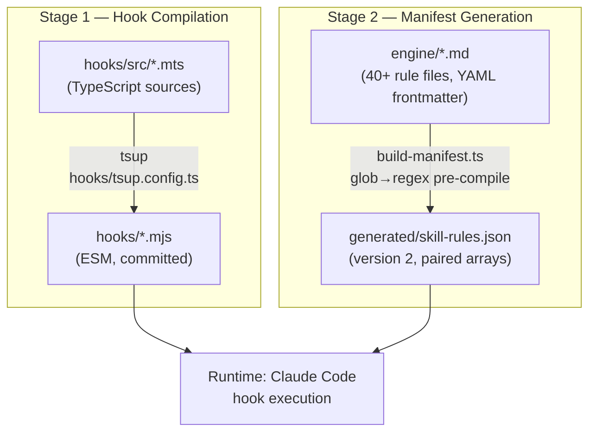
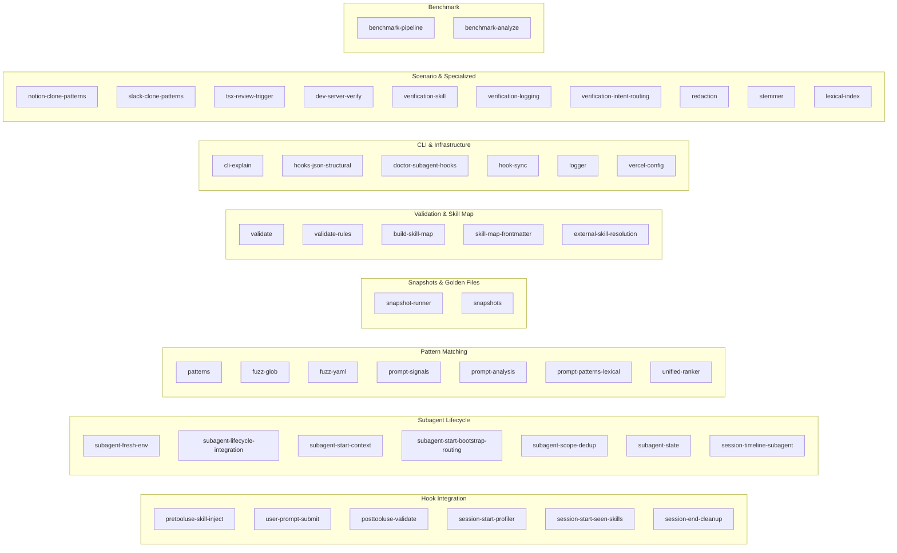
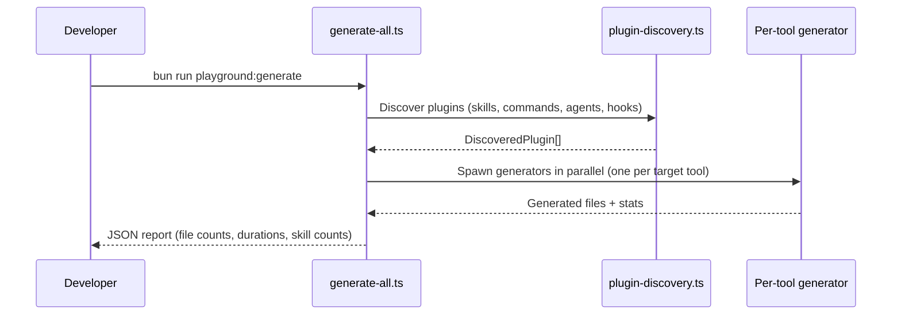

# Developer Workflows & CLI Reference

This guide covers every build command, CLI tool, testing workflow, and development process in vercel-plugin.

---

## Table of Contents

- [Build Pipeline](#build-pipeline)
- [Build Commands](#build-commands)
- [Testing Architecture](#testing-architecture)
- [Pre-Commit Hook](#pre-commit-hook)
- [Playground System](#playground-system)
- [Environment Variables](#environment-variables)
- [Troubleshooting](#troubleshooting)

---

## Build Pipeline

The project has two independent build stages that combine into a single `bun run build`:



### Data flow summary

1. **TypeScript hooks** (`hooks/src/*.mts`) compile via tsup to ESM modules (`hooks/*.mjs`). Target: `node20`, no bundling, no sourcemaps. The compiled `.mjs` files are committed to the repo so the Claude Agent SDK can execute them directly.
2. **Engine rule frontmatter** from 40+ `engine/*.md` files gets pre-compiled into `generated/skill-rules.json` with glob-to-regex conversion for fast runtime matching. The manifest uses a version 2 format with paired arrays (`pathPatterns` ↔ `pathRegexSources`, `bashPatterns` ↔ `bashRegexSources`).

Agents and commands (`agents/*.md`, `commands/*.md`) are standalone files that do not require a build step.

### Stage execution order

```
bun run build
  ├── bun run build:hooks        # Stage 1: .mts → .mjs
  └── bun run build:manifest     # Stage 2: engine/*.md → skill-rules.json
```

Both stages are independent and can run in any order, but `build` runs them sequentially for simplicity.

---

## Build Commands

### `bun run build:hooks`

Compiles all TypeScript hook sources to ESM.

| Detail | Value |
|--------|-------|
| Source | `hooks/src/*.mts` |
| Output | `hooks/*.mjs` |
| Tool | tsup with `hooks/tsup.config.ts` |
| Target | `node20`, no bundling, no sourcemaps |

Run this after editing any `.mts` file. The pre-commit hook runs it automatically when `.mts` files are staged.

### `bun run build:manifest`

Generates the skill rules manifest from engine rule frontmatter.

| Detail | Value |
|--------|-------|
| Script | `scripts/build-manifest.ts` |
| Input | `engine/*.md` (40+ rule files) |
| Output | `generated/skill-rules.json` |

The manifest pre-compiles glob patterns to regex at build time so runtime hooks avoid expensive parsing. Version 2 format with paired arrays (`pathPatterns` ↔ `pathRegexSources`).

### `bun run build`

Runs both stages sequentially:

```
bun run build:hooks && bun run build:manifest
```

### `bun run typecheck`

Runs TypeScript type checking on hook sources without emitting files:

```
tsc -p hooks/tsconfig.json --noEmit
```

### `bun run doctor`

Runs `vercel-plugin doctor` (see [docs/cli-reference.md](cli-reference.md) for full details). Self-diagnosis for the plugin setup.

---

## Testing Architecture

### Running tests

```bash
bun test                                    # Typecheck + all test files
bun test tests/<file>.test.ts               # Single test file
bun run test:update-snapshots               # Regenerate golden snapshots
```

`bun test` runs typecheck first (`tsc -p hooks/tsconfig.json --noEmit`), then all test files.

### Test categories

The test suite is organized into functional categories:



#### Hook integration tests

End-to-end tests for each hook entry point. They simulate Claude Agent SDK hook invocations with realistic tool input and verify the correct skills are injected, dedup state is maintained, and output conforms to `SyncHookJSONOutput`.

| Test file | Hook under test | Key assertions |
|-----------|----------------|----------------|
| `pretooluse-skill-inject` | PreToolUse | Path/bash/import matching, priority ranking, budget enforcement, dedup |
| `user-prompt-submit` | UserPromptSubmit | Prompt signal scoring (phrases/allOf/anyOf/noneOf), 2-skill cap, 8KB budget |
| `posttooluse-validate` | PostToolUse | Validation rule matching, severity levels, `skipIfFileContains` |
| `session-start-profiler` | SessionStart | Config file scanning, dependency detection, greenfield mode |
| `session-start-seen-skills` | SessionStart | Env var initialization, claim dir creation |
| `session-end-cleanup` | SessionEnd | Temp file deletion, claim dir cleanup |

#### Pattern matching tests

Unit tests for the matching and compilation layer. Cover glob-to-regex conversion, bash command regex, import pattern detection, YAML parsing edge cases, and prompt signal scoring.

#### Snapshot tests

Golden-file regression tests. `snapshot-runner` generates skill injection metadata for each `vercel.json` fixture and compares against committed baselines. Update with `bun run test:update-snapshots`.

#### Validation tests

Test the YAML frontmatter parser, skill map construction, structural validation rules, and external skill resolution. Exercises the custom `parseSimpleYaml` parser's intentional differences from `js-yaml` (bare `null` → string `"null"`, bare booleans → strings, unclosed `[` → scalar).

#### Build & template tests

Test the template include engine: marker regex matching, section extraction with nested headings, frontmatter field resolution, code block fence skipping, and full compilation pipeline.

#### Benchmark tests

Performance regression tests for the injection pipeline. `benchmark-pipeline` measures pattern compilation and matching latency; `benchmark-analyze` validates that results stay within acceptable bounds.

#### CLI tests

Tests for `vercel-plugin explain` covering target type detection (file vs bash), pattern matching output, priority calculations with profiler/vercel.json boosts, budget simulation, and collision detection.

#### Scenario tests

Real-world regression tests that simulate specific project types (Notion clone, Slack clone) to verify correct skill injection for realistic file and dependency combinations.

---

## Pre-Commit Hook

The `.git/hooks/pre-commit` script automates hook compilation.

When any `hooks/src/*.mts` file is staged:

```
1. Typecheck: bun run typecheck
2. Compile:   bun run build:hooks
3. Stage:     git add hooks/*.mjs
```

---

## Playground System

The playground generates static skill files for external AI coding tools. Lives in `.playground/`.

### Structure

```
.playground/
├── generate-all.ts          # Unified CLI entry point
├── _shared/
│   ├── emitter.ts           # Context creation + skill flattening
│   ├── plugin-discovery.ts  # Discovers skills from plugin root
│   ├── skill-discovery.ts   # Skill data extraction
│   ├── types.ts             # Shared types (DiscoveredSkill, PluginManifest, etc.)
│   └── marker-patch.ts      # {{include:…}} marker resolution for external tools
├── codex-cli/generate.ts    # → .codex/ directory structure
├── cursor/generate.ts       # → .cursor/rules/
├── vscode-copilot/generate.ts   # → .github/copilot-instructions.md
├── opencode/generate.ts     # → .opencode/
├── gemini-cli/generate.ts   # → .gemini/commands/
├── gemini-code-assist/generate.ts  # → .gemini/skills/
├── _fixtures/               # Test plugins (full, minimal, collision, oversized, etc.)
└── _snapshots/              # Golden output snapshots
```

### Running the generator

```bash
bun run playground:generate
```

**Options:**

| Flag | Description |
|------|-------------|
| `--plugins <dir>` | Plugin root to discover skills from (default: `.playground/_fixtures`) |
| `--out <dir>` | Output directory (default: `.playground/_output`) |
| `--dry-run` | Preview without writing files |
| `--target <name>` | Comma-separated generator names (e.g., `cursor,codex-cli`) |

**Supported generators:** `codex-cli`, `cursor`, `vscode-copilot`, `opencode`, `gemini-cli`, `gemini-code-assist`

### Workflow



Output is a JSON report with file counts, durations, and per-generator statistics.

---

## Environment Variables

These variables control runtime behavior. Set them before running Claude Code or in tests.

| Variable | Default | Description |
|----------|---------|-------------|
| `VERCEL_PLUGIN_LOG_LEVEL` | `off` | Logging verbosity: `off`, `summary`, `debug`, `trace` |
| `VERCEL_PLUGIN_DEBUG` | — | Legacy: `1` maps to `debug` level |
| `VERCEL_PLUGIN_SEEN_SKILLS` | `""` | Comma-delimited already-injected skill slugs |
| `VERCEL_PLUGIN_HOOK_DEDUP` | — | Set to `off` to disable deduplication |
| `VERCEL_PLUGIN_LIKELY_SKILLS` | — | Profiler-detected skills (comma-delimited, +5 boost) |
| `VERCEL_PLUGIN_GREENFIELD` | — | `true` when project is empty (set by profiler) |
| `VERCEL_PLUGIN_INJECTION_BUDGET` | `18000` | PreToolUse byte budget |
| `VERCEL_PLUGIN_PROMPT_INJECTION_BUDGET` | `8000` | UserPromptSubmit byte budget |
| `VERCEL_PLUGIN_REVIEW_THRESHOLD` | `3` | TSX edits before `react-best-practices` injection |
| `VERCEL_PLUGIN_TSX_EDIT_COUNT` | `0` | Current `.tsx` edit count |
| `VERCEL_PLUGIN_AUDIT_LOG_FILE` | — | Audit log path or `off` |

---

## Troubleshooting

### Manifest parity errors from `doctor`

The `generated/skill-rules.json` is out of sync with live `engine/*.md` files.

**Fix:**

```bash
bun run build:manifest
```

### Typecheck failures

Hook source uses TypeScript features that need compilation. The `tsc` target is `hooks/tsconfig.json`.

**Fix:**

```bash
bun run typecheck  # See errors
# Fix the .mts files, then:
bun run build:hooks
```

### Hook timeout (5-second limit)

All PreToolUse, UserPromptSubmit, PostToolUse, SubagentStart, and SubagentStop hooks have a 5-second timeout. If you add many skills or patterns, `doctor` will warn you.

**Diagnose:**

```bash
bun run doctor
```

**Mitigations:**
- Use the pre-built manifest (`build:manifest`) to avoid live YAML scanning
- Consolidate low-priority skills
- Increase pattern specificity to reduce false-positive matching

### Dedup not working (skills injected twice)

**Check:** Is `session-start-seen-skills.mjs` running on SessionStart? Run `doctor` to verify.

**Debug:** Set `VERCEL_PLUGIN_LOG_LEVEL=debug` to see dedup strategy selection and claim attempts in stderr.

### Pre-commit hook not running

Verify the hook exists and is executable:

```bash
ls -la .git/hooks/pre-commit
chmod +x .git/hooks/pre-commit
```

### Playground generator fails

Ensure the plugin root has an `engine/` directory with valid rule files:

```bash
bun run playground:generate --dry-run
```

The `--dry-run` flag previews without writing, showing discovery errors on stderr.

### Tests fail after adding a new skill

After adding a new `engine/<name>.md`:

```bash
bun run build:manifest          # Update manifest
bun run test:update-snapshots   # Update golden snapshots
bun test                        # Verify everything passes
```
