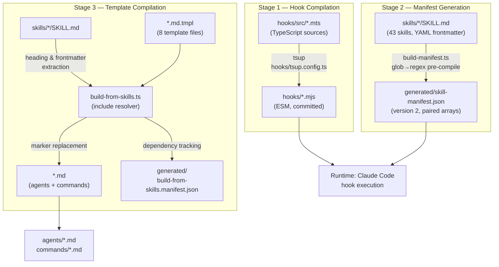
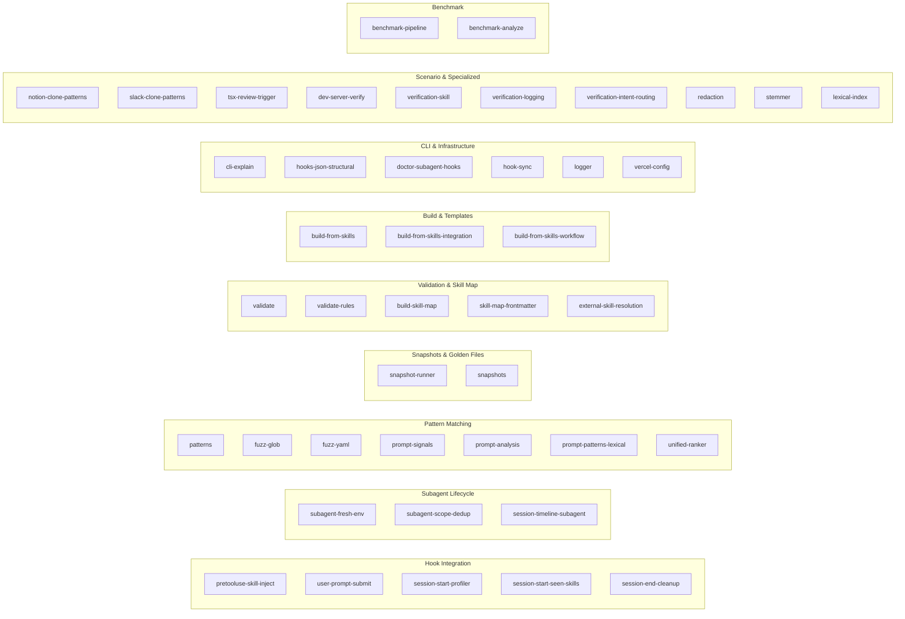
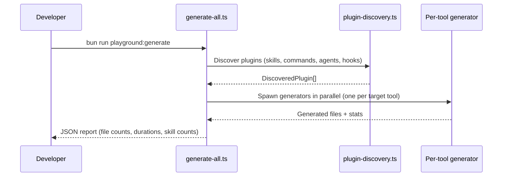

# Developer Workflows & CLI Reference

This guide covers every build command, CLI tool, testing workflow, and development process in vercel-plugin.

---

## Table of Contents

- [Build Pipeline](#build-pipeline)
- [Build Commands](#build-commands)
- [Template Include Engine](#template-include-engine)
- [Testing Architecture](#testing-architecture)
- [Pre-Commit Hook](#pre-commit-hook)
- [Playground System](#playground-system)
- [Environment Variables](#environment-variables)
- [Troubleshooting](#troubleshooting)

---

## Build Pipeline

The project has three independent build stages that combine into a single `bun run build`:



### Data flow summary

1. **TypeScript hooks** (`hooks/src/*.mts`) compile via tsup to ESM modules (`hooks/*.mjs`). Target: `node20`, no bundling, no sourcemaps. The compiled `.mjs` files are committed to the repo so the Claude Agent SDK can execute them directly.
2. **Skill frontmatter** from 43 `SKILL.md` files gets pre-compiled into `generated/skill-manifest.json` with glob-to-regex conversion for fast runtime matching. The manifest uses a version 2 format with paired arrays (`pathPatterns` ↔ `pathRegexSources`, `bashPatterns` ↔ `bashRegexSources`).
3. **Templates** (`*.md.tmpl`) pull sections from skills via `{{include:skill:...}}` markers, producing committed `.md` files for agents and commands. A build manifest (`generated/build-from-skills.manifest.json`) tracks dependencies for staleness detection.

### Stage execution order

```
bun run build
  ├── bun run build:hooks        # Stage 1: .mts → .mjs
  ├── bun run build:manifest     # Stage 2: SKILL.md → manifest
  └── bun run build:from-skills  # Stage 3: .md.tmpl → .md
```

All three stages are independent and can run in any order, but `build` runs them sequentially for simplicity.

---

## Build Commands

### `bun run build:hooks`

Compiles all TypeScript hook sources to ESM.

| Detail | Value |
|--------|-------|
| Source | `hooks/src/*.mts` |
| Output | `hooks/*.mjs` |
| Tool | tsup with `hooks/tsup.config.ts` |
| Target | `node20`, no bundling, no sourcemaps |

Run this after editing any `.mts` file. The pre-commit hook runs it automatically when `.mts` files are staged.

### `bun run build:manifest`

Generates the skill manifest from SKILL.md frontmatter.

| Detail | Value |
|--------|-------|
| Script | `scripts/build-manifest.ts` |
| Input | `skills/*/SKILL.md` (43 skills) |
| Output | `generated/skill-manifest.json` |

The manifest pre-compiles glob patterns to regex at build time so runtime hooks avoid expensive parsing. Version 2 format with paired arrays (`pathPatterns` ↔ `pathRegexSources`).

### `bun run build:from-skills`

Resolves template includes and generates output files.

| Detail | Value |
|--------|-------|
| Script | `scripts/build-from-skills.ts` |
| Templates | 8 files in `agents/` and `commands/` |
| Output | Corresponding `.md` files + `generated/build-from-skills.manifest.json` |

See [Template Include Engine](#template-include-engine) below for full details.

### `bun run build:from-skills:check`

Verifies generated `.md` files are up-to-date without writing. Exits non-zero on drift. Useful in CI.

### `bun run build`

Runs all three stages sequentially:

```
bun run build:hooks && bun run build:manifest && bun run build:from-skills
```

### `bun run typecheck`

Runs TypeScript type checking on hook sources without emitting files:

```
tsc -p hooks/tsconfig.json --noEmit
```

### `bun run validate`

Structural validation of all skills and the manifest. Runs `scripts/validate.ts` to check:
- Every skill has valid YAML frontmatter
- Required fields are present (name, description, summary, metadata)
- Pattern arrays contain valid entries
- Manifest is consistent with live skill data

### `bun run doctor`

Runs `vercel-plugin doctor` (see [docs/cli-reference.md](cli-reference.md) for full details). Self-diagnosis for the plugin setup.

---

## Template Include Engine

The template engine (`scripts/build-from-skills.ts`) resolves skill content into agent and command definitions at build time. Skills are the **single source of truth** — templates pull content so agents/commands stay in sync without duplicating prose.

### Marker formats

Two include marker syntaxes are supported:

#### 1. Section extraction

```
{{include:skill:<name>:<heading>}}
```

Extracts a markdown section by heading from `skills/<name>/SKILL.md`. The extraction algorithm:

1. Finds the first heading whose text matches `<heading>` (case-insensitive, optional leading `#` characters)
2. Captures all content from that heading to the next heading of equal or higher level
3. Skips heading detection inside fenced code blocks (``` markers)

**Nested headings** use `>` as a path separator:

```
{{include:skill:nextjs:Rendering Strategy Decision > Caching Strategy Matrix}}
```

This first extracts the "Rendering Strategy Decision" section, then extracts "Caching Strategy Matrix" within that narrowed scope.

#### 2. Frontmatter field extraction

```
{{include:skill:<name>:frontmatter:<field>}}
```

Extracts a YAML frontmatter field value from `skills/<name>/SKILL.md`. Supports dotted paths for nested fields (e.g., `frontmatter:metadata.priority`). Returns strings/numbers directly; arrays/objects are JSON-serialized.

### CLI options for `build-from-skills`

| Flag | Description |
|------|-------------|
| `--check` | Verify outputs are up-to-date without writing (exit 1 on drift) |
| `--dry-run` | Print resolved output to stdout without writing |
| `--json` | Structured JSON output with per-template diagnostics |
| `--audit` | Coverage report showing what percentage of each template comes from includes |
| `--skill <name>` | Reverse-dependency query: which templates depend on a given skill |

### All 8 templates and their source skills

#### Agent templates (`agents/*.md.tmpl`)

| Template | Output | Source skills | Includes |
|----------|--------|---------------|----------|
| `ai-architect.md.tmpl` | `ai-architect.md` | `ai-sdk` | Core Functions > Agents, Migration from AI SDK 5 |
| `deployment-expert.md.tmpl` | `deployment-expert.md` | `vercel-functions`, `deployments-cicd` | Function Runtime Diagnostics (5 subsections), Deployment Strategy Matrix, Common Build Errors, CI/CD Integration, Promote & Rollback |
| `performance-optimizer.md.tmpl` | `performance-optimizer.md` | `nextjs`, `observability` | Rendering Strategy Decision (6 subsections), Bundle Analyzer, Cache Components, Speed Insights Metrics, Performance Audit Checklist |

#### Command templates (`commands/*.md.tmpl`)

| Template | Output | Source skills | Includes |
|----------|--------|---------------|----------|
| `bootstrap.md.tmpl` | `bootstrap.md` | `bootstrap` | Preflight, Rules, Resource Setup, AUTH_SECRET, Env Verification, App Setup, Bootstrap Verification, Summary Format, Next Steps |
| `deploy.md.tmpl` | `deploy.md` | `observability`, `deployments-cicd` | Deploy Preflight, Post-Deploy Error Scan, Preview/Production Deployment, Inspect, Summary, Next Steps |
| `env.md.tmpl` | `env.md` | `env-vars` | vercel env CLI (List/Pull/Add/Remove), Environment-Specific Config, Gotchas |
| `marketplace.md.tmpl` | `marketplace.md` | `marketplace` | Observability Integration Path |
| `status.md.tmpl` | `status.md` | `observability` | Drains Security/Signature, Fallback Guidance, Decision Matrix |

### User story: editing a skill updates downstream templates

```
Developer edits skills/observability/SKILL.md
  → Pre-commit hook detects staged SKILL.md
  → Runs `bun run build:from-skills:check`
  → Detects drift in commands/deploy.md and commands/status.md
  → Auto-regenerates with `bun run build:from-skills`
  → Stages updated .md files
  → Exits with code 1 ("review and re-commit")
  → Developer reviews diff, runs `git commit` again
```

### Diagnostic codes

The template engine emits structured diagnostics when includes fail:

| Code | Meaning |
|------|---------|
| `SKILL_NOT_FOUND` | `skills/<name>/SKILL.md` does not exist |
| `HEADING_NOT_FOUND` | Heading text not found in the skill body |
| `FRONTMATTER_NOT_FOUND` | YAML field not present in frontmatter |
| `STALE_OUTPUT` | Output file is out of date (--check mode) |

---

## Testing Architecture

### Running tests

```bash
bun test                                    # Typecheck + all test files
bun test tests/<file>.test.ts               # Single test file
bun run test:update-snapshots               # Regenerate golden snapshots
```

`bun test` runs typecheck first (`tsc -p hooks/tsconfig.json --noEmit`), then all test files.

### Test categories

The test suite is organized into functional categories:



#### Hook integration tests

End-to-end tests for each hook entry point. They simulate Claude Agent SDK hook invocations with realistic tool input and verify the correct skills are injected, dedup state is maintained, and output conforms to `SyncHookJSONOutput`.

| Test file | Hook under test | Key assertions |
|-----------|----------------|----------------|
| `pretooluse-skill-inject` | PreToolUse | Path/bash/import matching, priority ranking, budget enforcement, dedup |
| `user-prompt-submit` | UserPromptSubmit | Prompt signal scoring (phrases/allOf/anyOf/noneOf), 2-skill cap, 8KB budget |
| `session-start-profiler` | SessionStart | Config file scanning, dependency detection, greenfield mode |
| `session-start-seen-skills` | SessionStart | Env var initialization, claim dir creation |
| `session-end-cleanup` | SessionEnd | Temp file deletion, claim dir cleanup |

#### Pattern matching tests

Unit tests for the matching and compilation layer. Cover glob-to-regex conversion, bash command regex, import pattern detection, YAML parsing edge cases, and prompt signal scoring.

#### Snapshot tests

Golden-file regression tests. `snapshot-runner` generates skill injection metadata for each `vercel.json` fixture and compares against committed baselines. Update with `bun run test:update-snapshots`.

#### Validation tests

Test the YAML frontmatter parser, skill map construction, structural validation rules, and external skill resolution. Exercises the custom `parseSimpleYaml` parser's intentional differences from `js-yaml` (bare `null` → string `"null"`, bare booleans → strings, unclosed `[` → scalar).

#### Build & template tests

Test the template include engine: marker regex matching, section extraction with nested headings, frontmatter field resolution, code block fence skipping, and full compilation pipeline.

#### Benchmark tests

Performance regression tests for the injection pipeline. `benchmark-pipeline` measures pattern compilation and matching latency; `benchmark-analyze` validates that results stay within acceptable bounds.

#### CLI tests

Tests for `vercel-plugin explain` covering target type detection (file vs bash), pattern matching output, priority calculations with profiler/vercel.json boosts, budget simulation, and collision detection.

#### Scenario tests

Real-world regression tests that simulate specific project types (Notion clone, Slack clone) to verify correct skill injection for realistic file and dependency combinations.

---

## Pre-Commit Hook

The `.git/hooks/pre-commit` script automates two tasks:

### 1. Hook compilation

When any `hooks/src/*.mts` file is staged:

```
1. Typecheck: bun run typecheck
2. Compile:   bun run build:hooks
3. Stage:     git add hooks/*.mjs
```

### 2. Template freshness

When any `.md.tmpl`, `SKILL.md`, `build-from-skills.ts`, or `skill-map-frontmatter.mts` is staged:

```
1. Check:      bun run build:from-skills:check
2. If stale:   bun run build:from-skills
3. Stage:      git add agents/*.md commands/*.md
4. Exit 1:     "Generated files updated and staged. Please review and re-commit."
```

The hook exits with code 1 after regeneration so you can review the changes before committing. Simply run `git commit` again after reviewing.

---

## Playground System

The playground generates static skill files for external AI coding tools. Lives in `.playground/`.

### Structure

```
.playground/
├── generate-all.ts          # Unified CLI entry point
├── _shared/
│   ├── emitter.ts           # Context creation + skill flattening
│   ├── plugin-discovery.ts  # Discovers skills from plugin root
│   ├── skill-discovery.ts   # Skill data extraction
│   ├── types.ts             # Shared types (DiscoveredSkill, PluginManifest, etc.)
│   └── marker-patch.ts      # {{include:…}} marker resolution for external tools
├── codex-cli/generate.ts    # → .codex/ directory structure
├── cursor/generate.ts       # → .cursor/rules/
├── vscode-copilot/generate.ts   # → .github/copilot-instructions.md
├── opencode/generate.ts     # → .opencode/
├── gemini-cli/generate.ts   # → .gemini/commands/
├── gemini-code-assist/generate.ts  # → .gemini/skills/
├── _fixtures/               # Test plugins (full, minimal, collision, oversized, etc.)
└── _snapshots/              # Golden output snapshots
```

### Running the generator

```bash
bun run playground:generate
```

**Options:**

| Flag | Description |
|------|-------------|
| `--plugins <dir>` | Plugin root to discover skills from (default: `.playground/_fixtures`) |
| `--out <dir>` | Output directory (default: `.playground/_output`) |
| `--dry-run` | Preview without writing files |
| `--target <name>` | Comma-separated generator names (e.g., `cursor,codex-cli`) |

**Supported generators:** `codex-cli`, `cursor`, `vscode-copilot`, `opencode`, `gemini-cli`, `gemini-code-assist`

### Workflow



Output is a JSON report with file counts, durations, and per-generator statistics.

---

## Environment Variables

These variables control runtime behavior. Set them before running Claude Code or in tests.

| Variable | Default | Description |
|----------|---------|-------------|
| `VERCEL_PLUGIN_LOG_LEVEL` | `off` | Logging verbosity: `off`, `summary`, `debug`, `trace` |
| `VERCEL_PLUGIN_DEBUG` | — | Legacy: `1` maps to `debug` level |
| `VERCEL_PLUGIN_SEEN_SKILLS` | `""` | Comma-delimited already-injected skill slugs |
| `VERCEL_PLUGIN_HOOK_DEDUP` | — | Set to `off` to disable deduplication |
| `VERCEL_PLUGIN_LIKELY_SKILLS` | — | Profiler-detected skills (comma-delimited, +5 boost) |
| `VERCEL_PLUGIN_GREENFIELD` | — | `true` when project is empty (set by profiler) |
| `VERCEL_PLUGIN_INJECTION_BUDGET` | `18000` | PreToolUse byte budget |
| `VERCEL_PLUGIN_PROMPT_INJECTION_BUDGET` | `8000` | UserPromptSubmit byte budget |
| `VERCEL_PLUGIN_REVIEW_THRESHOLD` | `3` | TSX edits before `react-best-practices` injection |
| `VERCEL_PLUGIN_TSX_EDIT_COUNT` | `0` | Current `.tsx` edit count |
| `VERCEL_PLUGIN_AUDIT_LOG_FILE` | — | Audit log path or `off` |

---

## Troubleshooting

### "Generated files are out of date"

The pre-commit hook or CI detected drift between `.md.tmpl` templates and their `.md` outputs.

**Fix:**

```bash
bun run build:from-skills
git add agents/*.md commands/*.md
```

### Manifest parity errors from `doctor`

The `generated/skill-manifest.json` is out of sync with live `SKILL.md` files.

**Fix:**

```bash
bun run build:manifest
```

### Typecheck failures

Hook source uses TypeScript features that need compilation. The `tsc` target is `hooks/tsconfig.json`.

**Fix:**

```bash
bun run typecheck  # See errors
# Fix the .mts files, then:
bun run build:hooks
```

### Hook timeout (5-second limit)

The default runtime no longer registers PostToolUse or subagent lifecycle hooks. The main timeout risk is the hook-driven injection engines when they are enabled.

**Diagnose:**

```bash
bun run doctor
```

**Mitigations:**
- Use the pre-built manifest (`build:manifest`) to avoid live YAML scanning
- Consolidate low-priority skills
- Increase pattern specificity to reduce false-positive matching

### Dedup not working (skills injected twice)

**Check:** Is `session-start-seen-skills.mjs` running on SessionStart? Run `doctor` to verify.

**Debug:** Set `VERCEL_PLUGIN_LOG_LEVEL=debug` to see dedup strategy selection and claim attempts in stderr.

### Pre-commit hook not running

Verify the hook exists and is executable:

```bash
ls -la .git/hooks/pre-commit
chmod +x .git/hooks/pre-commit
```

### Playground generator fails

Ensure the plugin root has a `skills/` directory with valid SKILL.md files:

```bash
bun run playground:generate --dry-run
```

The `--dry-run` flag previews without writing, showing discovery errors on stderr.

### Tests fail after adding a new skill

After adding a new `skills/<name>/SKILL.md`:

```bash
bun run build:manifest          # Update manifest
bun run build:from-skills       # Update templates (if referenced)
bun run test:update-snapshots   # Update golden snapshots
bun test                        # Verify everything passes
```
