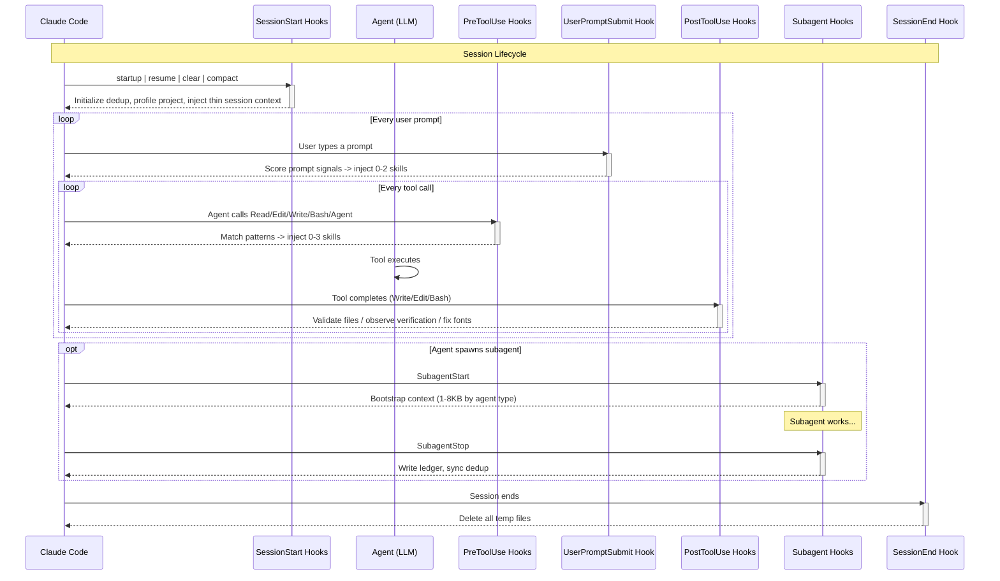
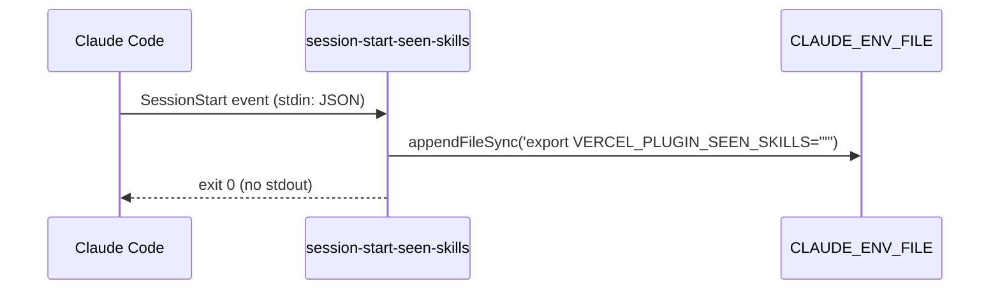
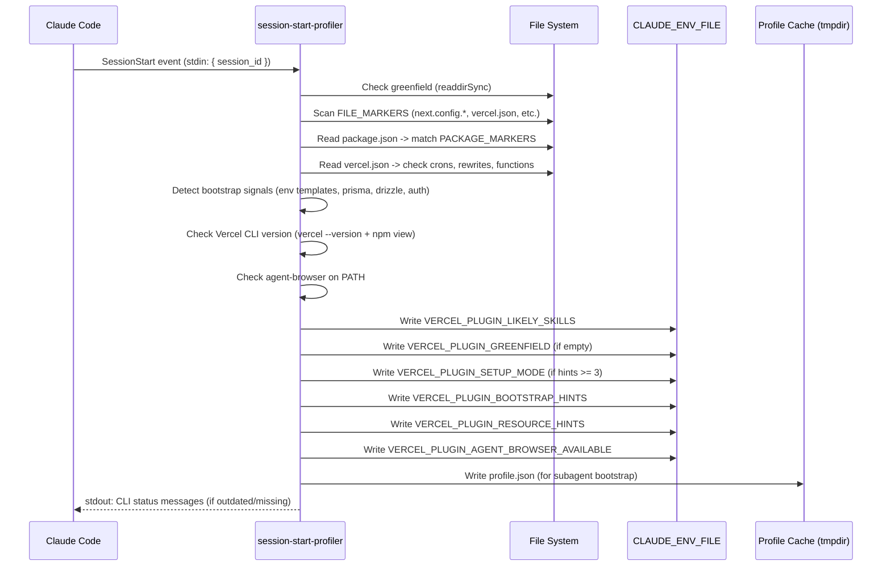
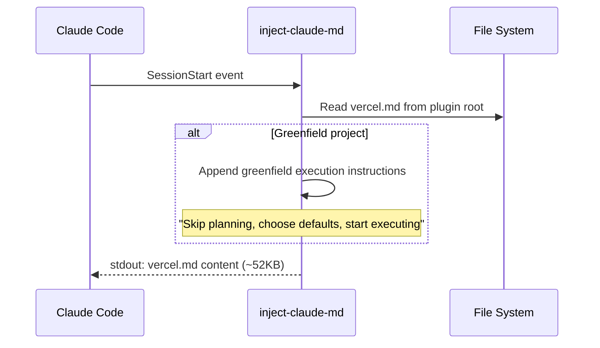
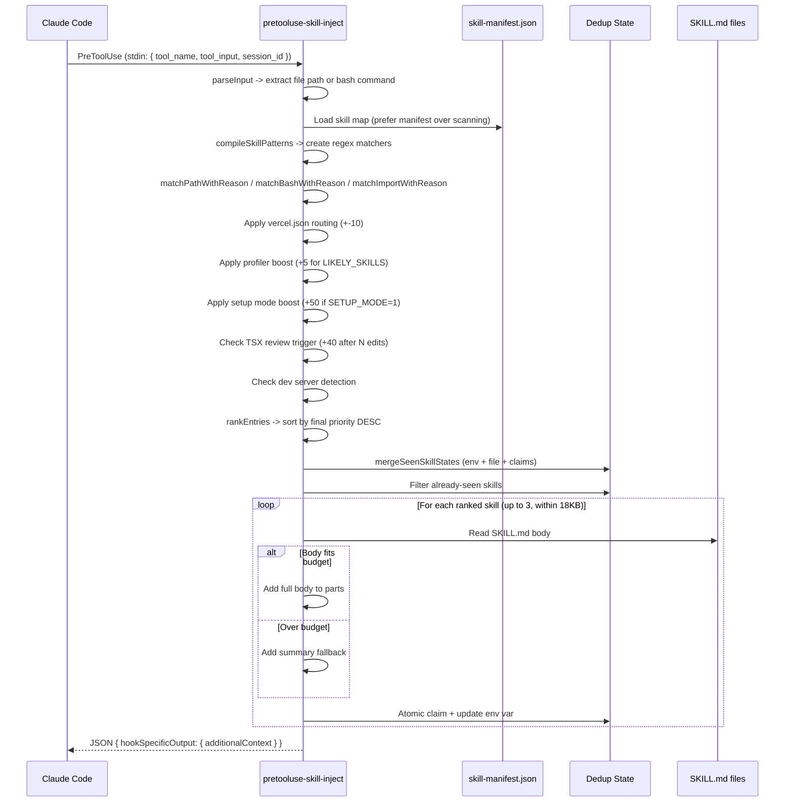
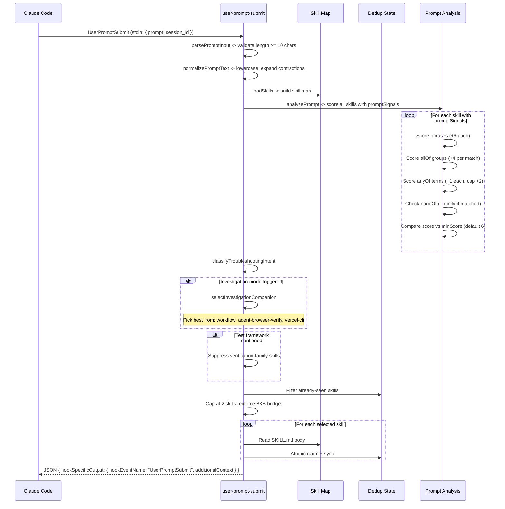
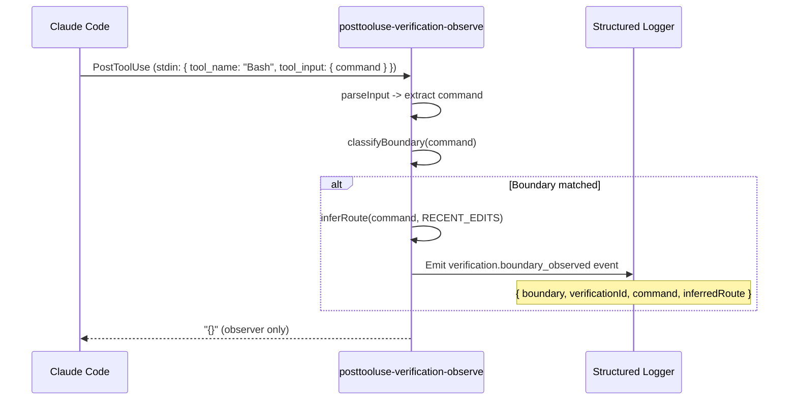
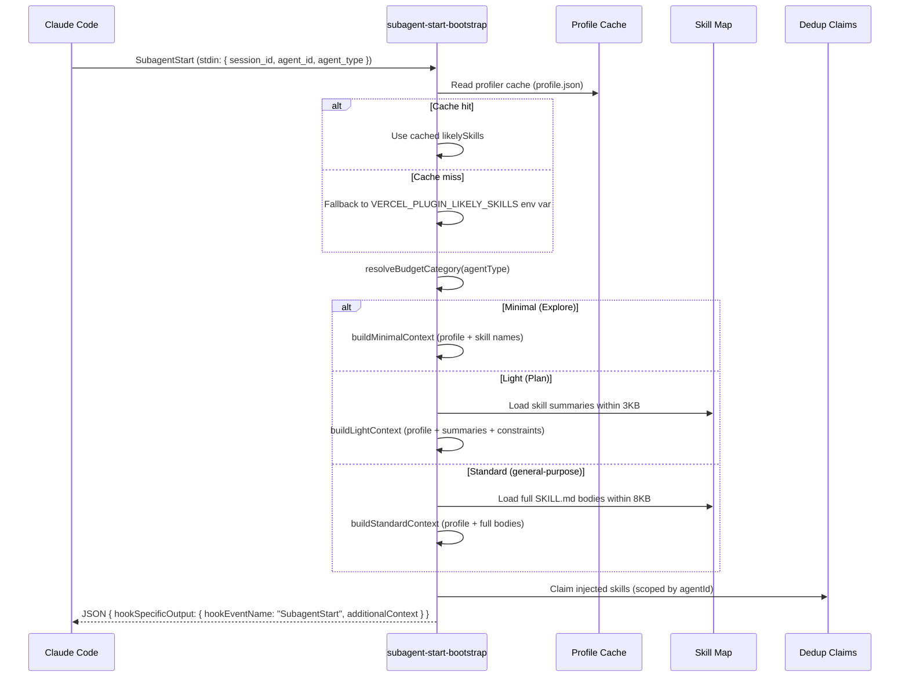
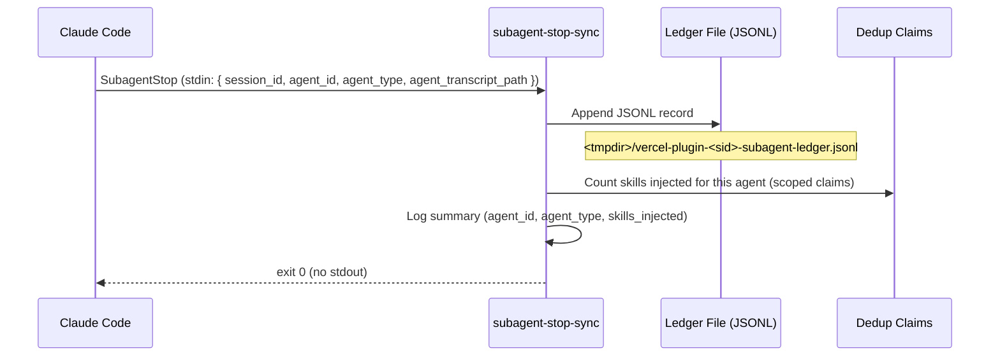
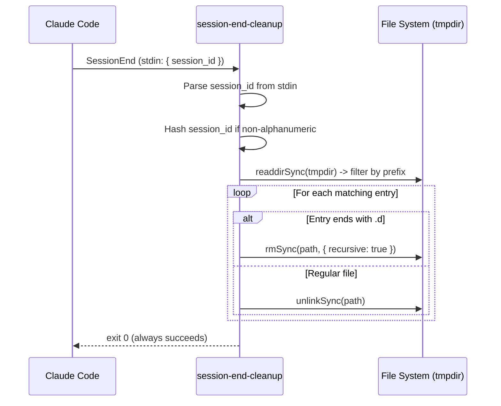

# Hook Lifecycle Deep Dive

> Note: the skill-injection engines described here still exist, but their `PreToolUse` and `UserPromptSubmit` registrations are disabled in the default `hooks/hooks.json` profile.

This document covers every hook entry point in `hooks/hooks.json`, organized by lifecycle phase. Each section includes input/output contracts, sequence diagrams, and implementation details.

---

## Table of Contents

1. [Lifecycle Overview](#lifecycle-overview)
2. [SessionStart Phase](#sessionstart-phase)
   - [session-start-seen-skills](#1-session-start-seen-skills)
   - [session-start-profiler](#2-session-start-profiler)
   - [inject-claude-md](#3-inject-claude-md)
3. [PreToolUse Phase](#pretooluse-phase)
   - [pretooluse-skill-inject](#4-pretooluse-skill-inject)
4. [UserPromptSubmit Phase](#userpromptsubmit-phase)
   - [user-prompt-submit-skill-inject](#6-user-prompt-submit-skill-inject)
5. [PostToolUse Phase](#posttooluse-phase)
   - [posttooluse-shadcn-font-fix](#7-posttooluse-shadcn-font-fix)
   - [posttooluse-verification-observe](#8-posttooluse-verification-observe)
   - [posttooluse-validate](#9-posttooluse-validate)
6. [SubagentStart Phase](#subagentstart-phase)
   - [subagent-start-bootstrap](#10-subagent-start-bootstrap)
7. [SubagentStop Phase](#subagentstop-phase)
   - [subagent-stop-sync](#11-subagent-stop-sync)
8. [SessionEnd Phase](#sessionend-phase)
   - [session-end-cleanup](#12-session-end-cleanup)
9. [Hook I/O Contract](#hook-io-contract)
10. [Custom YAML Parser Semantics](#custom-yaml-parser-semantics)
11. [Environment Variables Reference](#environment-variables-reference)

---

## Lifecycle Overview

Every hook fires at a specific point in Claude Code's execution cycle. The following diagram shows the complete lifecycle from session start to session end, including all 12 hook entry points.



---

## SessionStart Phase

These hooks fire once when a session begins, resumes, is cleared, or compacted. They set up the environment for all subsequent hooks.

**Matcher**: `startup|resume|clear|compact`

**Execution order**: Hooks run in the order listed in `hooks.json` — seen-skills first, then profiler, then inject-claude-md.

---

### 1. session-start-seen-skills

**Source**: `hooks/src/session-start-seen-skills.mts` (17 lines)
**Timeout**: None
**Output**: None (side-effect only)

#### Purpose

Initializes the dedup state by writing `VERCEL_PLUGIN_SEEN_SKILLS=""` to `CLAUDE_ENV_FILE`. This ensures the PreToolUse and UserPromptSubmit hooks start with a blank slate for skill dedup tracking.

#### Sequence



#### Implementation Details

- Reads `CLAUDE_ENV_FILE` from environment (required — `requireEnvFile()` exits if missing)
- Appends a single `export` line — does not overwrite existing content
- Failures are silently ignored (non-critical)
- This must run **before** the profiler to ensure the env var exists when the profiler writes `LIKELY_SKILLS`

---

### 2. session-start-profiler

**Source**: `hooks/src/session-start-profiler.mts` (620 lines)
**Timeout**: None
**Output**: stdout text (CLI status messages), env var side-effects

#### Purpose

Scans the project's `package.json`, config files, directory structure, and Vercel CLI version to:
1. Determine which skills are likely relevant (`VERCEL_PLUGIN_LIKELY_SKILLS`)
2. Detect bootstrap/setup signals (`VERCEL_PLUGIN_BOOTSTRAP_HINTS`, `VERCEL_PLUGIN_SETUP_MODE`)
3. Detect greenfield (empty) projects (`VERCEL_PLUGIN_GREENFIELD`)
4. Check if `agent-browser` CLI is available (`VERCEL_PLUGIN_AGENT_BROWSER_AVAILABLE`)
5. Report Vercel CLI installation and update status

#### Sequence



#### File Markers

The profiler checks for these files to determine likely skills:

| File | Skills Detected |
|------|-----------------|
| `next.config.{js,mjs,ts,mts}` | `nextjs`, `turbopack` |
| `turbo.json` | `turborepo` |
| `vercel.json` | `vercel-cli`, `deployments-cicd`, `vercel-functions` |
| `.mcp.json` | `vercel-api` |
| `middleware.{ts,js}` | `routing-middleware` |
| `components.json` | `shadcn` |
| `.env.local` | `env-vars` |
| `pnpm-workspace.yaml` | `turborepo` |

#### Package Markers

Dependencies in `package.json` map to skills:

| Package | Skills |
|---------|--------|
| `next` | `nextjs` |
| `ai`, `@ai-sdk/*` | `ai-sdk`, `ai-elements`, `ai-gateway` |
| `@vercel/blob`, `@vercel/kv`, `@vercel/postgres`, `@vercel/edge-config` | `vercel-storage` |
| `@vercel/analytics`, `@vercel/speed-insights` | `observability` |
| `@vercel/flags` | `vercel-flags` |
| `@vercel/workflow` | `workflow` |
| `@vercel/queue` | `vercel-queues` |
| `turbo` | `turborepo` |
| `@repo/*`, `@t3-oss/env-nextjs` | `next-forge` |

#### Bootstrap Signal Detection

The profiler detects setup/bootstrap signals that trigger `VERCEL_PLUGIN_SETUP_MODE` when 3 or more hints are found:

- **Env templates**: `.env.example`, `.env.sample`, `.env.template`
- **README**: Any file starting with `readme`
- **Database**: `drizzle.config.*`, `prisma/schema.prisma`, `db:push`/`db:seed` scripts
- **Auth**: `next-auth`, `@auth/core`, `better-auth` dependencies
- **Resources**: `@neondatabase/serverless`, `drizzle-orm`, `@upstash/redis`

#### Greenfield Detection

A project is greenfield if:
- Every top-level entry is a dot-directory (`.git`, `.claude`)
- No dot-files exist (`.env.local`, `.mcp.json` indicate real config)

Greenfield projects get default skills: `nextjs`, `ai-sdk`, `vercel-cli`, `env-vars`.

---

### 3. inject-claude-md

**Source**: `hooks/src/inject-claude-md.mts` (33 lines)
**Timeout**: None
**Output**: stdout text (vercel.md content as additionalContext)

#### Purpose

Outputs the `vercel.md` ecosystem graph (~52KB) as `additionalContext`. This gives the agent a map of the entire Vercel ecosystem before any specific skills fire. If the project is greenfield, it also appends execution mode instructions.

#### Sequence



---

## PreToolUse Phase

These hooks fire **before** a tool call executes. They can inject additional context or observe the pending action.

---

### 4. pretooluse-skill-inject

**Source**: `hooks/src/pretooluse-skill-inject.mts` (~1300 lines)
**Matcher**: `Read|Edit|Write|Bash`
**Timeout**: 5 seconds
**Output**: JSON with `additionalContext`

#### Purpose

The main injection engine. When the agent calls Read, Edit, Write, or Bash, this hook:
1. Parses the tool input (file path or bash command)
2. Matches against all skills' `pathPatterns`, `bashPatterns`, and `importPatterns`
3. Applies priority boosters (profiler, vercel.json, setup mode)
4. Deduplicates against already-injected skills
5. Injects up to 3 skills within an 18KB byte budget

#### Sequence



#### Pipeline Stages

The hook is organized as a testable pipeline:

```
parseInput -> loadSkills -> matchSkills -> deduplicateSkills -> injectSkills -> formatOutput
```

#### Special Triggers

| Trigger | Condition | Effect |
|---------|-----------|--------|
| **TSX review** | After `VERCEL_PLUGIN_REVIEW_THRESHOLD` (default 3) `.tsx` edits | Injects `react-best-practices` with +40 priority boost |
| **Dev server detection** | Bash command matches `next dev`, `npm run dev`, etc. | Boosts `agent-browser-verify` |
| **Vercel env help** | First `vercel env` command | One-time injection of env-vars guidance |
| **Setup mode** | `VERCEL_PLUGIN_SETUP_MODE=1` | +50 priority boost for matched skills |

#### Input Schema

```json
{
  "tool_name": "Read|Edit|Write|Bash",
  "tool_input": {
    "file_path": "app/page.tsx",
    "command": "vercel deploy --prod"
  },
  "session_id": "abc-123",
  "cwd": "/Users/dev/my-app"
}
```

#### Output Schema

```json
{
  "hookSpecificOutput": {
    "additionalContext": "<!-- skillInjection: {...} -->\n[vercel-plugin] Best practices...\n\n<!-- skill:nextjs -->\n..."
  }
}
```

---

## UserPromptSubmit Phase

This hook fires when the user submits a prompt, before the agent processes it.

---

### 6. user-prompt-submit-skill-inject

**Source**: `hooks/src/user-prompt-submit-skill-inject.mts` (703 lines)
**Matcher**: _(all prompts)_
**Timeout**: 5 seconds
**Output**: JSON with `additionalContext`

#### Purpose

Scores the user's prompt text against `promptSignals` defined in skill frontmatter. Injects up to 2 skills within an 8KB budget. Also handles troubleshooting intent routing and investigation companion selection.

#### Sequence



#### Scoring Example

Given a skill with:
```yaml
promptSignals:
  phrases: ["deploy to preview"]  # +6
  allOf: [["deploy", "branch"]]   # +4
  anyOf: ["ci", "github"]         # +1 each, cap +2
  noneOf: ["rollback"]
  minScore: 6
```

- Prompt "how do I deploy to preview?" -> phrase match (+6) -> score 6 >= minScore 6 -> **matched**
- Prompt "deploy my branch to CI" -> allOf (+4) + anyOf "ci" (+1) -> score 5 < minScore 6 -> **not matched**
- Prompt "rollback the deploy" -> noneOf "rollback" -> score -Infinity -> **suppressed**

#### Investigation Companion Selection

When `investigation-mode` is selected, the hook picks the best companion skill:

| Priority | Companion | When Selected |
|----------|-----------|---------------|
| 1st | `workflow` | Best score among companions |
| 2nd | `agent-browser-verify` | If workflow doesn't match |
| 3rd | `vercel-cli` | Fallback companion |

---

## PostToolUse Phase

These hooks fire **after** a tool call completes. They observe results, validate outputs, or apply fixes.

---

### 7. posttooluse-shadcn-font-fix

Removed from the runtime. This hook was deleted as part of the hook-reduction pass.

---

### 8. posttooluse-verification-observe

**Source**: `hooks/src/posttooluse-verification-observe.mts` (285 lines)
**Matcher**: `Bash`
**Timeout**: 5 seconds
**Output**: `{}` (observer only — emits structured log events)

#### Purpose

After a Bash command completes, classifies the command into a verification boundary type and emits structured log events. This powers the verification pipeline that tracks whether the agent is testing at all system boundaries.

#### Boundary Classification

| Boundary | Pattern Examples | Label |
|----------|-----------------|-------|
| `uiRender` | `open`, `screenshot`, `playwright`, `puppeteer` | Browser/UI interaction |
| `clientRequest` | `curl`, `wget`, `fetch(`, `httpie` | HTTP client requests |
| `serverHandler` | `tail -f *.log`, `vercel logs`, port inspection | Server/log inspection |
| `environment` | `printenv`, `vercel env`, `cat .env` | Environment reads |

#### Story Inference

The hook infers the target route from two sources (in priority order):
1. `VERCEL_PLUGIN_RECENT_EDITS` — file paths recently edited, e.g. `app/settings/page.tsx` -> `/settings`
2. URL patterns in the command itself, e.g. `curl http://localhost:3000/api/data` -> `/api/data`

#### Sequence



---

### 9. posttooluse-validate

Removed from the runtime. This hook and its validated-file dedup state were deleted as part of the hook-reduction pass.

---

## SubagentStart Phase

This hook fires when any subagent starts.

---

### 10. subagent-start-bootstrap

**Source**: `hooks/src/subagent-start-bootstrap.mts` (427 lines)
**Matcher**: `.+` (any subagent)
**Timeout**: 5 seconds
**Output**: JSON with `additionalContext`

#### Purpose

When any subagent starts, bootstraps it with relevant skill context. The context size is tailored to the agent type:

| Agent Type | Budget | Content Strategy |
|------------|--------|------------------|
| `Explore` | 1KB (minimal) | Project profile line + skill name list |
| `Plan` | 3KB (light) | Profile + skill summaries + deployment constraints |
| `general-purpose` | 8KB (standard) | Profile + full skill bodies (with summary fallback) |
| Other/custom | 8KB (standard) | Same as general-purpose |

#### Sequence



## SubagentStop Phase

This hook fires when any subagent stops.

---

### 11. subagent-stop-sync

**Source**: `hooks/src/subagent-stop-sync.mts` (141 lines)
**Matcher**: `.+` (any subagent)
**Timeout**: 5 seconds
**Output**: None (side-effect only)

#### Purpose

When any subagent stops, writes a JSONL ledger entry for observability and counts the skills injected for that agent.

#### Sequence



#### Ledger Entry Format

```json
{
  "timestamp": "2026-03-10T12:00:00.000Z",
  "session_id": "abc-123",
  "agent_id": "agent-456",
  "agent_type": "Explore",
  "agent_transcript_path": "/path/to/transcript"
}
```

---

## SessionEnd Phase

This hook fires when the session ends.

---

### 12. session-end-cleanup

**Source**: `hooks/src/session-end-cleanup.mts` (81 lines)
**Matcher**: None (fires on all session ends)
**Timeout**: None
**Output**: None (side-effect only)

#### Purpose

Best-effort cleanup of all session-scoped temporary files. Always exits successfully, even if cleanup fails.

#### What Gets Cleaned Up

| Path Pattern | Type | Contents |
|-------------|------|----------|
| `<tmpdir>/vercel-plugin-<sid>-seen-skills.d/` | Directory | Atomic skill claim files |
| `<tmpdir>/vercel-plugin-<sid>-seen-skills.txt` | File | Comma-delimited seen skills |
| `<tmpdir>/vercel-plugin-<sid>-subagent-ledger.jsonl` | File | Subagent lifecycle ledger |
| `<tmpdir>/vercel-plugin-<sid>-profile.json` | File | Profiler cache |
| `<tmpdir>/vercel-plugin-<sid>-validated-files.txt` | File | Validation dedup state |

#### Sequence



---

## Hook I/O Contract

All hooks follow the same I/O contract defined by `SyncHookJSONOutput` from `@anthropic-ai/claude-agent-sdk`:

### Input (stdin)

```json
{
  "tool_name": "Read",
  "tool_input": { "file_path": "app/page.tsx" },
  "session_id": "abc-123",
  "cwd": "/Users/dev/my-app",
  "hook_event_name": "PreToolUse"
}
```

For `UserPromptSubmit`:
```json
{
  "prompt": "How do I deploy to preview?",
  "session_id": "abc-123",
  "cwd": "/Users/dev/my-app",
  "hook_event_name": "UserPromptSubmit"
}
```

For `SubagentStart` / `SubagentStop`:
```json
{
  "session_id": "abc-123",
  "cwd": "/Users/dev/my-app",
  "agent_id": "agent-456",
  "agent_type": "Explore",
  "hook_event_name": "SubagentStart"
}
```

### Output (stdout)

Hooks that inject context return:
```json
{
  "hookSpecificOutput": {
    "hookEventName": "PreToolUse",
    "additionalContext": "<!-- skill:nextjs -->\n..."
  }
}
```

Observer-only hooks and hooks with no matches return:
```json
{}
```

### Error Handling

All hooks follow defensive patterns:
- Catch all errors and log to stderr
- Always write valid JSON to stdout (at minimum `{}`)
- Never crash the Claude Code session — graceful degradation is preferred
- Timeouts (5s) kill the hook process; Claude Code continues without the hook's output

---

## Custom YAML Parser Semantics

The plugin uses `parseSimpleYaml` (in `hooks/src/skill-map-frontmatter.mts`), a custom inline YAML parser purpose-built for skill frontmatter. It is **not** `js-yaml`.

### Why a Custom Parser?

Skill frontmatter values are always used as strings for pattern matching. The standard YAML spec converts values like `null`, `true`, and `false` to their JavaScript equivalents, which would break pattern matching.

### Behavioral Differences

| Input | Standard YAML (js-yaml) | vercel-plugin parser | Rationale |
|-------|------------------------|---------------------|-----------|
| Bare `null` | JavaScript `null` | String `"null"` | Patterns should always be strings |
| Bare `true` | JavaScript `true` | String `"true"` | No type coercion |
| Bare `false` | JavaScript `false` | String `"false"` | No type coercion |
| Unclosed `[items` | Parse error (throws) | Scalar string `"[items"` | Graceful degradation |
| Tab indentation | Allowed | **Explicit error thrown** | Prevents hard-to-debug whitespace issues |
| `---` delimiters | Standard | Standard | Same behavior |
| Nested objects | Full support | Indentation-based nesting | Same behavior |
| Array items (`- item`) | Standard | Standard | Same behavior |
| Inline arrays (`[a, b]`) | Standard | Standard | Same behavior |

### Tab Error Example

```yaml
---
name: my-skill
metadata:
	priority: 6    # <-- Tab character: parser throws explicit error
---
```

The parser will throw with a message indicating the tab character and line number, making it easy to find and fix.

### Frontmatter Extraction

The `extractFrontmatter()` function splits a SKILL.md into:
- `yaml`: The raw YAML string between `---` delimiters
- `body`: The markdown content after the closing `---`

The `buildSkillMap()` function reads all `skills/*/SKILL.md` files, extracts frontmatter, parses it with `parseSimpleYaml`, validates the structure, and returns a `Record<string, SkillConfig>` keyed by skill slug.

---

## Environment Variables Reference

### Plugin-Controlled Variables

These are set and read by the plugin's hooks. Writers and readers are listed to show data flow.

| Variable | Default | Writer(s) | Reader(s) | Lifecycle |
|----------|---------|-----------|-----------|-----------|
| `VERCEL_PLUGIN_SEEN_SKILLS` | `""` | `session-start-seen-skills` (init), `pretooluse-skill-inject` (append), `user-prompt-submit` (append) | `pretooluse-skill-inject`, `user-prompt-submit` | Session-scoped |
| `VERCEL_PLUGIN_LIKELY_SKILLS` | — | `session-start-profiler` | `pretooluse-skill-inject`, `subagent-start-bootstrap` | Session-scoped |
| `VERCEL_PLUGIN_GREENFIELD` | — | `session-start-profiler` | `inject-claude-md` | Session-scoped |
| `VERCEL_PLUGIN_SETUP_MODE` | — | `session-start-profiler` | `pretooluse-skill-inject` | Session-scoped |
| `VERCEL_PLUGIN_BOOTSTRAP_HINTS` | — | `session-start-profiler` | — | Session-scoped |
| `VERCEL_PLUGIN_RESOURCE_HINTS` | — | `session-start-profiler` | — | Session-scoped |
| `VERCEL_PLUGIN_AGENT_BROWSER_AVAILABLE` | — | `session-start-profiler` | `pretooluse-skill-inject` | Session-scoped |
| `VERCEL_PLUGIN_TSX_EDIT_COUNT` | `0` | `pretooluse-skill-inject` | `pretooluse-skill-inject` | Session-scoped, counter |
| `VERCEL_PLUGIN_DEV_VERIFY_COUNT` | `0` | `pretooluse-skill-inject` | `pretooluse-skill-inject` | Session-scoped, counter |
| `VERCEL_PLUGIN_DEV_COMMAND` | — | `pretooluse-skill-inject` | `pretooluse-skill-inject` | Session-scoped |
| `VERCEL_PLUGIN_RECENT_EDITS` | — | `pretooluse-skill-inject` | `posttooluse-verification-observe` | Session-scoped |

### User-Configurable Variables

These can be set by the user to customize plugin behavior.

| Variable | Default | Effect |
|----------|---------|--------|
| `VERCEL_PLUGIN_LOG_LEVEL` | `off` | Logging verbosity: `off`, `summary`, `debug`, `trace` |
| `VERCEL_PLUGIN_DEBUG` | — | Legacy: `1` maps to `debug` level |
| `VERCEL_PLUGIN_HOOK_DEBUG` | — | Legacy: `1` maps to `debug` level |
| `VERCEL_PLUGIN_HOOK_DEDUP` | — | `off` to disable dedup entirely |
| `VERCEL_PLUGIN_INJECTION_BUDGET` | `18000` | PreToolUse byte budget (bytes) |
| `VERCEL_PLUGIN_PROMPT_INJECTION_BUDGET` | `8000` | UserPromptSubmit byte budget (bytes) |
| `VERCEL_PLUGIN_REVIEW_THRESHOLD` | `3` | Number of TSX edits before injecting `react-best-practices` |
| `VERCEL_PLUGIN_AUDIT_LOG_FILE` | — | Path to audit log file, or `off` to disable |
| `VERCEL_PLUGIN_LEXICAL_RESULT_MIN_SCORE` | `5.0` | Minimum score for lexical fallback results |

### Claude Code-Provided Variables

These are set by Claude Code itself and used by hooks.

| Variable | Description |
|----------|-------------|
| `CLAUDE_ENV_FILE` | Path to env file for persisting variables across hook invocations |
| `CLAUDE_PLUGIN_ROOT` | Root directory of the plugin installation |
| `CLAUDE_PROJECT_ROOT` | Root directory of the user's project |
| `SESSION_ID` | Fallback session ID (used when not provided in stdin) |
