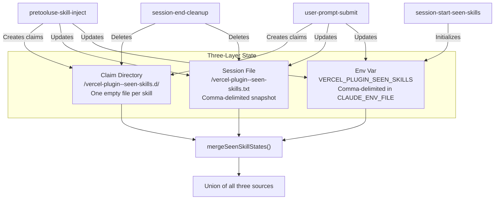
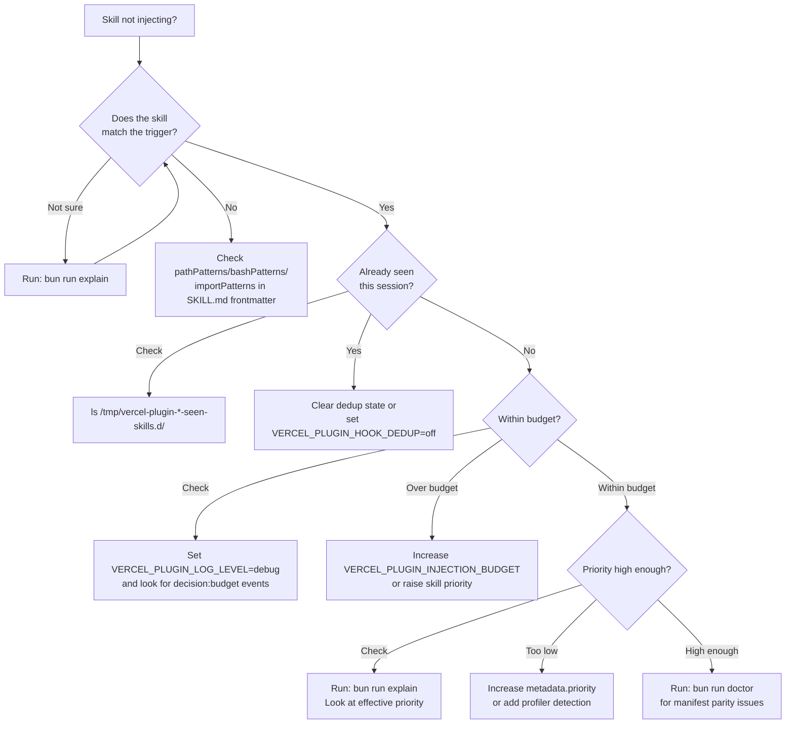

# Observability Guide

How to monitor, debug, and trace the vercel-plugin's skill injection behavior. Covers the structured logging system, audit log configuration, and dedup debugging strategies.

---

## Table of Contents

1. [Log Levels](#log-levels)
   - [off (default)](#off-default)
   - [summary](#summary)
   - [debug](#debug)
   - [trace](#trace)
2. [Structured JSON Logging](#structured-json-logging)
   - [Log Format](#log-format)
   - [Common Event Types](#common-event-types)
   - [Invocation ID Correlation](#invocation-id-correlation)
3. [Audit Log File](#audit-log-file)
   - [Configuration](#audit-log-configuration)
   - [Log Location](#audit-log-location)
   - [Format and Contents](#audit-log-format)
4. [Dedup Debugging](#dedup-debugging)
   - [Dedup Architecture](#dedup-architecture)
   - [Strategy Fallback Chain](#strategy-fallback-chain)
   - [Inspecting Dedup State](#inspecting-dedup-state)
   - [Common Dedup Issues](#common-dedup-issues)
5. [Environment Variable Quick Reference](#environment-variable-quick-reference)
6. [Debugging Decision Tree](#debugging-decision-tree)

---

## Log Levels

The plugin uses a four-tier log level system, controlled by `VERCEL_PLUGIN_LOG_LEVEL`. All log output goes to **stderr** as structured JSON — it never contaminates hook stdout (which is reserved for `SyncHookJSONOutput`).

### Level Resolution Order

The logger checks environment variables in this order:

1. `VERCEL_PLUGIN_LOG_LEVEL` — explicit level name (`off`, `summary`, `debug`, `trace`)
2. `VERCEL_PLUGIN_DEBUG=1` — legacy flag, maps to `debug`
3. `VERCEL_PLUGIN_HOOK_DEBUG=1` — legacy flag, maps to `debug`
4. Falls back to `off` if nothing is set

If `VERCEL_PLUGIN_LOG_LEVEL` is set to an unrecognized value, the logger prints a warning to stderr and falls back to `off`.

### off (default)

```bash
# No environment variable needed — this is the default
unset VERCEL_PLUGIN_LOG_LEVEL
```

No log output. Hooks run silently, producing only their JSON result on stdout. This is the production default to avoid any performance overhead.

### summary

```bash
export VERCEL_PLUGIN_LOG_LEVEL=summary
```

Emits outcome, latency, and issue reports. Best for monitoring hook health without noise.

**Example output** (one line per event, pretty-printed here for readability):

```json
{
  "invocationId": "a3f1c02e",
  "event": "complete",
  "timestamp": "2026-03-10T14:22:01.123Z",
  "reason": "injected",
  "matchedCount": 4,
  "injectedCount": 2,
  "dedupedCount": 1,
  "cappedCount": 1,
  "injectedSkills": ["nextjs", "vercel-functions"],
  "droppedByCap": ["routing-middleware"],
  "elapsed_ms": 12
}
```

The `complete` event fires at the end of every hook invocation and summarizes what happened:

| Field | Description |
|-------|-------------|
| `matchedCount` | Skills whose patterns matched the trigger |
| `injectedCount` | Skills actually injected into context |
| `dedupedCount` | Skills skipped because already seen this session |
| `cappedCount` | Skills dropped by the per-invocation cap (5 for PreToolUse, 2 for UserPromptSubmit) |
| `droppedByCap` | Names of cap-dropped skills |
| `droppedByBudget` | Names of budget-dropped skills |
| `boostsApplied` | Description of priority boosts that fired |
| `elapsed_ms` | Wall-clock time for the entire hook |

**Issue events** appear when something went wrong:

```json
{
  "invocationId": "a3f1c02e",
  "event": "issue",
  "timestamp": "2026-03-10T14:22:01.125Z",
  "code": "DEDUP_CLAIM_FAIL",
  "message": "Could not create claim file",
  "hint": "Check /tmp permissions",
  "context": { "skill": "nextjs", "errno": -13 }
}
```

### debug

```bash
export VERCEL_PLUGIN_LOG_LEVEL=debug
```

Adds match reasons, dedup state, skill map statistics, and decision traces. Use this when investigating **why** a specific skill was or wasn't injected.

**Additional events at debug level:**

```json
{
  "invocationId": "a3f1c02e",
  "event": "decision:match",
  "timestamp": "2026-03-10T14:22:01.110Z",
  "hook": "pretooluse-skill-inject",
  "skill": "nextjs",
  "score": 11,
  "reason": "pathPattern matched: app/**/page.tsx"
}
```

```json
{
  "invocationId": "a3f1c02e",
  "event": "decision:dedup",
  "timestamp": "2026-03-10T14:22:01.111Z",
  "hook": "pretooluse-skill-inject",
  "skill": "vercel-storage",
  "reason": "already seen (claim file exists)"
}
```

```json
{
  "invocationId": "a3f1c02e",
  "event": "decision:boost",
  "timestamp": "2026-03-10T14:22:01.112Z",
  "hook": "pretooluse-skill-inject",
  "skill": "nextjs",
  "score": 16,
  "reason": "profiler boost +5"
}
```

### trace

```bash
export VERCEL_PLUGIN_LOG_LEVEL=trace
```

Maximum verbosity. Adds per-pattern evaluation details — every glob, regex, and import pattern tested against the current trigger. **Use sparingly** — this generates significant output, especially in projects with many skills.

**Example trace events:**

```json
{
  "invocationId": "a3f1c02e",
  "event": "pattern:test",
  "timestamp": "2026-03-10T14:22:01.105Z",
  "skill": "vercel-storage",
  "patternType": "path",
  "pattern": "**/*.prisma",
  "input": "app/api/route.ts",
  "matched": false
}
```

At trace level, you see every pattern the engine evaluates, making it possible to understand exactly why a skill did or didn't match.

---

## Structured JSON Logging

### Log Format

Every log line is a single JSON object written to **stderr** via `process.stderr.write()`. Lines are newline-delimited (JSONL format).

**Standard fields present on every log line:**

| Field | Type | Description |
|-------|------|-------------|
| `invocationId` | `string` | 8-char hex ID shared across all log lines from one hook process |
| `event` | `string` | Event name (e.g., `complete`, `decision:match`, `pattern:test`) |
| `timestamp` | `string` | ISO 8601 timestamp |

Additional fields vary by event type. The logger never emits log lines when the level is `off`.

### Common Event Types

| Event | Level | Description |
|-------|-------|-------------|
| `complete` | summary | Hook invocation summary with counts and timing |
| `issue` | summary | Warning or error encountered during execution |
| `decision:match` | debug | A skill matched the current trigger |
| `decision:dedup` | debug | A skill was skipped due to dedup |
| `decision:boost` | debug | A priority boost was applied |
| `decision:budget` | debug | A skill was dropped or summarized due to budget |
| `decision:suppress` | debug | A skill was suppressed (e.g., `noneOf` match) |
| `pattern:test` | trace | Individual pattern evaluation result |
| `prompt:score` | debug | Prompt signal scoring breakdown for a skill |

### Invocation ID Correlation

All hook modules running in the same Node.js process share a single `invocationId`. This is stored on `globalThis` via a shared key, so even if multiple modules import and create their own logger, they all emit the same ID.

To filter logs for a single hook invocation:

```bash
# Filter by invocation ID
cat /dev/stderr 2>&1 | grep '"invocationId":"a3f1c02e"' | jq .
```

---

## Audit Log File

The audit log provides a persistent, append-only record of every skill injection decision. Unlike stderr logging (which is ephemeral), the audit log writes to a file on disk.

### Audit Log Configuration

| Variable | Value | Behavior |
|----------|-------|----------|
| `VERCEL_PLUGIN_AUDIT_LOG_FILE` | *(unset)* | Writes to default location (see below) |
| `VERCEL_PLUGIN_AUDIT_LOG_FILE` | `/path/to/file.jsonl` | Writes to the specified path (resolved relative to project root) |
| `VERCEL_PLUGIN_AUDIT_LOG_FILE` | `off` | Disables audit logging entirely |

```bash
# Use the default location
unset VERCEL_PLUGIN_AUDIT_LOG_FILE

# Write to a custom path
export VERCEL_PLUGIN_AUDIT_LOG_FILE=./logs/plugin-audit.jsonl

# Disable audit logging
export VERCEL_PLUGIN_AUDIT_LOG_FILE=off
```

### Audit Log Location

When no explicit path is configured, the audit log writes to:

```
~/.claude/projects/<project-slug>/vercel-plugin/skill-injections.jsonl
```

Where `<project-slug>` is the project root path with `/` replaced by `-`. The directory is created automatically if it doesn't exist.

The project root is resolved in order: `CLAUDE_PROJECT_ROOT` > hook input `cwd` > `process.cwd()`.

### Audit Log Format

Each line is a JSON object (JSONL format) recording what was injected and why. The audit log captures the same structured data as the `complete` event at summary level, plus additional context about the trigger.

---

## Dedup Debugging

The dedup system prevents the same skill from being injected twice in a single Claude Code session. It uses a three-layer architecture for resilience.

### Dedup Architecture



### Strategy Fallback Chain

The dedup system uses a strategy chain. If the primary strategy fails, it falls back to the next:

| Strategy | Mechanism | When Used | Pros | Cons |
|----------|-----------|-----------|------|------|
| **file** | Atomic claims via `O_EXCL` | Default — `/tmp` writable | Race-condition safe, survives process restarts | Requires writable `/tmp` |
| **env-var** | `VERCEL_PLUGIN_SEEN_SKILLS` in `CLAUDE_ENV_FILE` | Fallback if `/tmp` fails | No filesystem dependency | Can drift if env file updates race |
| **memory-only** | In-memory `Set` within a single process | Fallback if env file unavailable | Zero I/O | Lost between hook invocations |
| **disabled** | No dedup at all | `VERCEL_PLUGIN_HOOK_DEDUP=off` | Useful for testing | Skills may inject multiple times |

To force a specific strategy for debugging:

```bash
# Disable dedup entirely (skills inject every time they match)
export VERCEL_PLUGIN_HOOK_DEDUP=off

# Watch which strategy the dedup system selects (requires debug level)
export VERCEL_PLUGIN_LOG_LEVEL=debug
```

At debug level, the logger emits `decision:dedup` events showing which strategy was used and whether a skill was already seen.

### Inspecting Dedup State

**Check the claim directory:**

```bash
# Find the claim directory for the current session
ls /tmp/vercel-plugin-*-seen-skills.d/

# List all claimed (already-injected) skills
ls /tmp/vercel-plugin-*-seen-skills.d/ 2>/dev/null
```

**Check the session file:**

```bash
cat /tmp/vercel-plugin-*-seen-skills.txt 2>/dev/null
```

**Check the env var:**

```bash
echo $VERCEL_PLUGIN_SEEN_SKILLS
```

**Force a clean slate** (resets dedup for the current session):

```bash
# Remove claim directory and session file
rm -rf /tmp/vercel-plugin-*-seen-skills.d/
rm -f /tmp/vercel-plugin-*-seen-skills.txt
```

### Common Dedup Issues

| Symptom | Likely Cause | Fix |
|---------|-------------|-----|
| Skill injects every time | Dedup disabled (`VERCEL_PLUGIN_HOOK_DEDUP=off`) or `/tmp` not writable | Check env var; verify `/tmp` permissions |
| Skill never injects after first time | Working correctly — this is expected behavior | If you need re-injection, clear dedup state (see above) |
| Skill injects in PreToolUse but also in UserPromptSubmit | Claim directory not shared between hooks | Check that both hooks resolve the same session ID from `CLAUDE_SESSION_ID` |
| Stale claim files from old sessions | `session-end-cleanup` didn't run (e.g., Claude Code crashed) | Manually delete old `/tmp/vercel-plugin-*` files |

---

## Environment Variable Quick Reference

| Variable | Default | Purpose |
|----------|---------|---------|
| `VERCEL_PLUGIN_LOG_LEVEL` | `off` | Log verbosity: `off` / `summary` / `debug` / `trace` |
| `VERCEL_PLUGIN_DEBUG` | — | Legacy: `1` maps to `debug` level |
| `VERCEL_PLUGIN_HOOK_DEBUG` | — | Legacy: `1` maps to `debug` level |
| `VERCEL_PLUGIN_AUDIT_LOG_FILE` | *(auto)* | Audit log path, or `off` to disable |
| `VERCEL_PLUGIN_HOOK_DEDUP` | — | Set to `off` to disable dedup entirely |
| `VERCEL_PLUGIN_SEEN_SKILLS` | `""` | Comma-delimited seen skills (managed by hooks) |
| `VERCEL_PLUGIN_LIKELY_SKILLS` | — | Profiler-set skills (+5 boost) |
| `VERCEL_PLUGIN_INJECTION_BUDGET` | `18000` | PreToolUse byte budget |
| `VERCEL_PLUGIN_PROMPT_INJECTION_BUDGET` | `8000` | UserPromptSubmit byte budget |
| `VERCEL_PLUGIN_REVIEW_THRESHOLD` | `3` | TSX edits before react-best-practices injection |
| `VERCEL_PLUGIN_TSX_EDIT_COUNT` | `0` | Current .tsx edit count |
| `VERCEL_PLUGIN_LEXICAL_RESULT_MIN_SCORE` | `5.0` | Minimum score for lexical fallback |

---

## Debugging Decision Tree

Use this flowchart to diagnose common issues:



**Quick debugging commands:**

```bash
# See why a skill matches (or doesn't) for a given file
bun run explain app/api/route.ts

# See why a skill matches for a bash command
bun run explain "vercel deploy --prod"

# Full diagnostic check
bun run doctor

# Enable debug logging for the next Claude Code session
export VERCEL_PLUGIN_LOG_LEVEL=debug

# Enable maximum trace logging
export VERCEL_PLUGIN_LOG_LEVEL=trace
```

---

## See Also

- [Operations & Debugging](./04-operations-debugging.md) — complete operations guide including CLI tools
- [Reference](./05-reference.md) — full environment variable table and hook registry
- [Glossary](./glossary.md) — definitions of project-specific terms
