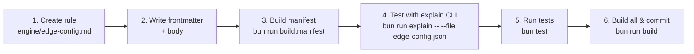
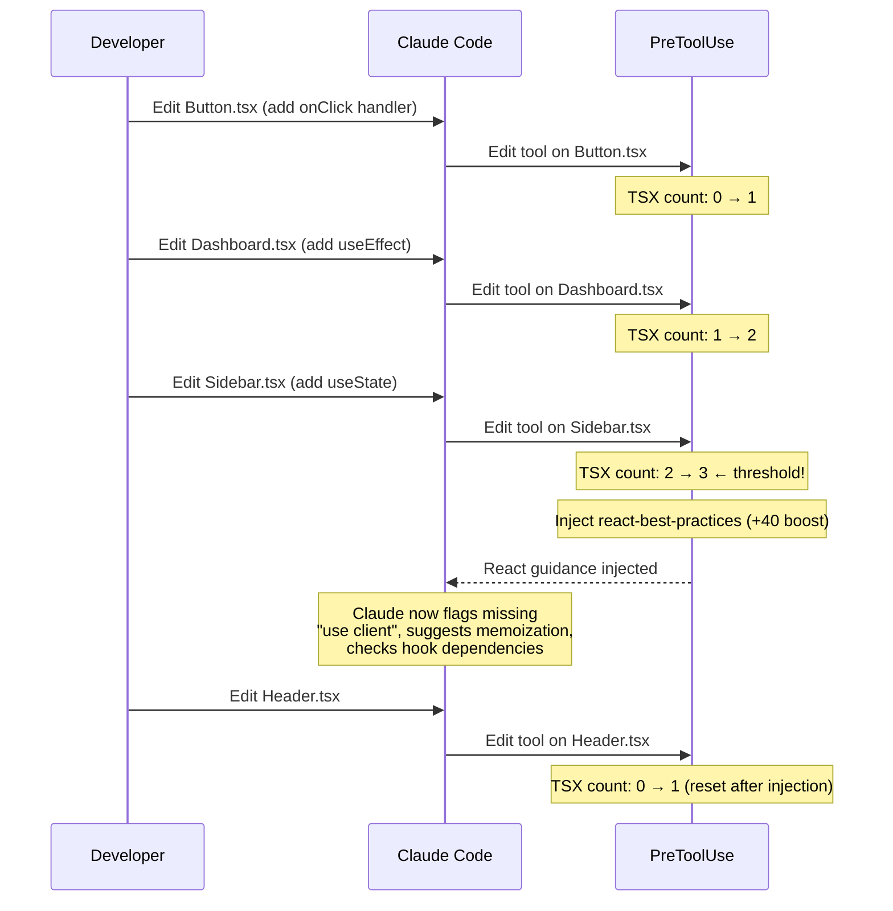
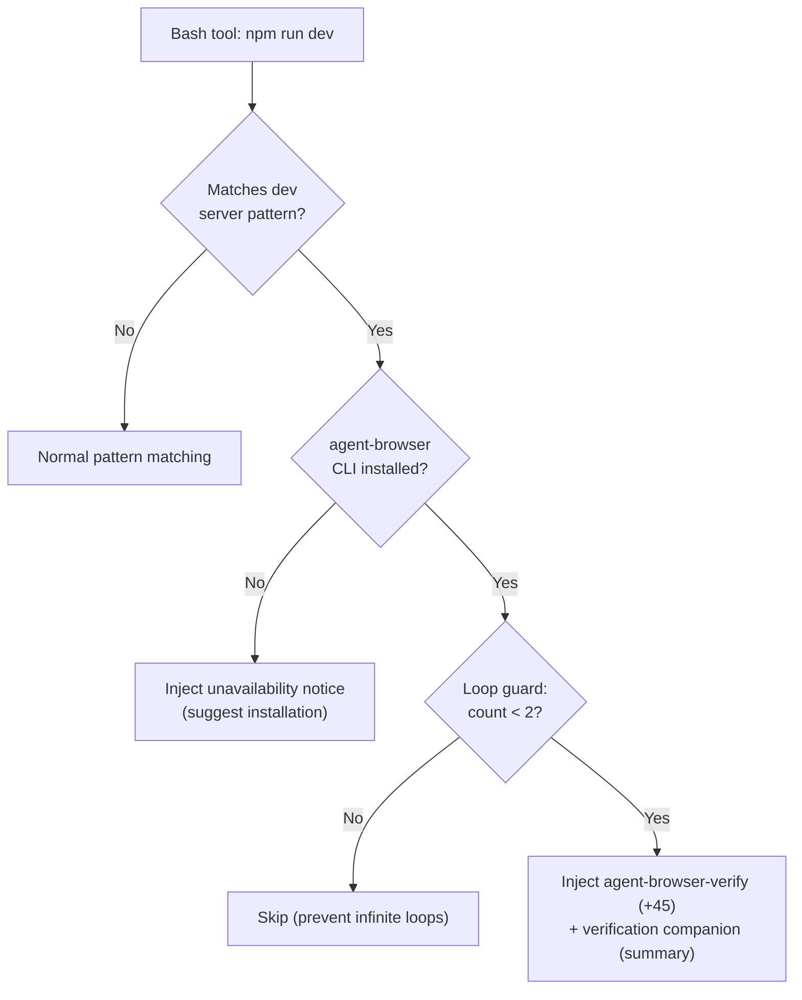
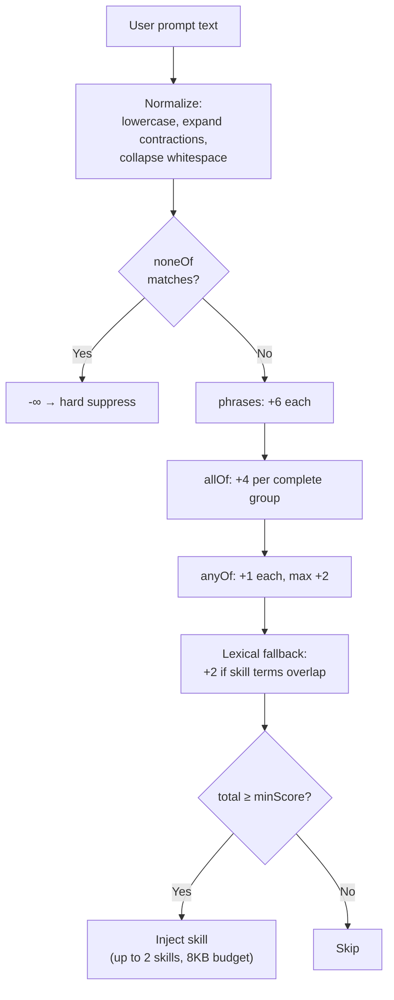
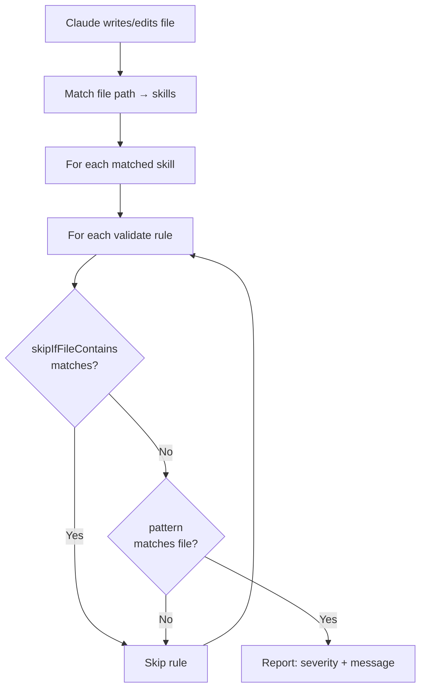
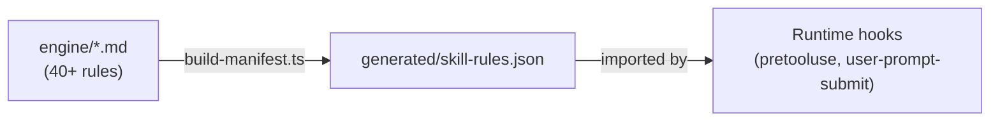

# Skill Authoring & Frontmatter Reference

> **Audience**: Skill authors — anyone adding new skills or extending existing ones.

This guide walks you through creating a new skill from scratch, explains every frontmatter field, documents the scoring engine, the validation system, the manifest build pipeline, and the custom YAML parser's non-standard behavior. It includes annotated real-world examples from the `engine/` directory.

---

## Table of Contents

1. [User Story: Adding a New Skill End-to-End](#user-story-adding-a-new-skill-end-to-end)
2. [SKILL.md Frontmatter Schema](#skillmd-frontmatter-schema)
   - [Top-Level Fields](#top-level-fields)
   - [metadata Object](#metadata-object)
   - [promptSignals Object](#promptsignals-object)
   - [validate Array](#validate-array)
   - [retrieval Object](#retrieval-object)
3. [Annotated Real Skill Examples](#annotated-real-skill-examples)
   - [Example 1: nextjs (Complex — Signals + Validation)](#example-1-nextjs)
   - [Example 2: email (Minimal — Patterns Only)](#example-2-email)
4. [Pattern Matching Reference](#pattern-matching-reference)
   - [pathPatterns (Globs)](#pathpatterns-globs)
   - [bashPatterns (Regex)](#bashpatterns-regex)
   - [importPatterns (Package Matchers)](#importpatterns-package-matchers)
5. [Prompt Signal Scoring](#prompt-signal-scoring)
6. [Validation Rules](#validation-rules)
7. [Manifest Build Pipeline](#manifest-build-pipeline)
8. [Custom YAML Parser Gotchas](#custom-yaml-parser-gotchas)
9. [Build & Test Workflow](#build--test-workflow)

---

## User Story: Adding a New Skill End-to-End

> **Scenario**: You're a developer on the Vercel plugin team. Vercel just shipped a new feature — say, "Edge Config" — and you want Claude to automatically inject best-practice guidance whenever a developer touches Edge Config files, runs related commands, or asks about it in a prompt.

### The journey



### Step 1 — Create the engine rule file

```bash
touch engine/edge-config.md
```

Skills are keyed by **filename** (without extension). The filename is the canonical identifier used everywhere: dedup, manifest, env vars, and logs.

### Step 2 — Write the rule with frontmatter

Create `engine/edge-config.md` with YAML frontmatter between `---` delimiters, followed by the guidance body in markdown. See the [Frontmatter Schema](#skillmd-frontmatter-schema) section for every available field.

Minimal skeleton:

```markdown
---
name: edge-config
description: "Best practices for Vercel Edge Config — a low-latency global data store"
summary: "Edge Config: use read() not get(), prefer JSON values"
registry: "vercel/edge-config-skill"
priority: 6
pathPatterns:
  - "edge-config.*"
bashPatterns:
  - "\\bedge.config\\b"
importPatterns:
  - "@vercel/edge-config"
promptSignals:
  phrases:
    - "edge config"
  minScore: 6
validate:
  - pattern: "edgeConfig\\.get\\("
    message: "Use edgeConfig.read() instead of .get() — read() returns typed values"
    severity: error
docs:
  - https://vercel.com/docs/edge-config
---

# Edge Config

You are an expert in Vercel Edge Config...
```

At runtime, full skill content is resolved from the `~/.vercel-plugin/` cache (installed from registry via `npx skills add`, or resolved from docs/sitemap fallback). The rule body serves as fallback content when the skill is not yet cached.

### Step 3 — Build the manifest

```bash
bun run build:manifest
```

This reads all `engine/*.md`, extracts frontmatter, compiles glob-to-regex and import-to-regex at build time, and writes `generated/skill-rules.json`. Hooks read the manifest at runtime for fast matching.

### Step 5 — Test with the explain CLI

```bash
# File path matching
bun run scripts/explain.ts --file edge-config.json

# Bash command matching
bun run scripts/explain.ts --bash "vercel edge-config ls"

# With profiler boost simulation
bun run scripts/explain.ts --file edge-config.json --likely-skills edge-config
```

The explain command mirrors runtime logic exactly — it shows priority scores, match reasons, and whether your skill would be injected within the budget.

### Step 6 — Run the full test suite

```bash
bun test
```

### Step 7 — Build everything and commit

```bash
bun run build   # hooks + manifest
bun test        # final verification
```

### What happens at runtime after you ship

1. **SessionStart** — The profiler scans `package.json`. If `@vercel/edge-config` is a dependency, your skill gets a **+5 priority boost** via `VERCEL_PLUGIN_LIKELY_SKILLS`.
2. **PreToolUse** — When Claude reads `edge-config.json` or runs `vercel env pull`, your `pathPatterns` and `bashPatterns` match → the skill is ranked, deduped, and injected within the 18KB budget (max 3 skills).
3. **UserPromptSubmit** — When the developer types "how do I set up edge config?", your `promptSignals.phrases` score +6 → the skill injects within the 8KB budget (max 2 skills).
4. **PostToolUse** — When Claude writes to a matched file, your `validate` rules run and flag antipatterns.

---

## User Story: TSX Edit Trigger (react-best-practices)

> **Scenario**: You're a developer building a React dashboard. You've been editing `.tsx` components for a while — adding hooks, state, and effects. After your 3rd `.tsx` edit, Claude suddenly has React best-practices guidance it didn't have before.

### What's happening under the hood

The PreToolUse hook tracks `.tsx` edits via `VERCEL_PLUGIN_TSX_EDIT_COUNT`. When the count hits the threshold (default 3, configurable via `VERCEL_PLUGIN_REVIEW_THRESHOLD`), the `react-best-practices` skill injects with a **+40 priority boost**.



### How to configure this in your skill

The TSX review trigger is hard-coded to the `react-best-practices` skill — you can't create custom edit-count triggers for other skills. But understanding the pattern helps you design skills that complement it: if your skill is about a React library (e.g., `swr`, `shadcn`), its patterns will fire alongside `react-best-practices` when matching files are edited.

---

## User Story: Dev Server Detection (agent-browser-verify)

> **Scenario**: You've just finished building a login form and ask Claude to start the dev server. Claude not only starts `npm run dev`, but also opens a browser to visually verify the form renders correctly.

### What's happening under the hood

The PreToolUse hook detects dev server commands (`next dev`, `npm run dev`, `pnpm dev`, `bun dev`, `vite`, etc.) and injects `agent-browser-verify` with a **+45 priority boost** — but only if the `agent-browser` CLI is installed.



### Key design details

- The session-start profiler sets `VERCEL_PLUGIN_AGENT_BROWSER_AVAILABLE=1` if the CLI is found on PATH
- A **loop guard** caps injection at 2 per session (`VERCEL_PLUGIN_DEV_VERIFY_COUNT`) — repeated `npm run dev` restarts won't flood context
- The `verification` skill is co-injected as a **summary-only companion** to provide a verification checklist without consuming too much budget

---

## User Story: Prompt Signal Matching (UserPromptSubmit)

> **Scenario**: A developer types "how do I add a durable workflow that survives crashes?" into Claude Code. Without touching any files, Claude gets the `workflow` skill injected because the prompt signals match.

### What's happening under the hood

The UserPromptSubmit hook normalizes the prompt and scores it against every skill's `promptSignals`:

**Normalized prompt**: `"how do i add a durable workflow that survive crash"`
(lowercase → contraction expansion → stemming: "survives" → "survive", "crashes" → "crash")

**Scoring for `workflow` skill**:

```yaml
# workflow's promptSignals:
phrases: ["durable workflow"]     # substring match → +6
allOf: [["workflow", "durable"]]  # both present → +4
anyOf: ["durable", "reliable"]    # "durable" +1 → +1
minScore: 4
```

| Component | Match | Score |
|-----------|-------|-------|
| phrase: `"durable workflow"` | Yes | +6 |
| allOf: `["workflow", "durable"]` | Both present | +4 |
| anyOf: `"durable"` | Yes | +1 |
| **Total** | | **11** |

11 >= minScore 4 → **skill injects** within the 8KB / 2-skill budget.

### How to write effective prompt signals for your skill

1. **Start with phrases** — these are the strongest signals (+6 each). Use the exact phrases your users type: `"edge config"`, `"ai sdk"`, `"deploy to vercel"`.

2. **Add allOf groups for concepts** — combinations of terms that together indicate intent: `[["cron", "schedule"]]`, `[["streaming", "response"]]`. Each fully-matched group scores +4.

3. **Sprinkle anyOf for weak signals** — individual terms that slightly boost relevance: `"timeout"`, `"cache"`, `"optimize"`. Capped at +2 total to prevent noise.

4. **Use noneOf to suppress false positives** — terms that indicate the user is asking about something else: `["github actions", ".github/workflows"]` in the workflow skill prevents matching GitHub CI prompts.

5. **Set minScore appropriately** — default 6 (one phrase match). Lower to 4 for broad skills like `investigation-mode` that should match on weaker signals.

---

## SKILL.md Frontmatter Schema

Every `SKILL.md` begins with a YAML frontmatter block between `---` delimiters. Below is the complete schema with types, defaults, and descriptions.

### Top-Level Fields

| Field | Type | Required | Default | Description |
|-------|------|----------|---------|-------------|
| `name` | `string` | No | directory name | Human-readable name. Falls back to the directory name if omitted. |
| `description` | `string` | **Yes** | — | One-line description of the skill's purpose. Used in manifest, logs, and lexical fallback scoring. |
| `summary` | `string` | Recommended | — | Brief fallback text injected when the full body exceeds the byte budget. Keep under ~200 chars. |
| `metadata` | `object` | **Yes** | — | Contains all matching, scoring, and validation configuration. |
| `validate` | `object[]` | No | `[]` | PostToolUse validation rules (can also live inside `metadata`). |
| `retrieval` | `object` | No | — | Discovery metadata for search/retrieval systems. |

### metadata Object

| Field | Type | Default | Description |
|-------|------|---------|-------------|
| `priority` | `number` | `5` | Injection priority (range 4–8). Higher = injected first when multiple skills match. |
| `pathPatterns` | `string[]` | `[]` | Glob patterns for file path matching. Compiled to regex at build time. |
| `bashPatterns` | `string[]` | `[]` | JavaScript regex patterns for bash command matching. |
| `importPatterns` | `string[]` | `[]` | Package name patterns for import/require matching. Supports `*` for scoped wildcards. |
| `promptSignals` | `object` | — | Prompt-based scoring configuration (see below). |

### promptSignals Object

Controls how the **UserPromptSubmit** hook scores user prompts against this skill.

| Field | Type | Default | Description |
|-------|------|---------|-------------|
| `phrases` | `string[]` | `[]` | Exact substring matches (case-insensitive). Each hit scores **+6**. |
| `allOf` | `string[][]` | `[]` | Groups of terms that must **all** appear in the prompt. Each fully-matched group scores **+4**. |
| `anyOf` | `string[]` | `[]` | Optional terms. Each hit scores **+1**, capped at **+2 total**. |
| `noneOf` | `string[]` | `[]` | Suppression terms. **Any match sets the score to -Infinity** (hard suppress — skill never injects). |
| `minScore` | `number` | `6` | Minimum total score required for the skill to be injected. |

### validate Array

Each entry defines a PostToolUse validation rule that runs when Claude writes or edits a file matched by the skill's path patterns.

| Field | Type | Required | Default | Description |
|-------|------|----------|---------|-------------|
| `pattern` | `string` | **Yes** | — | Regex pattern to search for in the written file content. |
| `message` | `string` | **Yes** | — | Error/warning message shown to Claude when pattern matches. Should be **actionable** (tell Claude what to do, not just what's wrong). |
| `severity` | `"error"` or `"warn"` | **Yes** | — | `error` = Claude must fix before proceeding. `warn` = advisory. |
| `skipIfFileContains` | `string` | No | — | Regex — if the file also matches this pattern, skip the rule entirely. Prevents false positives. |

### retrieval Object

Optional metadata for discovery and search systems.

| Field | Type | Description |
|-------|------|-------------|
| `aliases` | `string[]` | Alternative names users might search for (e.g., `["vercel ai", "ai library"]`). |
| `intents` | `string[]` | User intents this skill addresses (e.g., `["add ai to app", "set up streaming"]`). |
| `entities` | `string[]` | Key API symbols, functions, or types (e.g., `["useChat", "streamText"]`). |

---

## Annotated Real Skill Examples

### Example 1: nextjs

**File**: `engine/nextjs.md` — a complex skill with prompt signals, validation rules, and broad pattern coverage.

```yaml
---
name: nextjs
description: Next.js App Router expert guidance. Use when building, debugging,
  or architecting Next.js applications — routing, Server Components, Server
  Actions, Cache Components, layouts, middleware/proxy, data fetching,
  rendering strategies, and deployment on Vercel.
metadata:
  priority: 5                          # ← Default priority; not boosted
                                       #   because Next.js is so common the
                                       #   profiler adds +5 when detected.
  pathPatterns:
    - 'next.config.*'                  # ← Matches next.config.js, .mjs, .ts
    - 'next-env.d.ts'
    - 'app/**'                         # ← Catches all App Router files
    - 'pages/**'                       # ← Also catches Pages Router (for migration guidance)
    - 'src/app/**'                     # ← Common src/ layout variant
    - 'src/pages/**'
    - 'tailwind.config.*'             # ← Tailwind is tightly coupled with Next.js projects
    - 'postcss.config.*'
    - 'tsconfig.json'
    - 'tsconfig.*.json'
    - 'apps/*/app/**'                  # ← Monorepo patterns (Turborepo convention)
    - 'apps/*/pages/**'
    - 'apps/*/src/app/**'
    - 'apps/*/src/pages/**'
    - 'apps/*/next.config.*'

  bashPatterns:
    - '\bnext\s+(dev|build|start|lint)\b'    # ← Core Next.js CLI commands
    - '\bnext\s+experimental-analyze\b'      # ← Bundle analyzer
    - '\bnpx\s+create-next-app\b'            # ← Project scaffolding
    - '\bbunx\s+create-next-app\b'
    - '\bnpm\s+run\s+(dev|build|start)\b'    # ← npm scripts that likely invoke Next.js
    - '\bpnpm\s+(dev|build)\b'
    - '\bbun\s+run\s+(dev|build)\b'

  promptSignals:
    phrases:                           # ← Each phrase hit = +6
      - "next.js"
      - "nextjs"
      - "app router"
      - "server component"
      - "server action"
    allOf:                             # ← All terms in group must match = +4
      - [middleware, next]             #   "next middleware" → +4
      - [layout, route]               #   "route layout" → +4
    anyOf:                             # ← Each hit = +1, capped at +2
      - "pages router"
      - "getserversideprops"
      - "use server"
    noneOf: []                         # ← No suppression terms
    minScore: 6                        # ← One phrase match is enough

validate:                              # ← 11 rules catching common mistakes
  - pattern: export.*getServerSideProps
    message: 'getServerSideProps is removed in App Router — use server
      components or route handlers'
    severity: error                    # ← error = Claude must fix

  - pattern: (useState|useEffect)
    message: 'React hooks require "use client" directive — add it at the
      top of client components'
    severity: warn
    skipIfFileContains: "^['\"]use client['\"]"
                                       # ↑ Skip if file already has "use client"

  - pattern: useRef\(\s*\)
    message: 'useRef() requires an initial value in React 19 — use useRef(null)'
    severity: error

  - pattern: (?<!await )\bcookies\(\s*\)
    message: 'cookies() is async in Next.js 16 — add await'
    severity: error
    skipIfFileContains: "^['\"]use client['\"]"
                                       # ↑ Client components don't call cookies()
---

# Next.js (App Router)

...guidance body follows...
```

**What makes this skill effective**:

- **pathPatterns** cover both standard and monorepo layouts, catching files whether they're in `app/`, `src/app/`, or `apps/*/app/`.
- **promptSignals** use all four scoring mechanisms: `phrases` for strong direct matches, `allOf` for multi-term concepts, `anyOf` for weaker signals, and `minScore: 6` so a single phrase is sufficient.
- **validate** rules target real migration pitfalls (Pages Router → App Router, React 18 → 19, Next.js 15 → 16) and use `skipIfFileContains` to avoid false positives on client components.

### Example 2: email

**File**: `engine/email.md` — a simpler skill with only path/bash patterns, no prompt signals or validation rules.

```yaml
---
name: email
description: Email sending integration guidance — Resend (native Vercel
  Marketplace) with React Email templates. Covers API setup, transactional
  emails, domain verification, and template patterns.
metadata:
  priority: 4                          # ← Lower priority; email is a secondary
                                       #   concern, not the primary framework.
  pathPatterns:
    - 'emails/**'                      # ← Email template directories
    - 'src/emails/**'
    - 'components/emails/**'
    - 'src/components/emails/**'
    - 'app/api/send/**'                # ← API routes for sending
    - 'src/app/api/send/**'
    - 'app/api/email/**'
    - 'src/app/api/email/**'
    - 'app/api/emails/**'
    - 'src/app/api/emails/**'
    - 'lib/resend.*'                   # ← Resend client setup files
    - 'src/lib/resend.*'
    - 'lib/email.*'
    - 'src/lib/email.*'
    - 'lib/email*'
    - 'src/lib/email*'
    - '**/email-template*'

  bashPatterns:                        # ← Cover all 4 package managers × 3 packages
    - '\bnpm\s+(install|i|add)\s+[^\n]*\bresend\b'
    - '\bpnpm\s+(install|i|add)\s+[^\n]*\bresend\b'
    - '\bbun\s+(install|i|add)\s+[^\n]*\bresend\b'
    - '\byarn\s+add\s+[^\n]*\bresend\b'
    - '\bnpm\s+(install|i|add)\s+[^\n]*@react-email/'
    - '\bpnpm\s+(install|i|add)\s+[^\n]*@react-email/'
    - '\bbun\s+(install|i|add)\s+[^\n]*@react-email/'
    - '\byarn\s+add\s+[^\n]*@react-email/'
    - '\bnpm\s+(install|i|add)\s+[^\n]*react-email\b'
    - '\bpnpm\s+(install|i|add)\s+[^\n]*react-email\b'
    - '\bbun\s+(install|i|add)\s+[^\n]*react-email\b'
    - '\byarn\s+add\s+[^\n]*react-email\b'

retrieval:
  aliases:                             # ← Alternate search terms
    - email
    - resend
    - react email
    - transactional email
  intents:                             # ← What the user is trying to do
    - send email from app
    - set up resend integration
    - create email template
    - configure email domain verification
---

# Email Integration (Resend + React Email)

...guidance body follows...
```

**What makes this skill a good minimal example**:

- No `promptSignals` — the skill relies entirely on file path and bash command matching. This is fine for highly specific tools where the file paths are unambiguous.
- No `validate` rules — email templates don't have common antipatterns that need automated checking.
- `retrieval` provides discoverability without affecting runtime injection scoring.
- `priority: 4` is low, meaning other skills (nextjs at 5, storage at 7) will be injected first when budget is tight.

---

## Pattern Matching Reference

### pathPatterns (Globs)

File path globs are compiled to regex at build time via `globToRegex()`. Supported syntax:

| Pattern | Matches | Example |
|---------|---------|---------|
| `*` | Any characters except `/` | `*.ts` matches `foo.ts` but not `dir/foo.ts` |
| `**` | Any path depth (including zero) | `app/**/*.tsx` matches `app/page.tsx` and `app/a/b/page.tsx` |
| `?` | Single character | `?.ts` matches `a.ts` but not `ab.ts` |
| `{a,b}` | Alternation | `*.{ts,tsx}` matches `foo.ts` and `foo.tsx` |
| `[abc]` | Character class | `[._]env` matches `.env` and `_env` |

**Runtime matching strategy** (PreToolUse tries in order):

1. **Full path**: The compiled regex tests against the complete relative file path
2. **Basename**: The regex tests against just the filename
3. **Suffix**: The path ends with the glob pattern

### bashPatterns (Regex)

Bash patterns are **JavaScript regular expressions** tested against the full bash command string.

```yaml
bashPatterns:
  - "\\bnext\\s+(dev|build|start)\\b"   # next dev, next build, next start
  - "npm run (dev|build)"                # npm scripts
  - "vercel\\s+deploy"                   # vercel deploy command
```

**Tips**:
- Use `\\b` for word boundaries (YAML requires escaping the backslash)
- Use alternation `(a|b)` for command variants
- Patterns are case-sensitive by default
- Cover all package manager variants if matching install commands (npm/pnpm/bun/yarn)

### importPatterns (Package Matchers)

Import patterns match against `import`/`require` statements in file content. They support wildcard scoping:

```yaml
importPatterns:
  - "ai"                    # Exact: import { x } from "ai"
  - "@ai-sdk/*"             # Scoped wildcard: @ai-sdk/openai, @ai-sdk/anthropic
  - "@vercel/edge-config"   # Exact scoped package
```

At build time, `importPatternToRegex()` compiles these into regex patterns with appropriate flags, stored in the manifest as `{ source, flags }` pairs.

---

## Prompt Signal Scoring

The **UserPromptSubmit** hook normalizes the user's prompt before scoring:

1. **Lowercased** — all comparisons are case-insensitive
2. **Contraction expansion** — "don't" → "do not", "isn't" → "is not", etc.
3. **Whitespace normalization** — multiple spaces collapsed to a single space

Then each skill's `promptSignals` are evaluated:



### Scoring walkthrough

Given a prompt: *"I want to add the ai sdk for streaming"*

And a skill with:
```yaml
promptSignals:
  phrases: ["ai sdk"]                    # "ai sdk" is a substring → +6
  allOf: [["streaming", "generation"]]   # Only "streaming" matched, not "generation" → +0
  anyOf: ["streaming"]                   # "streaming" present → +1
  minScore: 6
```

| Component | Matches | Score |
|-----------|---------|-------|
| phrases: "ai sdk" | Yes (substring) | +6 |
| allOf: ["streaming", "generation"] | Partial (1 of 2) | +0 |
| anyOf: "streaming" | Yes | +1 |
| **Total** | | **7** |

7 ≥ minScore 6 → **skill injects**.

### Lexical fallback scoring

When phrase/allOf/anyOf scoring yields a low result, the system tokenizes both the prompt and skill metadata (description, phrases, aliases, entities) and checks for significant term overlap. This adds up to **+2** and catches prompts that are topically relevant but don't match exact phrases.

---

## Validation Rules

Validation rules run in the **PostToolUse** hook after Claude writes or edits a file. The hook:

1. Matches the written file path against all skills' `pathPatterns`
2. For each matched skill, runs its `validate` rules against the file content
3. Returns fix instructions as `additionalContext` for any violations



### Best practices for validation rules

- Use `severity: error` sparingly — only for patterns that **will** break functionality
- Use `severity: warn` for style preferences or potential issues
- Use `skipIfFileContains` to avoid false positives (e.g., skip "needs use client" if file already has it)
- Keep `message` **actionable** — tell Claude what to do, not just what's wrong
- Remember patterns are **regex**: escape special characters (`.` → `\\.`, `(` → `\\(`)

### Real example: Next.js validation

```yaml
validate:
  # Error: will definitely break at runtime
  - pattern: (?<!await )\bcookies\(\s*\)
    message: 'cookies() is async in Next.js 16 — add await: const cookieStore = await cookies()'
    severity: error
    skipIfFileContains: "^['\"]use client['\"]"

  # Warn: might be intentional, but usually a mistake
  - pattern: (useState|useEffect)
    message: 'React hooks require "use client" directive — add it at the top of client components'
    severity: warn
    skipIfFileContains: "^['\"]use client['\"]"
```

---

## Manifest Build Pipeline

Engine rules are the source of truth for matching metadata, but hooks don't parse them at runtime. Instead, a build step pre-compiles everything into a fast-lookup manifest.



### Pipeline: `engine/*.md` → `build-manifest.ts` → `skill-rules.json`

**Input**: All `engine/*.md` files.

**Processing** (`scripts/build-manifest.ts`):

1. **Parse frontmatter** — extracts YAML between `---` delimiters using the custom parser
2. **Compile pathPatterns** — each glob is converted to a regex via `globToRegex()`. Invalid globs are dropped (with warnings).
3. **Compile bashPatterns** — each string is validated as a `RegExp`. Invalid patterns are dropped.
4. **Compile importPatterns** — each pattern is converted via `importPatternToRegex()`, producing `{ source, flags }` pairs.
5. **Paired arrays** — the manifest stores patterns and their compiled regex sources in parallel arrays with matching indices. If a pattern fails to compile, **both** the pattern and its regex slot are dropped to keep indices aligned.

**Output** (`generated/skill-rules.json`, version 2):

```json
{
  "generatedAt": "2026-03-10T...",
  "version": 2,
  "skills": {
    "nextjs": {
      "priority": 5,
      "summary": null,
      "pathPatterns": ["next.config.*", "app/**", ...],
      "pathRegexSources": ["^next\\.config\\.[^/]*$", ...],
      "bashPatterns": ["\\bnext\\s+(dev|build|start)\\b", ...],
      "bashRegexSources": ["\\bnext\\s+(dev|build|start)\\b", ...],
      "importPatterns": [],
      "importRegexSources": [],
      "bodyPath": "engine/nextjs.md",
      "validate": [...],
      "promptSignals": { "phrases": [...], ... }
    }
  }
}
```

### Build command

```bash
bun run build:manifest
```

This is also included in `bun run build` (which runs hooks + manifest).

### Keeping the manifest in sync

- Run `bun run doctor` for a comprehensive health check including manifest drift detection
- The pre-commit hook does **not** auto-rebuild the manifest (only hooks are auto-compiled)

---

## Custom YAML Parser Gotchas

The plugin uses a custom inline YAML parser (`parseSimpleYaml` in `skill-map-frontmatter.mjs`), **not** the standard `js-yaml` library. This parser has intentional non-standard behavior:

| Input | Standard YAML | This Parser |
|-------|---------------|-------------|
| `null` (bare) | JavaScript `null` | String `"null"` |
| `true` (bare) | Boolean `true` | String `"true"` |
| `false` (bare) | Boolean `false` | String `"false"` |
| `[unclosed` | Parse error | Scalar string `"[unclosed"` |
| Tab indent | Usually accepted | **Parse error** |

### Key implications

1. **No JavaScript nulls** — you never get `null` from frontmatter; everything is a string or number.
2. **No booleans** — don't rely on boolean coercion; build scripts handle this explicitly.
3. **Always close brackets** — a missing `]` silently turns your array into a useless string.
4. **Spaces only** — the parser deliberately rejects tabs to avoid ambiguous indentation.

---

## Build & Test Workflow

After creating or modifying a skill:

```bash
# 1. Build manifest (compiles frontmatter → JSON)
bun run build:manifest

# 2. Test with explain CLI
bun run scripts/explain.ts --file <your-file-pattern>

# 3. Run full test suite
bun test

# 4. Build everything (hooks + manifest)
bun run build

# 5. Run doctor to check for issues
bun run doctor
```

The pre-commit hook automatically runs `build:hooks` when `.mts` files are staged, but you should manually run `build:manifest` when changing frontmatter.
