# Skill Injection Engine

> **Audience**: Plugin developers, skill authors, and anyone debugging why a skill did or didn't inject.

This document explains the complete skill injection pipeline — how vercel-plugin decides which skills to surface, when, and why. It covers both injection hooks (PreToolUse and UserPromptSubmit), the ranking system with all boost factors, the dedup state machine, budget enforcement, prompt signal scoring, and special-case triggers.

---

## Table of Contents

1. [How Injection Works (Overview)](#how-injection-works-overview)
2. [PreToolUse Pipeline](#pretooluse-pipeline)
   - [Stage 1: Parse Input](#stage-1-parse-input)
   - [Stage 2: Load Skills](#stage-2-load-skills)
   - [Stage 3: Match Skills](#stage-3-match-skills)
   - [Stage 4: Rank & Deduplicate](#stage-4-rank--deduplicate)
   - [Stage 5: Inject with Budget Enforcement](#stage-5-inject-with-budget-enforcement)
   - [Stage 6: Format Output](#stage-6-format-output)
3. [UserPromptSubmit Pipeline](#userpromptsubmit-pipeline)
4. [Prompt Signal Scoring](#prompt-signal-scoring)
   - [Normalization](#normalization)
   - [Scoring Weights](#scoring-weights)
   - [Scoring Walkthrough](#scoring-walkthrough)
   - [Lexical Fallback](#lexical-fallback)
   - [Troubleshooting Intent Classification](#troubleshooting-intent-classification)
5. [Ranking & Boost Factors](#ranking--boost-factors)
6. [Dedup State Machine](#dedup-state-machine)
7. [Budget Enforcement](#budget-enforcement)
8. [Special-Case Triggers](#special-case-triggers)
   - [TSX Review Trigger](#tsx-review-trigger)
   - [Dev Server Detection](#dev-server-detection)
   - [Vercel Env Help](#vercel-env-help)
   - [Investigation Companion Selection](#investigation-companion-selection)
9. [User Stories](#user-stories)
   - [User Story 1: TSX Edit Trigger](#user-story-1-tsx-edit-trigger)
   - [User Story 2: Dev Server Detection](#user-story-2-dev-server-detection)
   - [User Story 3: Prompt Signal Matching](#user-story-3-prompt-signal-matching)
10. [PostToolUse Validation](#posttooluse-validation)
11. [Environment Variables Reference](#environment-variables-reference)

---

## How Injection Works (Overview)

The plugin watches what Claude is doing and injects only the skills relevant to the current action. There are two independent injection paths:

| Hook | Trigger | Budget | Max Skills | Match Method |
|------|---------|--------|------------|--------------|
| **PreToolUse** | Claude calls Read, Edit, Write, or Bash | 18 KB | 5 | File path globs, bash regex, import patterns |
| **UserPromptSubmit** | User types a prompt | 8 KB | 2 | Prompt signal scoring (phrases/allOf/anyOf/noneOf) |

Both hooks share the same dedup system — once a skill is injected, it won't be injected again in the same session.

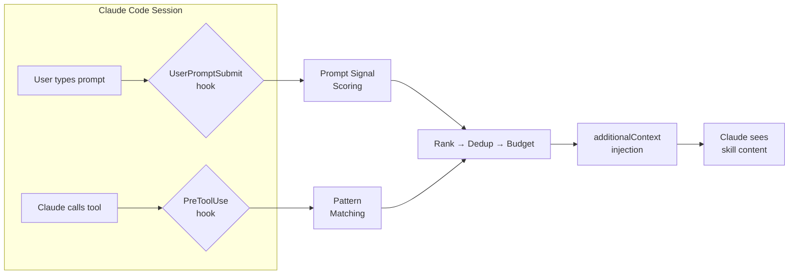

---

## PreToolUse Pipeline

The PreToolUse hook fires every time Claude calls Read, Edit, Write, or Bash. It runs a six-stage pipeline:

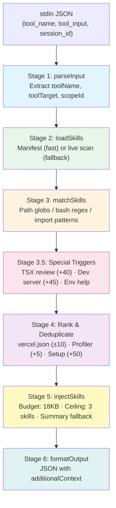

### Stage 1: Parse Input

**Source**: `pretooluse-skill-inject.mts:parseInput()`

Reads JSON from stdin and extracts:

| Field | Description |
|-------|-------------|
| `toolName` | One of `Read`, `Edit`, `Write`, `Bash` |
| `toolInput` | The tool's arguments (e.g., `file_path`, `command`) |
| `sessionId` | Used for file-based dedup |
| `toolTarget` | Primary target — file path for file tools, command string for Bash |
| `scopeId` | Agent ID for subagent-scoped dedup (undefined for main agent) |

Unsupported tools (anything not in `["Read", "Edit", "Write", "Bash"]`) are rejected with an empty `{}` response.

### Stage 2: Load Skills

**Source**: `pretooluse-skill-inject.mts:loadSkills()`

Two-tier loading strategy:

1. **Manifest** (`generated/skill-manifest.json`): Pre-built JSON with pre-compiled regex. Version 2 includes paired arrays (`pathPatterns` ↔ `pathRegexSources`) so hooks reconstruct `RegExp` objects directly — no glob compilation needed.

2. **Live scan** (fallback): Scans `skills/*/SKILL.md`, parses YAML frontmatter via `buildSkillMap()`, validates with `validateSkillMap()`, and compiles patterns at runtime.

The manifest path is always preferred (faster: no filesystem scan, no YAML parsing, no glob compilation).

### Stage 3: Match Skills

**Source**: `pretooluse-skill-inject.mts:matchSkills()`

**For file tools** (Read/Edit/Write):

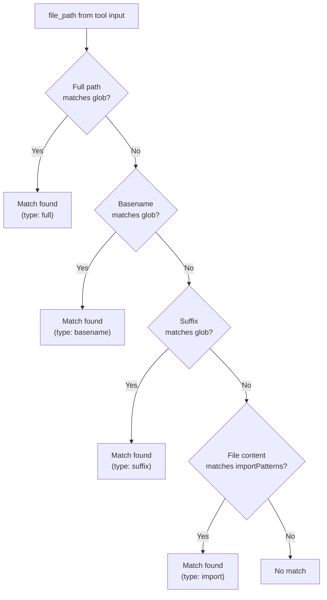

**For Bash**: Match command string against each skill's compiled `bashPatterns` regex.

Each match produces a `MatchReason` with the winning pattern and match type.

### Stage 4: Rank & Deduplicate

**Source**: `pretooluse-skill-inject.mts:deduplicateSkills()`

Priority adjustments are applied in layers. See [Ranking & Boost Factors](#ranking--boost-factors) for the complete boost table.

Steps:
1. **Filter already-seen** — remove skills present in the merged dedup state
2. **vercel.json routing** — if target is `vercel.json`, read keys, adjust priorities (±10)
3. **Profiler boost** — skills in `VERCEL_PLUGIN_LIKELY_SKILLS` get +5
4. **Setup-mode routing** — `bootstrap` gets +50 in greenfield projects
5. **Rank** — sort by `effectivePriority` DESC, then skill name ASC
6. **Cap** — take the top N skills (default 5)

### Stage 5: Inject with Budget Enforcement

**Source**: `pretooluse-skill-inject.mts:injectSkills()`

For each ranked skill in priority order:

1. Check hard ceiling (max 3 skills) — drop with `cap_exceeded`
2. Read `skills/<name>/SKILL.md`, strip frontmatter, keep body
3. Wrap in comment markers: `<!-- skill:name -->...<!-- /skill:name -->`
4. Check byte budget — **first skill always gets full body**; subsequent must fit remaining budget
5. If over budget, try `summary` fallback (see [Budget Enforcement](#budget-enforcement))
6. Atomically claim skill in dedup system via `tryClaimSessionKey()` (O_EXCL)

### Stage 6: Format Output

Assembles final JSON:

```json
{
  "hookSpecificOutput": {
    "additionalContext": "<!-- skill:nextjs -->\n...body...\n<!-- /skill:nextjs -->\n<!-- skillInjection: {...metadata...} -->"
  }
}
```

The metadata comment includes matched skills, injected skills, match reasons, boost factors, and budget usage — useful for debugging.

---

## UserPromptSubmit Pipeline

The UserPromptSubmit hook fires when the user types a prompt, before any tool calls. It uses **prompt signal scoring** instead of pattern matching.

**Source**: `user-prompt-submit-skill-inject.mts`

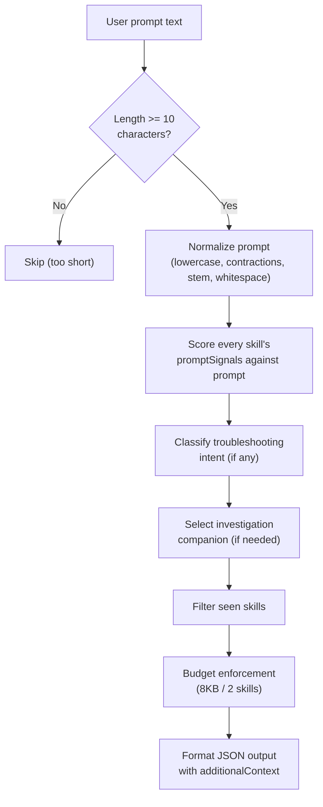

Key differences from PreToolUse:

| Parameter | PreToolUse | UserPromptSubmit |
|-----------|------------|------------------|
| Budget | 18 KB | 8 KB |
| Max skills | 5 | 2 |
| Match method | File/bash/import patterns | Prompt signal scoring |
| Min input | — | 10 characters |

---

## Prompt Signal Scoring

**Source**: `hooks/src/prompt-patterns.mts`

Each skill can define `promptSignals` in its frontmatter to declare which user prompts should trigger injection.

### Normalization

Both the user's prompt and the signal terms undergo normalization before scoring:

1. **Lowercase** — `"Deploy to Vercel"` → `"deploy to vercel"`
2. **Contraction expansion** — `"it's"` → `"it is"`, `"don't"` → `"do not"`, `"can't"` → `"cannot"`
3. **Stemming** — `"deploying"` → `"deploy"`, `"configured"` → `"configur"`, `"building"` → `"build"`
4. **Whitespace collapse** — multiple spaces/newlines → single space

Skill authors don't need to account for contractions or verb tenses in signal definitions.

### Scoring Weights

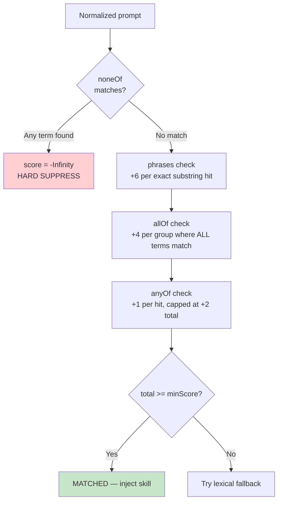

| Signal Type | Weight | Behavior |
|-------------|--------|----------|
| `phrases` | **+6** per hit | Exact substring match (case-insensitive, word-boundary aware) |
| `allOf` | **+4** per group | All terms in the group must appear in the prompt |
| `anyOf` | **+1** per hit, **capped at +2** | Prevents low-signal flooding |
| `noneOf` | **-Infinity** | Hard suppress — skill is permanently excluded for this prompt |
| `minScore` | threshold (default **6**) | Score must meet or exceed to qualify |

### Scoring Walkthrough

**Prompt**: *"I want to add the ai sdk for streaming"*

**Skill signals**:
```yaml
promptSignals:
  phrases: ["ai sdk"]                    # "ai sdk" is a substring → +6
  allOf: [["streaming", "generation"]]   # Only "streaming" matched → +0
  anyOf: ["streaming"]                   # "streaming" present → +1
  minScore: 6
```

| Component | Matches? | Score |
|-----------|----------|-------|
| phrases: `"ai sdk"` | Yes (substring) | +6 |
| allOf: `["streaming", "generation"]` | Partial (1 of 2) | +0 |
| anyOf: `"streaming"` | Yes | +1 |
| **Total** | | **7** |

7 >= minScore 6 → **skill injects**.

**Another example** — reaching threshold via allOf + anyOf only:

```yaml
promptSignals:
  allOf: [["cron", "schedule"]]       # +4
  anyOf: ["vercel", "deploy", "prod"] # +1 each, capped at +2
  minScore: 6
```

Prompt: *"I need to schedule a cron job on vercel for production"*
- allOf `["cron", "schedule"]` both present → +4
- anyOf `"vercel"` +1, `"prod"` (stemmed from "production") +1 → +2 (cap reached)
- Total: 6 >= 6 → **matched**

### Lexical Fallback

**Source**: `prompt-patterns.mts:scorePromptWithLexical()`

When exact scoring doesn't reach the threshold, a **TF-IDF lexical index** provides a fallback. The lexical score is boosted by 1.35x and compared against the exact score. The higher wins.

This catches prompts that are topically relevant but don't exactly hit configured phrases.

### Troubleshooting Intent Classification

**Source**: `user-prompt-submit-skill-inject.mts:classifyTroubleshootingIntent()`

A regex classifier detects three troubleshooting intents:

| Intent | Pattern Examples | Routed Skills |
|--------|-----------------|---------------|
| `flow-verification` | "loads but", "submits but", "works locally but" | `verification` |
| `stuck-investigation` | "stuck", "frozen", "timed out", "not responding" | `investigation-mode` |
| `browser-only` | "blank page", "white screen", "console errors" | `agent-browser-verify` + `investigation-mode` |

**Suppression**: Test framework mentions (`jest`, `vitest`, `playwright test`) suppress all verification-family skills to avoid injecting browser guidance during unit testing.

---

## Ranking & Boost Factors

Every matched skill goes through a ranking pipeline that applies priority adjustments in layers:

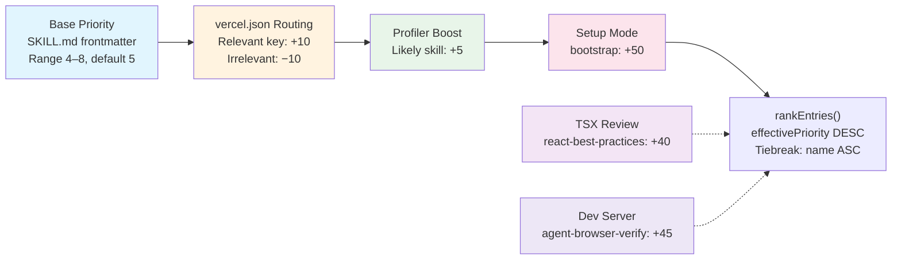

### Complete Boost Factor Table

| Boost | Value | Condition | Target Skill | Source |
|-------|-------|-----------|--------------|--------|
| **Base priority** | 4–8 | Always applied | All skills | `SKILL.md` frontmatter |
| **Profiler** | **+5** | Skill is in `VERCEL_PLUGIN_LIKELY_SKILLS` | Any detected skill | `session-start-profiler.mts` |
| **vercel.json relevant** | **+10** | Tool target is `vercel.json` and file keys match the skill | `routing-middleware`, `cron-jobs`, `vercel-functions`, `deployments-cicd` | `vercel-config.mts` |
| **vercel.json irrelevant** | **−10** | Tool target is `vercel.json` but file keys don't match | Skills that claim `vercel.json` in `pathPatterns` | `vercel-config.mts` |
| **Setup mode** | **+50** | 3+ bootstrap hints detected; greenfield project | `bootstrap` | `session-start-profiler.mts` |
| **TSX review** | **+40** | 3+ `.tsx` edits (configurable via `VERCEL_PLUGIN_REVIEW_THRESHOLD`) | `react-best-practices` | `pretooluse-skill-inject.mts` |
| **Dev server** | **+45** | Bash command matches dev server pattern (`next dev`, etc.) | `agent-browser-verify` + companions | `pretooluse-skill-inject.mts` |

**Priority formula**:
```
effectivePriority = basePriority
                  + vercelJsonAdjustment   (±10 or 0)
                  + profilerBoost          (+5 or 0)
                  + setupModeBoost         (+50 or 0)
                  + specialTriggerBoost    (+40 or +45 or 0)
```

### vercel.json Key-to-Skill Routing

**Source**: `hooks/src/vercel-config.mts`

When the tool target is `vercel.json`, the hook reads the file's top-level keys and maps them to skills:

| vercel.json Keys | Relevant Skill |
|------------------|----------------|
| `redirects`, `rewrites`, `headers`, `cleanUrls`, `trailingSlash` | `routing-middleware` |
| `crons` | `cron-jobs` |
| `functions`, `regions` | `vercel-functions` |
| `builds`, `buildCommand`, `installCommand`, `outputDirectory`, `framework`, `devCommand`, `ignoreCommand` | `deployments-cicd` |

Skills relevant to the file's keys get **+10**; skills that claim `vercel.json` but aren't relevant get **−10**.

### Profiler Detection

**Source**: `hooks/src/session-start-profiler.mts`

The session-start profiler scans the project and sets `VERCEL_PLUGIN_LIKELY_SKILLS`:

| Detected Signal | Skills Added |
|-----------------|-------------|
| `next.config.*` file | `nextjs`, `turbopack` |
| `turbo.json` file | `turborepo` |
| `vercel.json` file | `vercel-cli`, `deployments-cicd`, `vercel-functions` |
| `middleware.ts\|js` file | `routing-middleware` |
| `components.json` file | `shadcn` |
| `next` in package.json deps | `nextjs` |
| `@vercel/blob\|kv\|postgres` in deps | `vercel-storage` |
| `@vercel/flags` in deps | `vercel-flags` |
| `crons` key in vercel.json | `cron-jobs` |
| ...and many more | See `session-start-profiler.mts` |

**Bootstrap/setup mode**: When 3+ "bootstrap hints" are detected (e.g., `.env.example`, `prisma/schema.prisma`, auth dependencies, storage resource dependencies), `VERCEL_PLUGIN_SETUP_MODE=1` is set, enabling the +50 boost for the `bootstrap` skill.

---

## Dedup State Machine

The dedup system prevents re-injecting skills already delivered in the current session. It uses three independent state sources merged into a unified view:

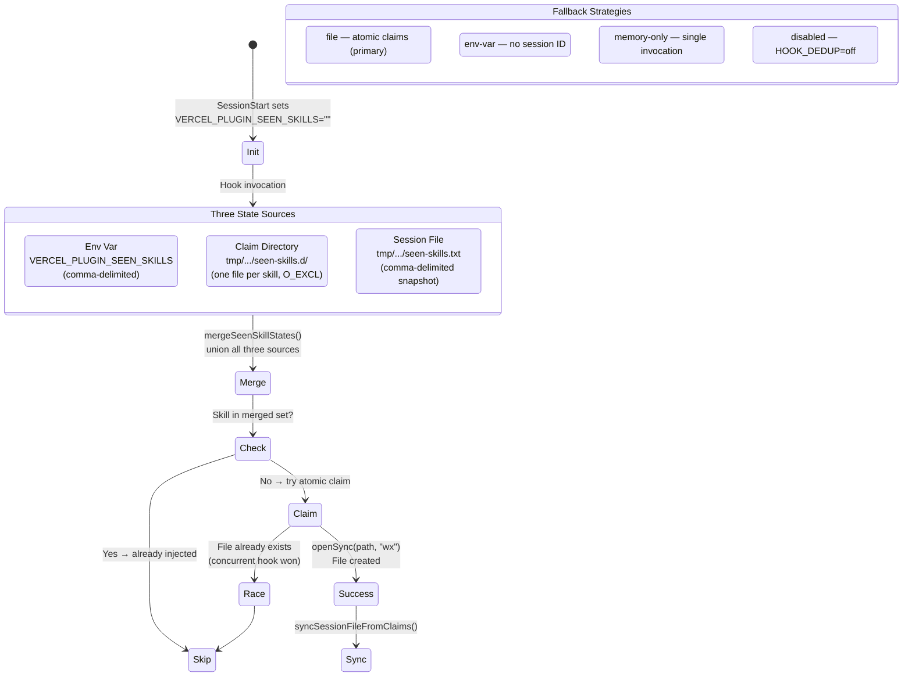

**Key design choice**: The atomic `openSync(path, "wx")` (O_EXCL) flag means if two hooks try to claim the same skill simultaneously, only one succeeds. This provides filesystem-level mutual exclusion.

**Subagent isolation**: Subagents (identified by `scopeId`) get their own dedup scope. The parent's env var is excluded from the subagent's merge, so subagents get fresh skill injection.

**Cleanup**: `session-end-cleanup.mts` deletes all temporary dedup files and claim directories when the session ends.

---

## Budget Enforcement

Budget enforcement prevents the plugin from flooding Claude's context window.

### PreToolUse Budget

| Parameter | Default | Env Override |
|-----------|---------|-------------|
| Byte budget | **18,000 bytes** (18 KB) | `VERCEL_PLUGIN_INJECTION_BUDGET` |
| Max skills | **5** | — (constant `MAX_SKILLS`) |

### UserPromptSubmit Budget

| Parameter | Default | Env Override |
|-----------|---------|-------------|
| Byte budget | **8,000 bytes** (8 KB) | `VERCEL_PLUGIN_PROMPT_INJECTION_BUDGET` |
| Max skills | **2** | — (constant `MAX_SKILLS`) |

### How Budget Is Applied

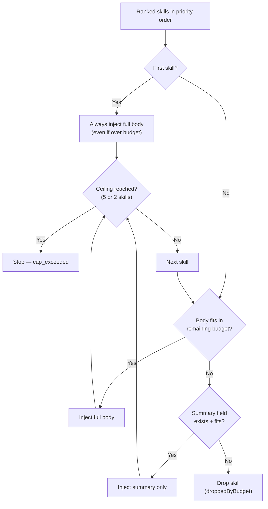

Rules:
- **First skill always gets full body** regardless of budget
- Skills are measured as UTF-8 bytes after wrapping in comment markers
- Summary fallback injects with a `mode:summary` marker
- Skills that neither fit as full body nor summary are dropped

---

## Special-Case Triggers

These operate alongside the normal matching pipeline with their own counter/dedup mechanisms.

### TSX Review Trigger

**Source**: `pretooluse-skill-inject.mts:checkTsxReviewTrigger()`

Injects `react-best-practices` after repeated `.tsx` edits to catch React antipatterns early.

| Parameter | Default | Env Override |
|-----------|---------|-------------|
| Edit threshold | 3 | `VERCEL_PLUGIN_REVIEW_THRESHOLD` |
| Priority boost | +40 | — |
| Counter env | — | `VERCEL_PLUGIN_TSX_EDIT_COUNT` |

**Behavior**:
1. Every Edit/Write on a `.tsx` file increments `VERCEL_PLUGIN_TSX_EDIT_COUNT`
2. When count >= threshold, the trigger fires
3. Counter **resets** after injection, allowing re-injection after another N edits
4. **Bypasses** normal SEEN_SKILLS dedup — the counter is the sole gate

### Dev Server Detection

**Source**: `pretooluse-skill-inject.mts:checkDevServerVerify()`

When Claude runs a dev server command, `agent-browser-verify` injects to encourage browser-based verification.

**Detected dev server patterns**:
```
next dev, npm run dev, pnpm dev, bun dev, bun run dev,
yarn dev, vite dev, vite, nuxt dev, vercel dev, astro dev
```

| Parameter | Value |
|-----------|-------|
| Priority boost | +45 |
| Max iterations | 2 per session |
| Loop guard env | `VERCEL_PLUGIN_DEV_VERIFY_COUNT` |
| Companion skills | `verification` (co-injected as summary) |

**Graceful degradation**: If `agent-browser` is not installed (`VERCEL_PLUGIN_AGENT_BROWSER_AVAILABLE=0`), the hook injects an unavailability notice suggesting the user install it.

### Vercel Env Help

**Source**: `pretooluse-skill-inject.mts`

One-time injection of a quick-reference guide when Claude runs `vercel env add|update|pull`. Uses standard dedup with key `vercel-env-help`.

### Investigation Companion Selection

**Source**: `user-prompt-submit-skill-inject.mts:selectInvestigationCompanion()`

When `investigation-mode` is selected via prompt signals, the second skill slot is reserved for the best companion from a prioritized list:

1. `workflow` (highest priority)
2. `agent-browser-verify`
3. `vercel-cli`

The companion must have independently scored above its `minScore`.

---

## User Stories

### User Story 1: TSX Edit Trigger

> **Scenario**: Sarah is building a dashboard. She's been editing React components and is on her 3rd `.tsx` file edit.

**What happens**:

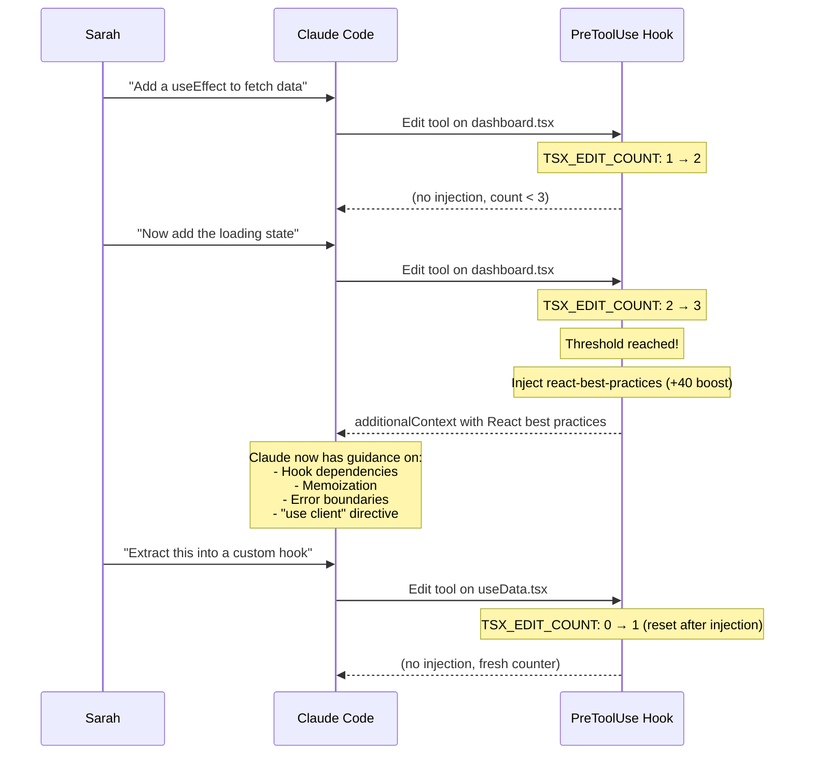

**Why it matters**: After several TSX edits, Claude accumulates context about what the developer is building. The react-best-practices skill arrives at the right moment — when Claude has enough context to apply the guidance meaningfully, and before the code grows too large to refactor easily.

**Key details**:
- The counter increments on **any** `.tsx` file edit (Write or Edit tool)
- After injection, the counter resets to 0, not to 1
- The trigger bypasses normal dedup — it can fire multiple times per session
- The +40 boost ensures `react-best-practices` outranks almost any other skill

### User Story 2: Dev Server Detection

> **Scenario**: Marcus just finished implementing a feature and asks Claude to start the dev server so he can test it.

**What happens**:

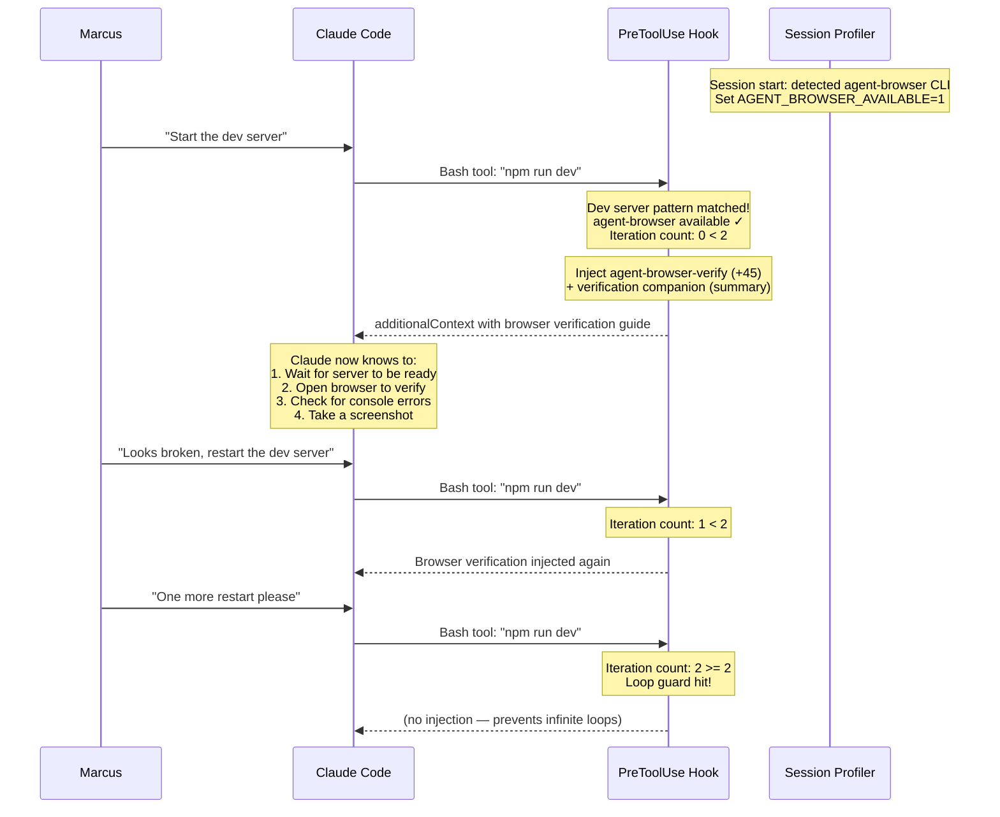

**Why it matters**: When a developer starts a dev server, they expect to see their changes in a browser. The plugin nudges Claude to verify using browser automation rather than just assuming the server started correctly.

**Key details**:
- The profiler checks at session start whether `agent-browser` CLI is on PATH
- If not installed, the hook injects an **unavailability notice** instead (suggesting installation)
- The loop guard (max 2 iterations) prevents the skill from being injected on every dev server restart
- The `verification` skill is co-injected as a summary-only companion

### User Story 3: Prompt Signal Matching

> **Scenario**: Jess is building a Next.js app and types "my deploy keeps failing with a timeout error" into Claude Code.

**What happens**:

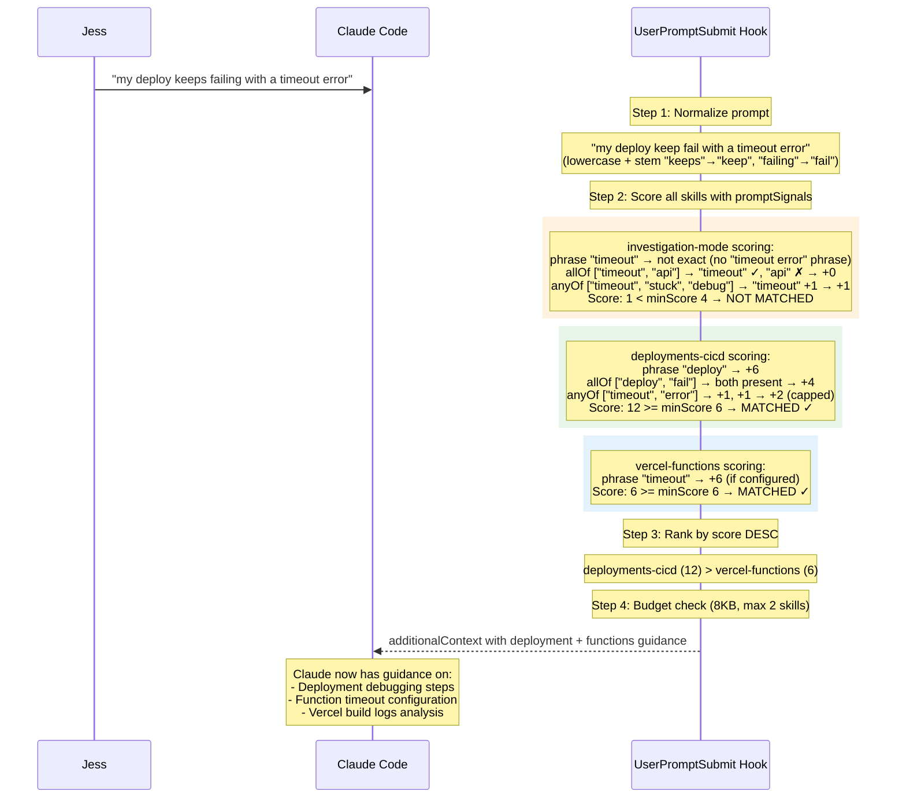

**Why it matters**: The prompt signal system catches user intent even when they don't mention specific technologies. The scoring formula ensures the most relevant skill wins — `deployments-cicd` scores higher because it matches on both the phrase "deploy" and the allOf group ["deploy", "fail"].

**Key details**:
- Stemming converts "failing" → "fail" and "keeps" → "keep", making signals match naturally
- The `noneOf` mechanism ensures skills aren't injected for irrelevant contexts (e.g., investigation-mode has `noneOf: ["css stuck", "sticky position"]`)
- The 8KB budget and 2-skill cap keep prompt injection lean since it's speculative
- If both investigation-mode and a companion were matched, investigation companion selection would kick in

---

## PostToolUse Validation

**Source**: `hooks/src/posttooluse-validate.mts`

After Claude writes or edits a file, the PostToolUse hook runs validation rules from matched skills.

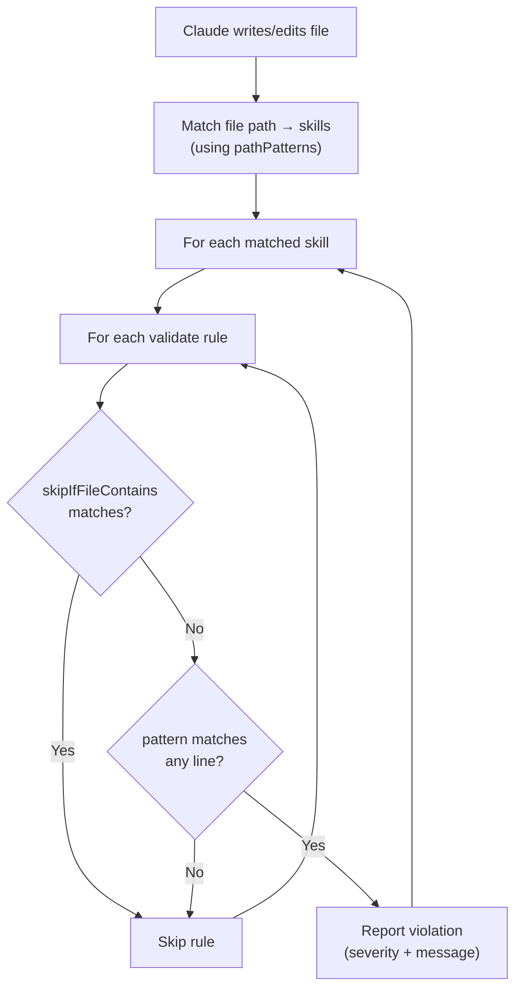

**Validation rule fields**:

| Field | Type | Required | Description |
|-------|------|----------|-------------|
| `pattern` | `string` (regex) | Yes | Pattern to search for in file content |
| `message` | `string` | Yes | Actionable fix instruction for Claude |
| `severity` | `"error"` or `"warn"` | Yes | `error` = must fix; `warn` = advisory |
| `skipIfFileContains` | `string` (regex) | No | Skip rule if file matches this pattern |

**Example** — Next.js async cookies rule:

```yaml
validate:
  - pattern: (?<!await )\bcookies\(\s*\)
    message: 'cookies() is async in Next.js 16 — add await'
    severity: error
    skipIfFileContains: "^['\"]use client['\"]"
```

This catches `cookies()` calls without `await`, but skips client components (which can't call `cookies()` anyway).

**Dedup**: Validation uses MD5 content hashing to avoid re-validating the same file content. The hash is tracked in `VERCEL_PLUGIN_VALIDATED_FILES`.

---

## Environment Variables Reference

| Variable | Default | Set By | Description |
|----------|---------|--------|-------------|
| `VERCEL_PLUGIN_SEEN_SKILLS` | `""` | session-start | Comma-delimited already-injected skills |
| `VERCEL_PLUGIN_LIKELY_SKILLS` | `""` | profiler | Comma-delimited profiler-detected skills (+5 boost) |
| `VERCEL_PLUGIN_GREENFIELD` | — | profiler | `"true"` if project is empty |
| `VERCEL_PLUGIN_SETUP_MODE` | — | profiler | `"1"` if 3+ bootstrap hints detected (+50 boost) |
| `VERCEL_PLUGIN_BOOTSTRAP_HINTS` | — | profiler | Comma-delimited bootstrap signals found |
| `VERCEL_PLUGIN_AGENT_BROWSER_AVAILABLE` | `"0"` | profiler | `"1"` if agent-browser CLI is on PATH |
| `VERCEL_PLUGIN_TSX_EDIT_COUNT` | `"0"` | pretooluse | Current `.tsx` edit count |
| `VERCEL_PLUGIN_DEV_VERIFY_COUNT` | `"0"` | pretooluse | Dev server injection iteration count |
| `VERCEL_PLUGIN_VALIDATED_FILES` | — | posttooluse | Content hashes of validated files |
| `VERCEL_PLUGIN_INJECTION_BUDGET` | `18000` | — | PreToolUse byte budget |
| `VERCEL_PLUGIN_PROMPT_INJECTION_BUDGET` | `8000` | — | UserPromptSubmit byte budget |
| `VERCEL_PLUGIN_REVIEW_THRESHOLD` | `3` | — | TSX edits before react-best-practices triggers |
| `VERCEL_PLUGIN_LOG_LEVEL` | `off` | — | `off` / `summary` / `debug` / `trace` |
| `VERCEL_PLUGIN_HOOK_DEDUP` | — | — | `off` to disable dedup entirely |
| `VERCEL_PLUGIN_AUDIT_LOG_FILE` | — | — | Audit log path or `off` |

---

## Learned Routing Rulebook & Capsule Provenance

When the routing-policy compiler promotes verified rules into a **Learned Routing Rulebook**, the ranking pipeline can apply per-rule boosts at injection time. Every decision capsule records which rule (if any) fired via the `rulebookProvenance` field, so downstream consumers never need to re-derive ranking state.

### Canonical Rulebook JSON

```json
{
  "version": 1,
  "createdAt": "2026-03-28T08:15:00.000Z",
  "sessionId": "sess_123",
  "rules": [
    {
      "id": "PreToolUse|flow-verification|uiRender|Bash|agent-browser-verify",
      "scenario": "PreToolUse|flow-verification|uiRender|Bash",
      "skill": "agent-browser-verify",
      "action": "promote",
      "boost": 8,
      "confidence": 0.93,
      "reason": "replay verified: no regressions, learned routing matched winning skill",
      "sourceSessionId": "sess_123",
      "promotedAt": "2026-03-28T08:15:00.000Z",
      "evidence": {
        "baselineWins": 4,
        "baselineDirectiveWins": 2,
        "learnedWins": 4,
        "learnedDirectiveWins": 2,
        "regressionCount": 0
      }
    }
  ]
}
```

### Decision Capsule Provenance

When a rulebook rule fires, the capsule includes:

```json
{
  "rulebookProvenance": {
    "matchedRuleId": "PreToolUse|flow-verification|uiRender|Bash|agent-browser-verify",
    "ruleBoost": 8,
    "ruleReason": "replay verified: no regressions, learned routing matched winning skill",
    "rulebookPath": "/tmp/vercel-plugin-routing-policy-<hash>-rulebook.json"
  }
}
```

When no rule fires, the field is `null`:

```json
{
  "rulebookProvenance": null
}
```

Each ranked entry in the capsule's `ranked` array also carries the per-skill fields `matchedRuleId`, `ruleBoost`, `ruleReason`, and `rulebookPath` for full traceability.
